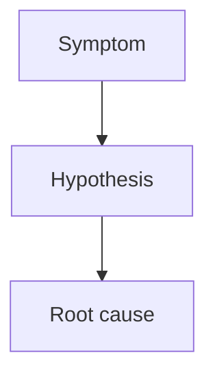

# Title

> **Audience:** Koko engineers and future readers publishing from `knowledge/blog/`.  
> **Target length:** 900–2,500 words — each note should stand alone as a **blog post page**, not a stub.

## Summary

Two to four paragraphs: what happened, why it matters, and the bottom-line conclusion. A reader who stops here should still learn the essential lesson.

---

## Problem

What problem was encountered? Who was affected (crawl, Google Search, CreepJS, SDK users)?

Include:

- Observable symptoms (metrics, HTML shapes, error strings)
- What was initially assumed (and why that assumption was tempting)
- Why the problem mattered for product or correctness

---

## Root Cause

Explain **why** it happened at the browser/architecture level — not only which line of code changed.

Focus on:

- Lifecycle ordering (parse, DCL, network idle, async bootstrap)
- Server vs client responsibility
- Profile/session state vs wire headers vs JS fingerprint
- Trade-offs that made the bug possible

Use a diagram when the flow is non-obvious:

---

## Investigation

How was it debugged? This section should read like a lab notebook.

Include:

- Commands run (with repo paths)
- A/B experiments and ablation matrices
- Logs, HAR/wire captures, probe JSON paths
- Browser comparison (Chrome vs Koko vs Playwright)
- Dead ends explicitly ruled out

| Experiment | Expected | Observed | Verdict |
|------------|----------|----------|---------|
| … | … | … | … |

---

## Solution

Explain the fix and **why** it is the right layer to fix.

Include:

- Immediate ops workaround (if any)
- Durable product/code fix
- What was explicitly *not* fixed (and why)

Avoid dumping large code blocks — point to files and describe the mechanism.

---

## Lessons Learned

What should future developers remember?

- Priority rules (e.g. session cookies before fingerprint)
- Probe discipline (20s budget, ReleaseFast for benchmarks)
- Baseline refresh procedures
- When to stop optimizing a secondary layer

---

## References

Links and paths:

- GitHub issues / commits
- Browser specifications (HTML, CSS, Web IDL)
- WPT tests (if relevant)
- External articles
- Koko source files (`src/...`, `scripts/...`)

---

## Related Knowledge

Cross-links to other notes in this repository:

- [`related-topic.md`](../path/related-topic.md) — one-line description