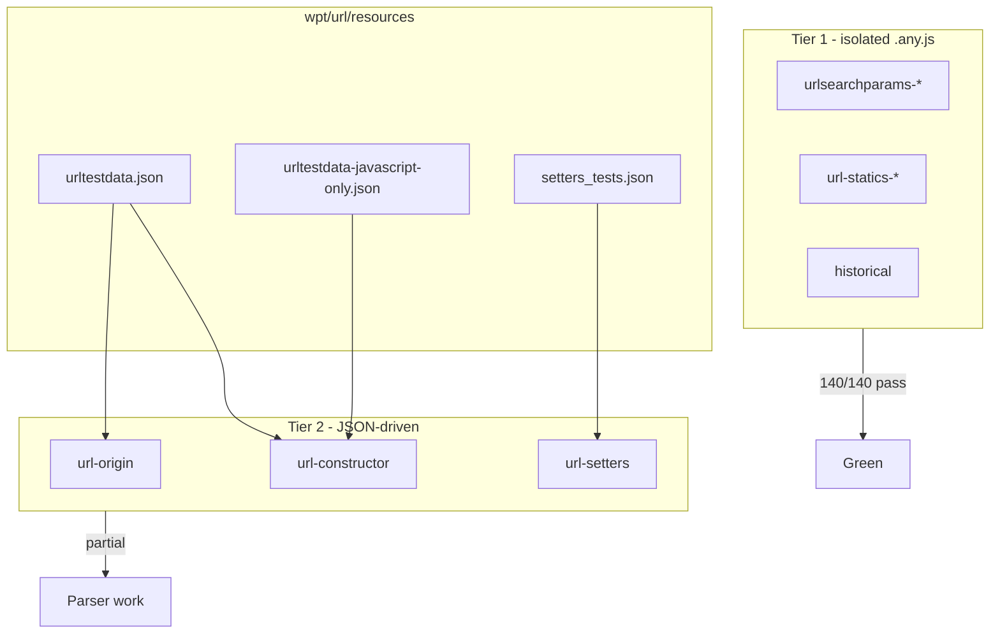

# WPT `url/` category — layout, runner, and Velora status

> **Date:** 2026-07-04  
> **Spec:** [URL Standard](https://url.spec.whatwg.org/)  
> **Snapshot log:** `code-check/tmp/wpt-url-status-20260704-143537.txt`

## Summary

Velora runs the official WPT `url/` directory via `scripts/wpt-run.sh` + `~/Desktop/demo/wptrunner` against `wpt/` served on `:8000` and Velora CDP on `:9222`.

**Category A (isolated testharness `.any.js` / small HTML)** is largely green: all **URLSearchParams** suites, **URL statics** (`canParse` / `parse`), **historical**, **url-searchparams**, **url-tojson**, and **url-setters** `javascript` / `mailto` variants.

**Category B (bulk JSON-driven parser tests)** remains open: **url-origin**, **url-constructor**, **url-setters** (main variant), **url-setters-stripping**, **urlencoded-parser**, **idlharness**, IDNA suites, and legacy **a-element** / **failure** HTML.

Latest batch: **~140/140** subtests in fully-passing suites; **~834** additional subtests pass inside partial suites (see table below).

---

## Repository layout (`wpt/url/`)

```
wpt/url/
├── README.md                    # Documents JSON resource formats
├── META.yml                     # spec + reviewers
├── WEB_FEATURES.yml
│
├── resources/                   # Shared test vectors (not run directly)
│   ├── urltestdata.json         # Main parser API vectors (~10k lines)
│   ├── urltestdata-javascript-only.json
│   ├── setters_tests.json       # URL setter expectations
│   ├── toascii.json             # IDNA / UTS #46
│   ├── percent-encoding.json
│   ├── IdnaTestV2.json (+ -removed.json)
│   ├── a-element.js             # Helpers for <a> tests
│   └── a-element-origin.js
│
├── tools/                       # IDNA corpus maintenance scripts
│
├── *.any.js                     # testharness — window + worker (Category A)
├── *.window.js                  # window-only testharness
├── *.html                       # Classic HTML tests (often multi-variant)
└── scripts/ (repo)              # Velora probes, not WPT
    └── cdp-usp-constructor-probe.mjs
```

### How files relate

| Pattern | Runner path | Notes |
|---------|-------------|-------|
| `foo.any.js` | `/url/foo.any.html` | wptrunner maps via `MANIFEST.json`; runs **window** + **worker** unless filtered |
| `foo.window.js` | `/url/foo.window.html` | Window only |
| `foo.html` + `<meta variant>` | `/url/foo.html?include=…` | Multiple logical suites from one file |
| `resources/*.json` | (embedded) | Loaded by `fetch()` inside tests — drives thousands of micro-cases |

### Variant query strings (important)

Several suites share one file with `META: variant=` or `<meta name="variant">`:

| File | Variants |
|------|----------|
| `url-constructor.any.js` | `?include=file`, `?include=javascript`, `?include=mailto`, `?exclude=(file\|javascript\|mailto)` (main bulk) |
| `url-setters.any.js` | same four variants |
| `url-setters-a-area.window.js` | mirror of setters |
| `a-element.html` | same four variants |

Always pass the **variant** to `wpt-run.sh` when targeting a slice; omitting it may run the wrong default or multiple expansions.

---

## Runner wiring (Velora)

| Component | Path / command |
|-----------|----------------|
| WPT tree | `/Users/huydev/Desktop/velora/wpt/` |
| WPT serve | `cd wpt && ./wpt serve --config config.local.json` → `:8000` |
| Velora CDP | `./zig-out/bin/velora serve --host 127.0.0.1 --port 9222 --insecure-disable-tls-host-verification` |
| Wrapper | `./scripts/wpt-run.sh -concurrency 1 /url/<test>.any.html` |
| Batch + restart | `./scripts/wpt-run.sh` via `scripts/wpt-batch-resilient.sh` |
| wptrunner | `~/Desktop/demo/wptrunner` (`WPT_ADDR`, `CDP_WS` env overrides) |

See also: [`knowledge/bugs/2026-07-04-wpt-runner-setup-and-fixes.md`](../bugs/2026-07-04-wpt-runner-setup-and-fixes.md).

---

## Velora status by suite (2026-07-04)

### Tier 1 — fully passing (100%)

| Suite | Result | Subtests |
|-------|--------|----------|
| `urlsearchparams-append` | Pass | 4/4 |
| `urlsearchparams-size` | Pass | 4/4 |
| `urlsearchparams-get` | Pass | 2/2 |
| `urlsearchparams-getall` | Pass | 2/2 |
| `urlsearchparams-has` | Pass | 4/4 |
| `urlsearchparams-foreach` | Pass | 6/6 |
| `urlsearchparams-delete` | Pass | 8/8 |
| `urlsearchparams-sort` | Pass | 17/17 |
| `urlsearchparams-set` | Pass | 2/2 |
| `urlsearchparams-constructor` | Pass | 27/27 |
| `urlsearchparams-stringifier` | Pass | 14/14 |
| `url-statics-canparse` | Pass | 8/8 |
| `url-statics-parse` | Pass | 8/8 |
| `url-searchparams` | Pass | 4/4 |
| `url-tojson` | Pass | 1/1 |
| `historical` (window) | Pass | 8/8 |
| `historical` (worker) | Pass | 7/7 |
| `url-setters?include=javascript` | Pass | 7/7 |
| `url-setters?include=mailto` | Pass | 7/7 |

**Tier 1 total: 140/140 subtests.**

### Tier 2 — partial (parser / IDL / legacy)

| Suite | Result | Subtests | Primary gap |
|-------|--------|----------|-------------|
| `url-origin` | Fail | 318/409 | Host C0 strip, port normalize, relative `http:foo`, invalid input + base |
| `url-constructor?exclude=(file\|javascript\|mailto)` | Fail | 267/888 | Core `urltestdata.json` parser vs browsers |
| `url-constructor?include=mailto` | Fail | 8/14 | Opaque mailto constructor edge cases |
| `url-setters?exclude=(file\|javascript\|mailto)` | Fail | 91/279 | Hierarchical setter + encoding |
| `url-setters-stripping` | Fail | 60/260 | Setter stripping / percent-encoding |
| `urlencoded-parser` | Fail | 35/105 | `application/x-www-form-urlencoded` |
| `idlharness` | Fail | 54/77 | IDL exposure / missing members |
| `IdnaTestV2-removed` | Fail | 1/21 | IDNA removed labels |
| `javascript-urls` | Fail | 0/6 | `javascript:` URL execution semantics (not run to completion in batch) |

**Tier 2 passing subtests (sum): ~834** across ~2.0k cases in these suites.

### Tier 3 — not reliably run (crash / 0/0 in batch)

Velora died mid-batch (`Crash 0/0`) — **re-run after restart**, do not treat as scored:

- `IdnaTestV2`, `percent-encoding`, `toascii`
- `data-uri-fragment`, `failure`, `a-element`, `a-element-origin`
- `url-setters?include=file`, large setter/constructor variants when chained after crashes

---

## Fix map (where work landed)

| Area | Knowledge / code |
|------|------------------|
| USP constructor throws in script 2+ | [`bugs/2026-07-04-urlsearchparams-constructor-throw-propagation.md`](../bugs/2026-07-04-urlsearchparams-constructor-throw-propagation.md), `src/core/js/usp_constructor_shim.js` |
| USP TaggedOpaque crash | [`bugs/2026-07-04-urlsearchparams-constructor-taggedopaque-crash.md`](../bugs/2026-07-04-urlsearchparams-constructor-taggedopaque-crash.md) |
| `canParse` / `parse` / opaque constructor | [`bugs/2026-07-04-url-statics-canparse-parse.md`](../bugs/2026-07-04-url-statics-canparse-parse.md), `src/core/browser/URL.zig`, `src/core/webapi/URL.zig` |
| Cannot-be-a-base setters (mailto vs javascript) | `src/core/browser/URL.zig` — `buildOpaqueUrl`, `isSpecialScheme` |
| Parser batch (origin) | `src/core/browser/URL.zig` — `isAbsoluteUrl`, `sanitizeAuthorityC0`, `normalizeAuthorityPort`, backslash, `resolve` leading `:` |

---

## Recommended run order

1. **Smoke (fast):** Tier 1 list above — ~2 min, confirms no regression.
2. **Parser progress:** `url-origin` → `url-constructor?exclude=…` → `url-setters?exclude=…`.
3. **Heavy / fragile:** IDNA, `a-element`, `failure` — one file per Velora restart (`wpt-batch-resilient.sh`).

```bash
# Full Tier 1 smoke
for t in urlsearchparams-{append,size,get,getall,has,foreach,delete,sort,set,constructor,stringifier}; do
  ./scripts/wpt-run.sh -concurrency 1 /url/${t}.any.html
done
./scripts/wpt-run.sh -concurrency 1 /url/url-statics-{canparse,parse}.any.html
./scripts/wpt-run.sh -concurrency 1 /url/{url-searchparams,url-tojson,historical}.any.html
```

---

## Next priorities (Tier 2)

1. **`url-origin` / `url-constructor` shared parser** — finish port normalization edge cases, failure + base fallback, file:/IPv6.
2. **`url-setters` main variant** — align with `setters_tests.json` + percent-encoding.
3. **`urlencoded-parser`** — separate from URL parser but same sprint.
4. **Stability** — avoid long chained batches on 98% disk; restart Velora between heavy HTML suites.

---

## Mermaid — test tier flow

