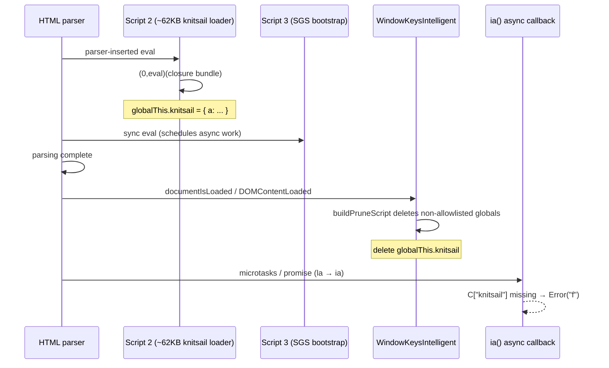

# Google Search Bootstrap Fails Because WindowKeys Prune Deletes `knitsail`

> Long-path prerequisite fix from **Phase 3** of [`google-search-investigation-journey.md`](../captcha/detection/google-search-investigation-journey.md). Necessary for cold-tier bootstrap; **not sufficient** for short-path SERP — see [NID trust tier](./2026-06-29-google-search-nid-trust-tier.md).

## Summary

Velora loaded Google Search with only **three network requests** and a degraded shell: `sg_b_e=Error: f`, no `#rso` results container, title stuck at `"Google Search"`. The inline knitsail closure loader ran successfully during HTML parsing and registered `globalThis.knitsail` as an object — but `WindowKeysIntelligent` deleted it at `DOMContentLoaded` before Google's async bootstrap invoked `ia()`. The root cause is a **lifecycle race** between antidetect global pruning (a spec milestone hook) and vendor-specific deferred JavaScript (promise-driven bootstrap). Adding `knitsail` to the `runtimeAssigned` allowlist restores bootstrap progress: five or more requests, no `sg_b_e` beacon, `sg_ss` token in URL. This fix does not replace session cookie warmup for short-path SERP.

---

## Problem

On `https://www.google.com/search?q=…`, Velora's antidetect profile diverged sharply from Chrome on the **long-path** tier:

| Signal | Chrome (working long or short path) | Velora (broken long path) |
|--------|--------------------------------------|---------------------------|
| Network requests | ~14–18 (after bootstrap) | **3** |
| `globalThis.knitsail` at DCL | object (long path) or N/A (short) | **undefined** |
| `google.sn` | `"web"` when SERP loads | `null` |
| Bootstrap beacon | — | `POST gen_204?cad=sg_b_e&e=Error: f` |
| Inline scripts in DOM | many after bootstrap | 5 only |

Initial hypotheses pointed at missing subresources, TLS fingerprint mismatch, truncated `<script>` bytes, or parser-inserted `eval` failures. All were ruled out with byte-accurate DOM probes and zero `Runtime.exceptionThrown` events during script 2 eval.

The failure was architectural: Velora's fingerprint hardening subsystem (`WindowKeysIntelligent`) runs at `Frame._documentIsLoaded()` — aligned with `DOMContentLoaded` in the loading lifecycle — and deletes globals not present in the captured Chrome `window_keys` baseline. Google's `knitsail` is a **runtime-assigned vendor global** installed by a ~62 KB inline `(0,eval)(…)` bundle. It is not in the 1235-key Chrome snapshot because Chrome's short-path sessions never expose it on hop 1, and even long-path Chrome only has it transiently during bootstrap.

---

## Root Cause

Google's SGS (Search Gateway Services) bootstrap on low-trust hop-1 HTML is a **two-phase inline script chain** with an **async gap** between synchronous parser work and deferred callback execution.

### Sequence (browser architecture)



### Mechanism detail

1. **Script 2** uses `(0,eval)(trustedTypesFactory(T)(…))` to install `p.knitsail` where `p = this||self` (the global object). This runs during `document.readyState === "loading"`.

2. **Script 3** defines `var g='knitsail'` and schedules `ia()` via `Z.then(… la() …)`. The `ia()` function does `var c=C[g]; if (c) { c.a(…) } else b(Error("f"))`. The call is **not** at script 3's synchronous tail — it runs after promise resolution.

3. After all inline scripts finish parsing, Velora calls `Frame._documentIsLoaded()` which installs antidetect intelligence **before** dispatching `DOMContentLoaded`.

4. `WindowKeysIntelligent.buildPruneScript()` iterates `Object.getOwnPropertyNames(globalThis)` and deletes every key not in the Chrome `window_keys` allowlist and not in `runtimeAssigned = {"Fingerprint","Creep"}`.

5. `knitsail` ∉ `chrome-local-huys-macbook-pro-window-keys.json` → **pruned at DCL**.

6. When Google's deferred `ia()` runs, `knitsail` is gone → `Error: f` → `gen_204` error beacon → degraded shell with minimal follow-up network activity.

### Why this is not a parser or network bug

- HTML script text matches saved response byte-for-byte (`diff-script-bytes.mjs`: 62539 chars in DOM).
- `knitsail` is present immediately after script 2 eval (`probe-between-scripts.mjs`).
- `knitsail` survives through script 3 and script 4 (`probe-after-script3.mjs`, `probe-all-checkpoints.mjs`).
- Failure reproduces on **locally served saved HTML** (`probe-local-html.mjs`) — no live network dependency.
- Isolated replay via `Runtime.evaluate` always registers `knitsail` (`isolate-bootstrap.mjs`).

The bug is **antidetect install timing colliding with vendor async bootstrap** — a pattern that will recur for any site assigning globals between sync script end and first microtask/macrotask after DCL.

---

## Investigation

### Ruled-out hypotheses

| Hypothesis | Evidence against |
|------------|------------------|
| Missing external JS/CSS | Google inlines bootstrap; Chrome's extra requests follow **successful** bootstrap |
| HTML script truncation | DOM `document.scripts[2].textContent` length matches saved HTML |
| Parser-inserted eval throws | CDP `Runtime.exceptionThrown`: 0; no eval warn logs for script 2 |
| Microtask deferral prevents registration | `probe-post-eval-globals.mjs`: `knitsail` is object during `loading` |
| Engine cannot run knitsail | `isolate-bootstrap.mjs` replay always registers `knitsail` |

### Key probes (`google-search-debug/scripts/`)

| Script | Finding |
|--------|---------|
| `probe-eval-hook.mjs` | 67 295-byte eval runs during parsing, no errors |
| `probe-between-scripts.mjs` | After script 2: `knitsail` = **object** |
| `probe-after-script3.mjs` | After script 3: `knitsail` = **object** |
| `probe-all-checkpoints.mjs` | After script 4: **object**; at `DOMContentLoaded`: **undefined** |
| `probe-local-html.mjs` | Same failure on local HTML — not network |

### Pinpoint in Velora source

`Frame._documentIsLoaded()` in `src/core/browser/Frame.zig` calls, in order:

1. `WindowKeysIntelligent.installOnDocument()`
2. `NavigatorKeysIntelligent.installOnDocument()`
3. `MathsIntelligent.installOnGlobal()`
4. dispatch `DOMContentLoaded`

`WindowKeysIntelligent.buildPruneScript()` (`src/runtime/profile/WindowKeysIntelligent.zig`):

```javascript
const runtimeAssigned = new Set(["Fingerprint","Creep"]);
// ...
if (!allowed.has(k) && !runtimeAssigned.has(k)) prune.push(k);
// ...
delete globalThis[k];
```

Profile check: `knitsail` ∉ `chrome-local-huys-macbook-pro-window-keys.json` (1235 keys).

### Verification commands

```bash
cd /Users/huydev/Desktop/velora

# Checkpoint timeline
node google-search-debug/scripts/probe-all-checkpoints.mjs

# Local HTML isolation (no network)
node google-search-debug/scripts/probe-local-html.mjs

# Network compare
npm run google:compare -- --query "test"

# Full sorry/bootstrap parity
npm run google:sorry-parity -- --query "test-$(date +%s)"
```

---

## Solution

Add `knitsail` (and later `td` for timing globals) to the `runtimeAssigned` set in both `buildPruneScript` and `buildBatchScript` so page-assigned Google bootstrap globals survive DCL pruning:

```zig
const runtimeAssigned = new Set(["Fingerprint","Creep","knitsail","td"]);
```

### Verification results

| Check | Before fix | After fix |
|-------|------------|-----------|
| `probe-all-checkpoints` @ DCL | `kn: undefined` | `kn: object` |
| `probe-local-html` | `kn: undefined` | `kn: object`, `knA: function` |
| `google:compare` network | 3 | **5+** |
| `sg_b_e` beacon | `Error: f` | **none** (`sg_b_e=-`) |
| Velora final URL | degraded search shell | `sg_ss=*…` token (bootstrap progressed) |

Note: bootstrap progression may still hit `/sorry` on flagged IPs — that is a separate captcha/reputation layer (see grecaptcha style shim note).

### Design principle

`runtimeAssigned` is the correct bucket for **vendor-specific globals** (`knitsail`, `td`, `Fingerprint`, `Creep`) that are not part of a static Chrome `window_keys` capture. The baseline snapshot reflects steady-state enumeration, not transient bootstrap globals.

---

## Lessons Learned

1. **Fingerprint hardening can break real pages.** Window-key pruning at `DOMContentLoaded` overlaps Google's async bootstrap — after sync inline scripts but before promise-driven `ia()`.
2. **`undefined` global ≠ script didn't run.** Always time-slice probes: during parse, after each script, at DCL, after microtask pump.
3. **`runtimeAssigned` is the right extension point** for vendor globals absent from static captures.
4. **Do not infer missing requests mean missing subresources.** Count requests only after confirming bootstrap phase-2 succeeded.
5. **Short-path Chrome never needed this fix** — `knitsail` absent because server served SERP directly. Long-path fixes are conditional (journey Phase 3 verdict).
6. **WindowKeysIntelligent affects more than CreepJS** — same subsystem as [`window-features-opn-hook.md`](../fingerprint/navigator/window-features-opn-hook.md); changes need cross-page regression review.

---

## References

- [`google-search-investigation-journey.md`](../captcha/detection/google-search-investigation-journey.md) — Phase 3 bootstrap narrative
- [`google-search-flow-architecture.md`](../captcha/detection/google-search-flow-architecture.md) — SGS script chain
- Velora: `src/runtime/profile/WindowKeysIntelligent.zig` — prune/batch install
- Velora: `src/core/browser/Frame.zig` — `_documentIsLoaded()`
- Velora: `src/core/browser/ScriptManager.zig` — knitsail `tailHook` / `pumpPostParseTasks`
- Debug harness: `google-search-debug/README.md`
- Saved SERP HTML fixture: `google-search-debug/tmp/trace-velora-*/response.html`

---

## Related Knowledge

- [Google Search NID trust tier](./2026-06-29-google-search-nid-trust-tier.md) — short-path unlock (session cookies)
- [Google Search bootstrap divergence](./2026-06-29-google-search-bootstrap-divergence.md) — long-path symptom catalog
- [Window features `opn` hook](../fingerprint/navigator/window-features-opn-hook.md) — same WindowKeysIntelligent subsystem
- [CreepJS navigator parity](../fingerprint/navigator/creepjs-navigator-parity.md) — antidetect profile install timing
- [grecaptcha HTMLElement.style shim](./2026-06-29-grecaptcha-htmlelement-style-shim.md) — `/sorry` DOM parity (downstream of bootstrap)