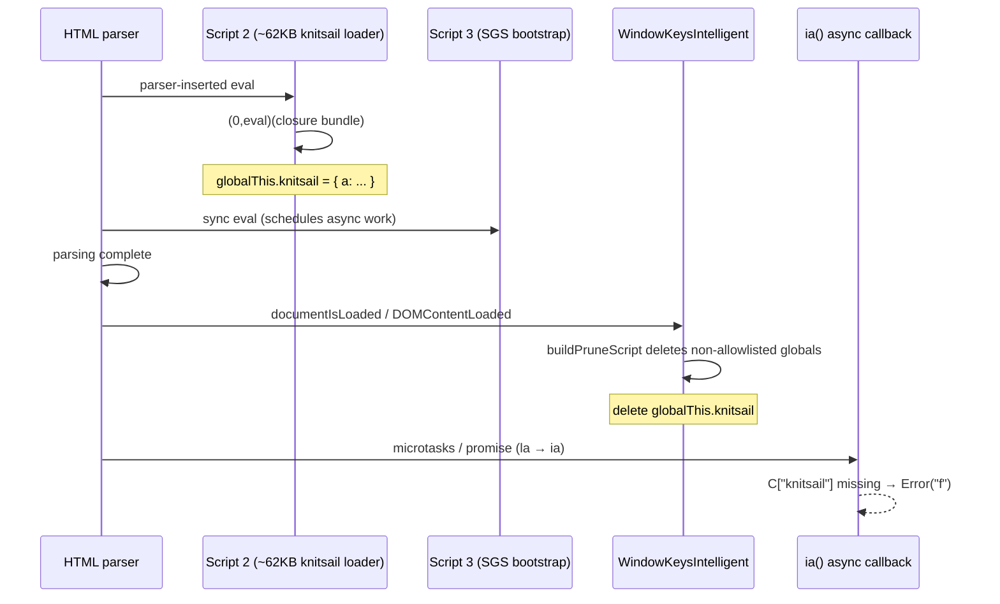

# Google Search Bootstrap Fails Because WindowKeys Prune Deletes `knitsail`

## Summary

Velora loaded Google Search with only **3 network requests** and a degraded shell (`sg_b_e=Error: f`, no `#rso`, title `"Google Search"`). The inline knitsail closure loader ran successfully during HTML parsing, but `WindowKeysIntelligent` deleted `globalThis.knitsail` at `DOMContentLoaded` before Google's async bootstrap called `ia()`. Preserving `knitsail` in the runtime-assigned allowlist restores bootstrap progress (5+ requests, no `sg_b_e`, `sg_ss` token in URL).

---

## Problem

On `https://www.google.com/search`, Velora (antidetect profile) diverged sharply from Chrome:

| Signal | Chrome (working path) | Velora (broken) |
|--------|----------------------|-----------------|
| Network requests | ~14–18 | **3** |
| `globalThis.knitsail` | object | **undefined** |
| `google.sn` | `"web"` (when SERP loads) | `null` |
| Bootstrap beacon | — | `POST gen_204?cad=sg_b_e&e=Error: f` |
| Inline scripts in DOM | many after bootstrap | 5 only |

Initial hypothesis: missing subresources, TLS/network parity, or parser-inserted script eval failure.

---

## Root Cause

Google's SGS bootstrap is a **two-phase inline script chain**:



1. **Script 2** uses `(0,eval)(trustedTypesFactory(T)(...))` to install `p.knitsail` where `p = this||self` (global).
2. **Script 3** defines `var g='knitsail'` and later calls `ia()`, which does `var c=C[g]; if (c) { c.a(...) } else b(Error("f"))`. The `ia()` call is **async** (via `Z.then(... la() ...)`), not at script 3's synchronous tail.
3. After all inline scripts finish, Velora calls `Frame._documentIsLoaded()` → `WindowKeysIntelligent.installOnDocument()`.
4. `buildPruneScript()` deletes every `globalThis` own property **not** in the captured Chrome `window_keys` list and **not** in `runtimeAssigned = {"Fingerprint","Creep"}`.
5. `knitsail` is Google-runtime-specific; it is **not** in the 1235-key Chrome snapshot → **pruned at DCL**.
6. When Google's deferred `ia()` runs, `knitsail` is gone → `Error: f` → degraded shell and minimal follow-up network activity.

This is **not** a V8 eval failure, network/TLS issue, or truncated `<script>` text.

---

## Investigation

### Ruled out

| Hypothesis | Evidence |
|------------|----------|
| Missing external JS/CSS | Google inlines bootstrap; Chrome's extra requests come from **successful** bootstrap + captcha/recaptcha |
| HTML script truncation | `diff-script-bytes.mjs`: DOM `document.scripts[2].textContent` length **62539** matches saved HTML byte-for-byte |
| Parser-inserted eval throws | CDP `Runtime.exceptionThrown`: 0; Velora `eval script` warn logs: none for script 2 |
| Microtask deferral prevents registration | `probe-post-eval-globals.mjs`: `knitsail` is **object** immediately after 67KB eval during `readyState: loading` |
| Engine cannot run knitsail | `isolate-bootstrap.mjs` / `diagnose-navigation.mjs`: replay via `Runtime.evaluate` always registers `knitsail` |

### Key probes (in `google-search-debug/scripts/`)

| Script | Finding |
|--------|---------|
| `probe-eval-hook.mjs` | 67 295-byte eval with `knitsail` runs during parsing (`readyState: loading`), no eval errors |
| `probe-between-scripts.mjs` | After script 2: `knitsail` = **object** |
| `probe-after-script3.mjs` | After script 3: `knitsail` = **object** |
| `probe-all-checkpoints.mjs` | After script 4: **object**; at `DOMContentLoaded`: **undefined** |
| `probe-local-html.mjs` | Same failure on locally served saved HTML → not a live network issue |

### Pinpoint

`Frame._documentIsLoaded()` in `src/core/browser/Frame.zig` calls, in order:

- `WindowKeysIntelligent.installOnDocument()`
- `NavigatorKeysIntelligent.installOnDocument()`
- `MathsIntelligent.installOnGlobal()`
- dispatch `DOMContentLoaded`

`WindowKeysIntelligent.buildPruneScript()` (`src/runtime/profile/WindowKeysIntelligent.zig`):

```javascript
const runtimeAssigned = new Set(["Fingerprint","Creep"]);
// ...
if (!allowed.has(k) && !runtimeAssigned.has(k)) prune.push(k);
// ...
delete globalThis[k];
```

Profile check: `knitsail` ∉ `chrome-local-huys-macbook-pro-window-keys.json` (1235 keys).

---

## Solution

Add `knitsail` to the `runtimeAssigned` set in both `buildPruneScript` and `buildBatchScript` so page-assigned Google bootstrap globals survive DCL pruning:

```zig
const runtimeAssigned = new Set(["Fingerprint","Creep","knitsail"]);
```

### Verification

| Check | Before fix | After fix |
|-------|------------|-----------|
| `probe-all-checkpoints` @ DCL | `kn: undefined` | `kn: object` |
| `probe-local-html` | `kn: undefined` | `kn: object`, `knA: function` |
| `google:compare` network | 3 | **5** |
| `sg_b_e` beacon | `Error: f` | **none** (`sg_b_e=-`) |
| Velora final URL | degraded search shell | `sg_ss=*...` token (bootstrap progressed; may still hit `/sorry` captcha separately) |

---

## Lessons Learned

1. **Fingerprint hardening can break real pages.** Window-key pruning runs at a spec milestone (`DOMContentLoaded`) that overlaps with Google's async bootstrap — after sync inline scripts but before promise-driven `ia()`.
2. **"undefined global" ≠ "script didn't run."** Always time-slice probes: during parse, after each script, at DCL, and after microtask pump.
3. **`runtimeAssigned` is the right bucket** for vendor-specific globals (`knitsail`, `Fingerprint`, `Creep`) that are not part of a static Chrome `window_keys` capture.
4. **Do not assume missing requests mean missing subresources.** Count requests only after confirming bootstrap phase-2 succeeded.

---

## References

- Velora: `src/runtime/profile/WindowKeysIntelligent.zig` — prune/batch install
- Velora: `src/core/browser/Frame.zig` — `_documentIsLoaded()`
- Velora: `src/core/browser/ScriptManager.zig` — Google knitsail `tailHook` / `pumpPostParseTasks`
- Related: `knowledge/fingerprint/navigator/window-features-opn-hook.md`
- Debug harness: `google-search-debug/README.md`, scripts listed above
- Saved SERP HTML fixture: `google-search-debug/tmp/trace-velora-*/response.html`

---

## Related Knowledge

- `knowledge/fingerprint/navigator/window-features-opn-hook.md` — same `WindowKeysIntelligent` subsystem
- `knowledge/fingerprint/navigator/creepjs-navigator-parity.md` — antidetect profile install timing