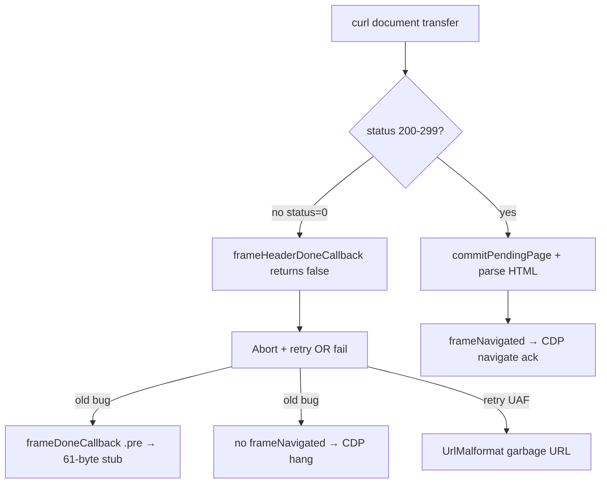

# eBay empty document and CDP Page.navigate hang

## Summary

eBay navigation intermittently failed with a 61-byte stub HTML document, empty title, and `readyState=complete`. Automation harnesses then appeared to hang for 45s because `Page.navigate` never returned a CDP response and `Runtime.evaluate` blocked on the main thread.

The failure chain started in the HTTP document layer: curl sometimes completed in ~280ms with **HTTP status 0** (no valid response). The frame layer still committed the pending page and ran `frameDoneCallback` in parse state `.pre`, installing an empty stub document. CDP `Page.navigate` only completes on `frameNavigated`, so clients waited forever when navigation failed.

A second bug in `retryPendingRootNavigation` made retries worse: it called `discardPendingPage()` before copying `self.url` from the pending frame arena, causing use-after-free and `UrlMalformat` with garbage URLs like `AAAAAAAA...`.

## Problem

- **Symptom:** `document.documentElement.outerHTML.length === 61`, empty title, `readyState === "complete"`.
- **Harness:** `multi-site-report.mjs` reported `HANG` at 45s and `0 bytes` HTML.
- **Logs:** `navigate header bad status status=0`, sometimes three times in rapid succession (retries).
- **CDP:** `Page.navigate` blocked indefinitely; `Runtime.evaluate` also blocked when the page was mid-script-load.

## Root Cause

1. **Transient HTTP status 0** — curl finishes without a valid response code (connection/TLS race or aborted transfer). Not eBay-specific logic; reproducible ~33% of cold navigations in local testing.
2. **Missing header gate (fixed earlier)** — bad status still reached commit / empty-body parse path.
3. **CDP completion only on success (fixed)** — `NavigateOpts.cdp_id` stored but never cleared on failure; added `frame_navigation_failed` event.
4. **Retry UAF (fixed 2026-07-10)** — `retryPendingRootNavigation` read `self.url` from freed pending frame after `discardPendingPage()`.

## Fix

### Frame.zig
- Reject non-2xx (and missing) status in `frameHeaderDoneCallback` before `commitPendingPage`.
- `frameDoneCallback`: treat `.pre` as failure, not stub install; retry or emit CDP failure.
- `retryPendingRootNavigation`: snapshot URL/body/header into `Session.arena` **before** `discardPendingPage()`; track retries on `Session._pending_root_nav_retries` with `NavigateOpts.is_document_retry`.

### CDP
- `Notification.frame_navigation_failed` → `page.zig::frameNavigationFailed` sends JSON error to the stored `cdp_id`.

## Verification

After rebuild (`velora 1.0.0-dev.67+b158aca9`):

| Case | Result |
|------|--------|
| status=0, all retries fail | `Page.navigate` returns CDP error `Abort` in ~380ms (no 45s hang) |
| status=200 | ~385KB HTML, `Page.navigate` ack in ~850–1250ms |
| `retryPendingRootNavigation` | No more `UrlMalformat` / garbage URL |

### 2026-07-10 (session 2) — HTTP/2 + split CDP ack

- **status=0 root cause:** document navigations used **HTTP/3** via curl-impersonate; Chrome HAR shows `http/2.0` for `www.ebay.com`. Switched `resource_type == .document` to **h2**; added `force_fresh_connection` on `is_document_retry`.
- **Page.navigate hang:** `scheduleDeferredFrameNavigated` queued the CDP command ack on the scheduler, but macrotasks did not run while the document body was still downloading. Added `frame_navigate_ack` notification (immediate JSON ack at response headers) and `flushPendingFrameNavigatedObservers()` after body complete for `contextCreated`.
- **Deferred HTML parse:** `Frame.deferDocumentParse` is scheduled after body complete; `HttpClient.pumpCdpMacrotasks()` runs after each transfer when CDP is active. **Still open:** scheduler pumps microtasks but `parse html start` does not log — DOM stays empty (`outerHTML.length === 0`, `readyState === loading`) until follow-up fix.

## Verification (session 2)

| Case | Result |
|------|--------|
| `Page.navigate` | Ack ~900–1100ms (no 15–45s hang) |
| HTTP document | status=200, ~380KB wire body (HAR ~478KB — still ~20% short) |
| `Runtime.evaluate` after 2s | Returns (no execution-context error); `n=0` until parse runs |
| All retries status=0 (h3 era) | Fast `Abort` ~650ms |

### 2026-07-10 (session 3) — CDP interleaving during parse + script eval

- **Root cause (refined):** `Page.navigate` ack is fast (~1s), but `Runtime.evaluate` times out because the main thread stays inside synchronous html5ever parse + parser-inserted blocking scripts for 15–60s+. Inbound CDP was skipped when `tick` returned `.cdp_socket` before draining deferred parse.
- **Fixes:**
  - `Frame.pollCdpDuringLongWork()` + Parser `createElement`/`append` callbacks poll CDP socket.
  - `ScriptManagerBase.evaluateOneScript()` / `evaluateSlice` — one script per scheduler turn after `staticScriptsDone`.
  - `Frame.scheduleDeferredStaticScriptsDone()` — scripts start on next macrotask after parse.
  - `Env.blocksInboundCdp()` — skip reentrant inspector dispatch during `is_evaluating` (avoids V8 deadlock).
  - `Runner.drainDeferredDocumentParse()` — up to 48 parse/script slices per CDP tick, called before returning `.cdp_socket`.
  - `CDP.callInspector` pumps V8 message loop after inspector dispatch.
- **Still open:** ebay ~380KB document parse often does not reach `parse html done` within 60s in local testing; `Runtime.evaluate` still times out at 15s in `ebay-quick.mjs`. Next: profile html5ever/DOM build path on ebay HTML, or chunk parse across macrotasks without breaking streaming parser.

## Follow-ups

- **P0:** Profile why ebay HTML parse blocks >60s (DOM `nodeComplete` / script sync fetch during parse).
- Log curl `CURLINFO_OS_ERRNO` when `getResponseCode() == 0`.
- Compare decoded body size vs HAR (br/zstd, truncation).
- Harness: wait for `Page.domContentEventFired` or poll until `outerHTML.length > 0`; increase evaluate timeout during load.