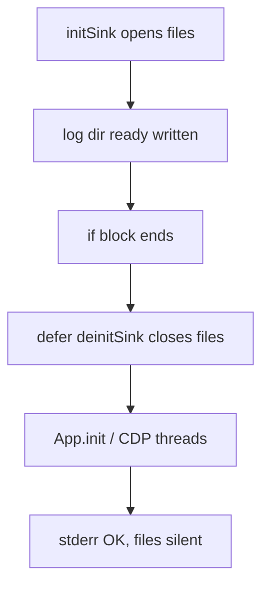

# Structured log sink: defer scope closed files after first line

## Summary

Koko's new per-run file logging (`--log-dir`) appeared to work on stderr but wrote only a single line (`log dir ready`) into `combined.log`. CDP worker threads, navigation logs, and CDP wire traces never reached disk. The root cause was not cross-thread synchronization—it was a Zig `defer` scoped inside an `if` block that called `log.deinitSink()` immediately after the first log, closing all file handles before the server started.

---

## Problem

After implementing structured logging with per-channel files (`js/`, `core/`, `network/`, `protocol/`, `system/`), integration smoke test `scripts/test-log-dir.mjs` reported:

- `combined.log` contained exactly one line
- `protocol/cdp-wire.log` was empty despite `--log-cdp-trace`
- stderr showed thousands of log lines (server, CDP, navigation)

Initial hypothesis: CDP worker threads could not see the global log sink (`active_ready` / mutex visibility). Several mitigations were tried (release stderr lock before file write, atomic ready flag, 64KB format buffer, `file.sync()` per line) without fixing the symptom.

---

## Root Cause

In `src/adapters/cli/main.zig`, `defer log.deinitSink()` was placed **inside** the `if (config.logDir())` block:

```zig
if (config.logDir()) |base_dir| {
    try log.initSink(allocator, ...);
    defer log.deinitSink();  // runs when this block ends
    log.info(.app, "log dir ready", ...);
}
// sink already torn down here
App.init(...);  // server + CDP threads log to closed sink
```

Zig `defer` executes at the end of the **enclosing block**, not at function return. The block ended right after `log dir ready`, so `deinitSink()` closed every file descriptor and cleared `active_ready` before `App.init()` and the CDP connection loop ran.

Stderr logging still worked because it does not depend on the file sink—only the `sink.isActive()` branch in `log()` was skipped for all subsequent messages.



---

## Investigation

| Experiment | Expected | Observed | Verdict |
|------------|----------|----------|---------|
| Compare stderr vs `combined.log` line counts | Similar | stderr ~6000, combined 1 | File sink inactive after boot |
| Check `log file format err` on stderr | None if formatting OK | 0 errors | Not a format/allocator failure |
| Atomic `active_ready` + `getSink()` | Cross-thread visibility | No change | Red herring |
| Move `defer deinitSink()` to `run()` scope | All logs reach files | 100+ combined lines, 17 cdp-wire lines | **Root cause confirmed** |

Probe command:

```bash
cd /Users/huydev/Desktop/koko
node scripts/test-log-dir.mjs
```

---

## Solution

Move `defer log.deinitSink()` outside the `if (config.logDir())` block so it runs when `run()` returns. `deinitSink()` is already a no-op when the sink was never initialized.

With the sink alive for the full process lifetime:

- Main and CDP threads write to channel files and `combined.log`
- `--log-cdp-trace` populates `protocol/cdp-wire.log` via `cdp-wire-in/out` messages
- Navigation sets `$nav_id`, `$frame_id`, `$url` context on frame navigate (see `Frame.zig`)

---

## Lessons Learned

- In Zig, `defer` scope follows block boundaries, not function lifetime. Resource teardown for process-wide subsystems (logging, telemetry) must be deferred at the same scope as the main run loop.
- When stderr shows logs but files do not, check whether the sink was torn down early before investigating thread synchronization.
- Smoke tests that compare stderr line counts to file line counts quickly distinguish "sink inactive" from "cross-thread write failure".

---

## References

- `src/adapters/cli/main.zig` — sink init/defer placement
- `src/support/log.zig` — stderr + file fan-out
- `src/support/log_sink.zig` — per-run folder layout, channel routing
- `scripts/test-log-dir.mjs` — integration smoke test

---

## Related Knowledge

- [`knowledge/bugs/2026-07-10-ebay-empty-document-cdp-navigate-hang.md`](2026-07-10-ebay-empty-document-cdp-navigate-hang.md) — CDP navigation debugging context that motivated structured logs