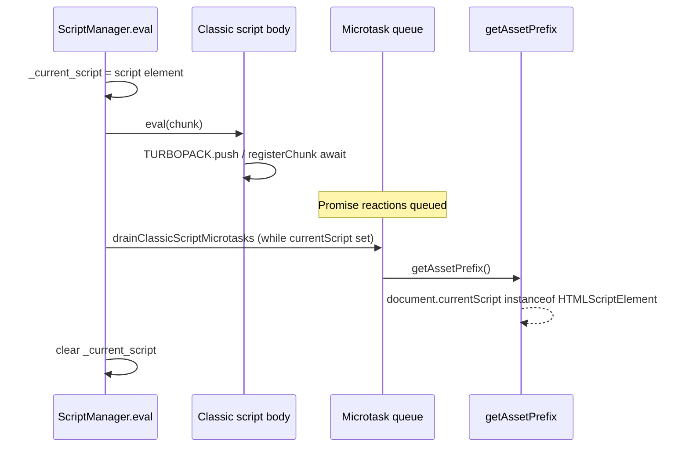

# SPA bootstrap: `document.currentScript` null breaks Next/Turbopack

> **Audience:** Velora engineers fixing SPA / Next.js client bootstrap.  
> **Sites:** Next App Router + Turbopack (e.g. `dovihome-sale.vercel.app`), and any classic-script bundle that reads `document.currentScript` during evaluation.

## Summary

Unauthenticated Next App Router pages that should client-redirect to `/login` stayed on the sale URL with a spinner (or empty body) under Velora. The hard failure was:

```text
InvariantError: Expected document.currentScript to be a <script> element. Received null instead
```

from Next’s `getAssetPrefix` (chunk `0mstyq…`, module factory for `appBootstrap`). That path is not server 302: the document is HTTP 200, then client JS must bootstrap Turbopack, hydrate, and router-replace to `/login`.

Root causes in Velora core:

1. **`Document.currentScript` was missing on `Document.prototype`** — only `HTMLDocument` exposed the real accessor, while `creepjs_compat_shim.js` installed a permanent `get: () => null` on `Document.prototype` whenever the key was absent. HTML puts `currentScript` on **Document**.
2. **V8 microtasks are `kExplicit`** — classic script evaluation must drain promise reactions **while** `_current_script` is still set. Turbopack’s `async registerChunk` + Next `getAssetPrefix` read `document.currentScript` on that same turn. Without an explicit same-turn checkpoint, continuations saw `null`.

Fixes (core):

- Move `currentScript` to `Document.JsApi` / `Document.getCurrentScript`.
- Stop stubbing `Document.prototype.currentScript` in the CreepJS compat shim.
- Add `Frame.drainClassicScriptMicrotasks()` and call it around classic `Script.eval` while `_current_script` is set.

After the fix, instrumentation shows `document.currentScript` is a real `HTMLScriptElement` during every Next chunk `TURBOPACK.push`, and the CreepJS null stub is gone. The unhandled `InvariantError` for `currentScript` no longer appears; login RSC (`/login?_rsc=…`) and login chunks load. Full URL flip to `/login` can still stall on a later soft-nav path (follow-up).

---

## Problem

| Symptom | Chrome | Velora (before) |
|---------|--------|-----------------|
| `GET /m/sale` | 200, then client → `/login` | 200, URL stuck, spinner / empty body |
| Console | — | `InvariantError` … `document.currentScript` … `null` |
| `window.next` | set by App Router bootstrap | missing / incomplete |

Affected class of sites: any SPA that uses **classic** scripts and reads `document.currentScript` during evaluation (Next 16 Turbopack runtime is the concrete repro).

---

## Root Cause

### Spec / IDL placement

HTML: `document.currentScript` is on the **Document** interface. Chrome exposes it on `Document.prototype`. Velora only wired the accessor on `HTMLDocument`, so CreepJS feature-fill did:

```js
// creepjs_compat_shim.js (before fix)
def(Document.prototype, "currentScript", { get: function () { return null; }, ... });
// def() only defines if key is not already `in` the prototype
```

Depending on lookup and property reordering, SPA code that expects a Document-level getter could observe `null` even when Zig had `_current_script` set.

### Explicit microtasks vs Turbopack

Velora isolates use `kExplicit` microtasks. Classic `Script.eval` sets `document._current_script`, runs the body, then must **PerformCheckpoint** before clearing it. Turbopack does:

```js
TURBOPACK.push([document.currentScript, factories...]); // capture at push
// runtime later:
async registerChunk(...) {
  await Promise.all(otherChunks.map(...));
  // then instantiate runtime modules → appBootstrap → getAssetPrefix()
}
function getAssetPrefix() {
  const e = document.currentScript;
  if (!(e instanceof HTMLScriptElement)) throw InvariantError(...);
  // ...
}
```

`getAssetPrefix` uses the **live** `document.currentScript`, not the value captured at `push`. Chrome’s same-turn microtask checkpoint keeps the evaluating script visible; Velora had to match that under `kExplicit`.



### Related (already in tree)

Reentrant libcurl (`RecursiveApiCall`) when SPA injects scripts during another script’s HTTP `doneCallback` was fixed earlier (`_force_async` default, demote blocking fetch, `scheduleDeferredEvaluate`, `canEvalScriptsFromHttpCallback`). That unblocked chunk download; `currentScript` was the next bootstrap gate.

---

## Investigation

| Experiment | Result |
|------------|--------|
| Fetch `/m/sale` headers | HTTP 200, no 302 — redirect is client-side |
| Extract `0mstyq…` / turbopack runtime | `getAssetPrefix` + `TURBOPACK.push([document.currentScript,…])` |
| Local `createElement('script')` | `instanceof HTMLScriptElement` true after Document-level fix |
| Hook `TURBOPACK` setter + `Array.push` | `cs: true` / correct `csSrc` on every Next chunk push after fix |
| Runtime install | `TURBOPACK` briefly becomes `{ push }`; no more currentScript Invariant |
| Soft nav | `fetch /login?_rsc=…` + login chunk execute; full `/login` href may still lag |

Probes (repo): `scripts/cdp-dovi-currentscript-probe.mjs`, `scripts/cdp-dovi-auth-probe.mjs`, `scripts/cdp-dovi-navcheck.mjs`.

---

## Solution

### Durable core changes

1. **`Document.getCurrentScript` + `Document.JsApi.currentScript`**  
   (`src/core/dom/Document.zig`) — IDL-correct placement; removes need for HTMLDocument-only accessor.

2. **Remove CreepJS null stub for `currentScript`**  
   (`src/core/js/creepjs_compat_shim.js`) — do not mask a live Document API.

3. **`Frame.drainClassicScriptMicrotasks`**  
   (`src/core/browser/Frame.zig`) — Fp-style checkpoint loop while classic scripts evaluate (works even if realm is still `.initializing` for strict `canEnterJs` gates).

4. **Call that drain from classic `Script.eval`**  
   (`src/core/browser/ScriptManagerBase.zig`) — after body eval, after load callback, and after same-turn pumps when still classic.

5. **Remove `HTMLDocument.currentScript`**  
   Inherited from Document; avoids two competing definitions.

### Follow-up: antidetect window prune deleted SPA globals

After `currentScript` was fixed, instrumentation showed `window.next` set with
`router` / `turbopack`, then **removed ~50–100ms later** (`Object.getOwnPropertyDescriptor(window,"next")` gone). Cause:

`WindowKeysIntelligent` prune (antidetect profile) deleted every `globalThis` key
not in the Chrome window-keys allowlist and not in a tiny `runtimeAssigned` set
(`Fingerprint`, `Creep`, `knitsail`, `td`). **`next` and `TURBOPACK` were deleted**,
killing App Router mid-bootstrap and leaving the spinner (or empty body).

**Fix:** expand `runtimeAssigned` in `src/runtime/profile/WindowKeysIntelligent.zig`
to keep SPA runtimes: `next`, `TURBOPACK`, `TURBOPACK_NEXT_CHUNK_URLS`, React/Vue/Nuxt/Angular markers, etc.

### Remaining parity note

With both fixes, Velora keeps `window.next` + router, fetches `/login?_rsc=…`, and
renders login inputs (`input[type=password]`). Soft-nav may still keep the address
bar on `/m/sale` in some runs while the login UI is shown — separate from the
prune / currentScript killers.

---

## Lessons Learned

- **IDL surface matters for shims:** stubs on `Document.prototype` must not cover live HTML APIs that SPAs depend on; prefer defining the real accessor on Document first so `def()` no-ops.
- **`kExplicit` microtasks are a product contract:** any host feature that browsers run as “same turn as script” (including promise reactions from that script) must checkpoint before clearing `document.currentScript`.
- **SPA auth is often client-only:** fixing HTTP/script loading is necessary but not sufficient; assert bootstrap invariants (`currentScript`, `window.next`, history) with CDP hooks before chasing server redirects.
- **Probe with hooks:** setter/push instrumentation on `TURBOPACK` is more reliable than post-hoc `typeof window.next` alone when soft-nav mutates globals.
