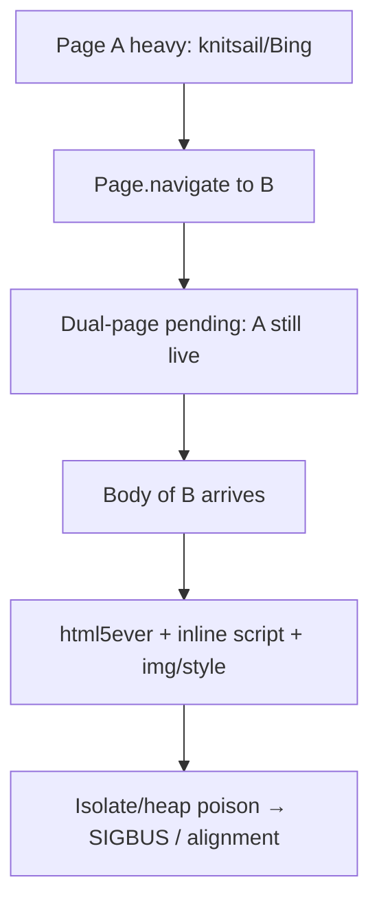

# Re-nav crash after heavy pages: clean-slate root navigate + parse-time resource defer

> **Date:** 2026-07-15 · **Area:** `Session`, `Frame`, `ScriptManager`, `HttpClient` · **Status:** Fixed (address_bar / form clean-slate)

## Summary

Sequential CDP navigations after **Google Search (knitsail)** or **Bing** crashed Velora (`SIGABRT` / `incorrect alignment` / `SIGBUS`). Cold loads of the same targets (Bing, Wikipedia, DuckDuckGo) worked. Bench harnesses then reported cascade `Transport closed` after the first hang.

Root cause was **dual-page pending navigation** keeping a heavy page’s V8 context alive until the next document’s response headers, combined with **eval and resource side-effects mid-html5ever** on the next document. Fix: clean-slate tear-down for address-bar/form root navigations; defer non-critical parser resources and queue inline scripts until after HTML parse.

## Symptoms

| Sequence | Before | After |
|----------|--------|-------|
| Cold `bing.com` | OK | OK |
| `example.com` → `bing.com` | OK | OK |
| `google.com/search?q=…` → `bing.com` | crash mid-parse | OK DCL |
| `bing.com` → `wikipedia.org` | crash | OK DCL |
| `google` → `search` → `bing` → `wiki` → `ddg` → `en.wiki` | crash after search | **all DCL** |

Crash stacks (ReleaseSafe / Debug):

- `StyleSheetList.add` → ArrayList grow (SIGSEGV)
- Zig panic `reason: incorrect alignment` (`source: global`)
- Later `Bus error` on `data:image/png` intercept after parse start

## Root cause



1. **Pending dual-page** (`initiateRootNavigation` keeps active page until headers) left knitsail/Bing V8 contexts running timers and residual work while the next document was allocated and parsed.
2. **Parser hot path** ran blocking inline scripts, `style` CSSOM registration, and `img`/`data:` loads **on the html5ever stack**. After a poisoned isolate that path was unreliable.
3. **Deferred HTML parse pumped from `frameDoneCallback`** (still inside curl transfer callbacks) compounded reentrancy for large docs.

## Fix (architecture)

### 1. Clean-slate root navigate (`Session.initiateRootNavigation`)

For `NavigateReason.address_bar` and `.form`:

1. `abortOutgoingSubresources` on the old frame  
2. `suppressScheduler` + `waitForBackgroundTasks`  
3. `tearDownActivePage` (destroy old V8 + arenas **before** the next hop)  
4. `installNewActivePage` + `navigate` as **active** (no pending dual-page)

In-page `.script` navigations still use pending dual-page so SPA hops can keep the old realm briefly.

### 2. Parse-time resource policy (`Frame.nodeIsReady` + `ScriptManager.addFromElement`)

During main-document html5ever (`_document_parse_active`):

- **Scripts:** still registered, but **inline bodies are queued as defer** (no eval on the parser stack).  
- **Style / link / img:** skipped; style marks StyleManager dirty only.  
- **Post-parse:** `activateDeferredParserResources()` walks the tree and activates style/link/img; `staticScriptsDone()` drains deferred scripts → DCL.

### 3. Deferred document parse timing (`Frame.frameDoneCallback` / `HttpClient`)

- Large HTML: **schedule only** from `frameDoneCallback` — do **not** `pumpDeferredDocumentParse` inside transfer callbacks.  
- `pumpDeferredDocumentParse` refuses while `inTransferCallback()`.  
- Runner drains parse after `tick()` returns.  
- Inline parse threshold raised to **256 KiB** so Bing-class HTML uses the same leaveTransfer lifecycle as SERP.

### 4. Style registration hardening

`styleAddedCallback` skips CSSOM allocation mid-document-parse; errors on dynamic insert are logged without aborting the tree.

## Verification

```bash
cd /Users/huydev/Desktop/velora && zig build -Doptimize=ReleaseSafe

# CDP multi-nav (was crash after search)
node /tmp/velora-probe-fails.mjs \
  "https://www.google.com/" \
  "https://www.google.com/search?q=lightpanda" \
  "https://www.bing.com/" \
  "https://www.wikipedia.org/" \
  "https://duckduckgo.com/" \
  "https://en.wikipedia.org/wiki/Main_Page"
# Expect: each Page.navigate OK + Page.domContentEventFired; no SIGABRT

cd /Users/huydev/Desktop/velora-run && LIMIT=15 node test-100-urls.mjs
```

## Trade-offs / follow-ups

- Clean-slate address-bar nav means **Runtime.evaluate against the old page is invalid once the next navigate starts** (Chrome still shows the old document until commit; we destroy earlier). Acceptable for CDP goto benches; SPA `location` hops still use pending.  
- Occasional `"Cannot find default execution context"` on evaluate immediately after clean-slate — CDP should wait for the new context after `frame_created` (minor race).  
- Queuing all inline scripts to post-parse changes classic HTML blocking-script interleaving; watch sites that depend on mid-parse `document.write` / sync DOM mutation.  
- Dual-page pending remains valuable for script-driven navigations; only address_bar/form force clean-slate.

## Related

- `knowledge/bugs/2026-07-15-renav-parse-isconnected-uaf.md` — isConnected walk during parse  
- `knowledge/bugs/2026-07-14-renavigate-cdp-reentrant-race.md` — CDP reentrancy during commit  
- `knowledge/bugs/2026-07-15-bench-90-url-lifecycle-cdp.md` — bench DCL partial work  
