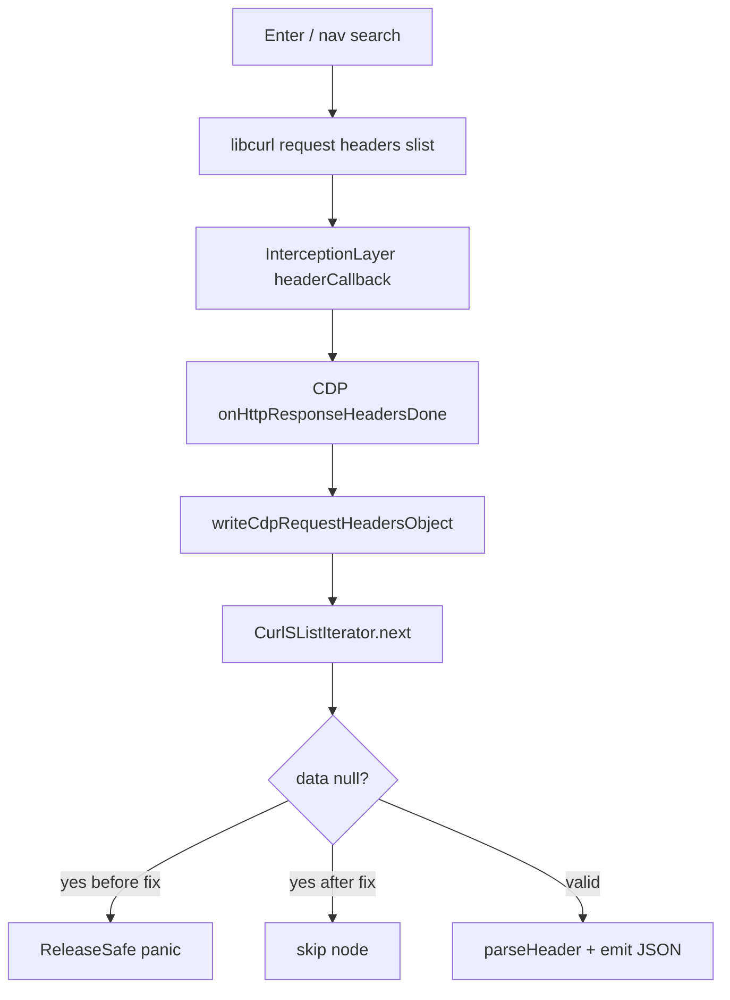

# curl_slist null `data` panics CDP request-header serialization

> **Audience:** Koko engineers working on HTTP/CDP, Google Search cold-path, and libcurl header lists.  
> **Date:** 2026-07-18 · **Area:** `runtime/network/http.zig` + CDP `Network` · **Status:** Fixed

## Summary

Cold Google Search from a blank profile (home → type query → Enter, or knitsail hop) could **abort the process** in `ReleaseSafe` while CDP was emitting network events. Stack traces pointed at `CurlSListIterator.next` casting a **null** `curl_slist.data` to `[*:0]const u8` (`cast causes pointer to be null`). Older stripped binaries surfaced the same class of bug as `attempt to use null value` (CacheLayer `_conn.?` on CLI `sg_ss` hops — fixed earlier).

The fix skips null/empty/malformed slist nodes when iterating request headers so CDP serialization cannot panic. After the fix, empty-profile Search survives the knitsail/`sg_ss` path (often ending on `/sorry` for IP/rate reasons — separate from the crash).

---

## Problem

### Symptoms

| Build | Symptom |
|-------|---------|
| `ReleaseSafe` (unstripped) | `reason: cast causes pointer to be null` · SIGABRT |
| `ReleaseSafe` (stripped) | `reason: attempt to use null value` / “debug info stripped” |
| Debug (poison) | occasional `Segmentation fault at address 0xaaaaaaaaaaaaaaaa` |

Repro path that was reliable on ReleaseSafe:

1. Empty profile, no cookie jar.
2. Navigate `https://www.google.com/?hl=en`.
3. Focus search box, type `koko`, press Enter (CDP `Input.dispatchKeyEvent`).
4. Process dies during navigation / response-header handling while Network domain is enabled.

Direct cold `/search?q=…` often reached knitsail then `/sorry` **without** this panic once CacheLayer `_conn` null was already handled; the home→Enter path still hit the slist cast.

### Why it mattered

- Blank-profile Google Search could not be debugged end-to-end: the engine died before cookies or SERP tier could be classified.
- Human-like automation (`run-human-search.mjs`) reported hard timeout after SIGABRT, masking antibot vs engine bugs.

---

## Root Cause

CDP `Network` serializes request headers via:

```
writeCdpRequestHeadersObject → request.params.headers.iterator() → CurlSListIterator.next
```

`CurlSListIterator` did:

```zig
return Headers.parseHeader(std.mem.span(@as([*:0]const u8, @ptrCast(h.*.data))));
```

`curl_slist.data` is a C pointer and **may be null** for some nodes. Zig `ReleaseSafe` rejects casting a null C pointer to a non-optional sentinel pointer (`[*:0]const u8`) with **“cast causes pointer to be null”**.



Related prior fix (not this stack, same product failure mode):

- [sg_ss CacheLayer null `_conn`](./2026-07-16-sg-ss-curl-cli-cachelayer-null-conn.md) — CLI document hops never attach a Connection.

---

## Solution

In `src/runtime/network/http.zig`:

1. **`CurlSListIterator.next`** — loop over nodes; skip null `data`, empty strings, and lines that fail `parseHeader` instead of panicking or stopping the whole iterator.
2. **`insertAfterName`** — same null-`data` guard before spanning.
3. **`CurlHeaderIterator.next`** — skip libcurl header entries with null name/value (defensive).

No change to Google-specific JS or cookie logic. Crash vs `/sorry` is now distinguishable.

---

## Verification

```bash
cd /Users/huydev/Desktop/koko
zig build -Doptimize=ReleaseSafe -Dstrip=false

# Repro: empty profile home → type → Enter (must not abort)
# Expect: process alive; page may be knitsail /sorry / webhp depending on IP
```

Post-fix (2026-07-18):

| Case | Before | After |
|------|--------|-------|
| home + Enter + Network.enable | SIGABRT `cast causes pointer to be null` | **no crash** (observed webhp settle on hot IP) |
| direct `/search?q=koko` empty | sometimes crash / knitsail | **no crash** → knitsail → `/sorry` |
| mature NID jar | SERP | SERP (unchanged) |

---

## Related

- [sg_ss CacheLayer null conn](./2026-07-16-sg-ss-curl-cli-cachelayer-null-conn.md)
- [Knitsail DCL during parse](./2026-07-15-google-knitsail-dcl-during-parse.md)
- Lab: `code-check/tmp/knitsail-crash-repro/`
