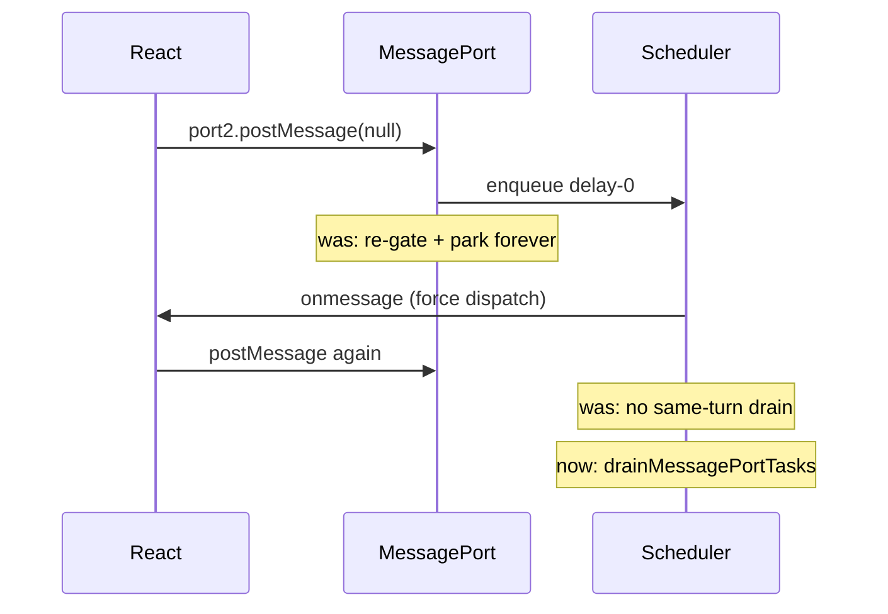

# MessagePort delivery broke React 18 MessageChannel scheduling (FP playground CSR)

> **Audience:** Velora engineers debugging silent SPA/CSR hangs (Next App Router, Fingerprint playground).  
> **Sites:** `demo.fingerprint.com/playground` (and any React 18+ app using `MessageChannel` as host scheduler).

## Summary

Chrome reaches **Your Visitor ID** on the Fingerprint playground in ~5s. Velora stayed on the BAILOUT shell (`bodyLen≈248`, no agent `/web/v4` or identify POST).

A/B network showed Chrome completes agent pipeline (`web/v4` → `/e?` → identify POST → `/api/event`); Velora never requested agent URLs.

Root cause in the engine (not agent-specific): **`MessagePort` async delivery re-applied sync reentrancy gates and failed to drain chained `postMessage` tasks**, so React 18’s host scheduler could not run. Local fixtures proved MessageChannel callbacks never fired; Chrome did.

Fixes in `MessagePort.zig` restore React-style chains (`work1…work8`). **Visitor ID on the live playground is still not shown** after this fix alone — Next CSR remains incomplete (no JS errors, still no agent fetch). MessagePort was a necessary blocker; further CSR/hydration work remains.

## Problem

| Check | Chrome | Velora (before) |
|-------|--------|-----------------|
| Your Visitor ID | yes (~5s) | no |
| Agent `…/web/v4/…?ci=jsl` | 200 | never requested |
| Identify POST | 200 | never |
| MessageChannel fixture | fires | **never fired** (`fired:0`) |
| React-like chain (8 posts) | 8 | **0–2** |

## Root Cause

1. **Sync path** correctly deferred delivery when `is_evaluating` / `call_depth>0` / V8 stack (avoids stripe.com `V8_Fatal`).
2. **Scheduled `PostMessageCallback`** called the same gated `dispatchMessageNow`. If still gated, it parked into `_pending_deliveries` **without a reliable reschedule**.
3. **Chained posts** from inside `onmessage` (React pattern: `port2.postMessage(null)` to schedule more work) were enqueued but **not drained in the same turn**, so the scheduler stopped after 1–2 callbacks.



## Solution

In `src/core/webapi/MessagePort.zig`:

1. **`dispatchMessageForced`** — deliver from the scheduled task without re-applying sync-only gates.
2. **`PostMessageCallback.run`** always force-dispatches, then **`drainMessagePortTasks`** (up to 64 ready tasks + microtasks) so React host-callback chains complete in one turn.
3. **`flushPendingDeliveries`** prefers forced delivery when not on the V8 stack; **`scheduleDeferredFlush`** retries parked deliveries.

Verified fixtures:

```bash
# simple onmessage
# title: fired:1 got:true

# React 18 host callback chain (8 posts)
# title: count:8 done:true
```

## Remaining (playground Visitor ID)

After MessagePort fix:

- Local MC fixtures: **pass**
- Live playground: still `bodyLen≈248`, BAILOUT template present, **zero** agent network, **zero** page JS errors
- CDP `MessageChannel` under `Runtime.evaluate(awaitPromise)` still under-drains (evaluate path pumps less than fetch macrotask loop)

Next investigations (not this fix):

- Why Next App Router never leaves BAILOUT despite scripts executing and `window.next` present
- Whether CSS non-fetch (link only `queueLoad`) interacts with Next readiness
- Agent pipeline once CSR mounts (`iframe` / identify)

## Lessons

- **React 18 scheduling is MessageChannel-shaped** — if port delivery is wrong, apps look “fine” (no exceptions) but never run effects.
- **Sync reentrancy gates must not apply to already-queued tasks.**
- **Chained port posts need same-turn drain** to match Chrome.
- Compare with Chrome network early: missing agent URL means CSR/scheduler, not identify alone.
