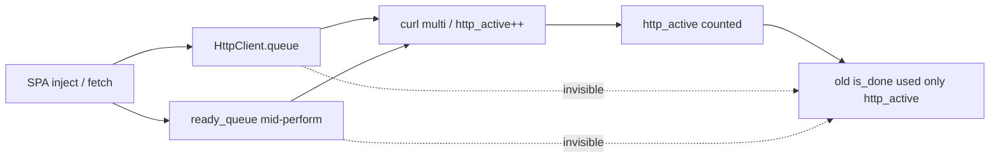

# Runner `.done` ignored HTTP queues (SPA/JS pages incomplete)

> **Audience:** Velora engineers fixing incomplete HTML dumps on JS-heavy SPAs (Nike, Next/App Router, feed walls).  
> **Sites:** `nike.com` homepage (shell + nav OK, product wall thin), any SPA that parks subresource fetches on `queue` / `ready_queue`.

## Summary

CLI/MCP `wait_until=done` and CDP `networkIdle` treated “no `http_active`” as network quiet. Transfers still sitting on Velora’s request **queue**, **ready_queue** (promoted only after `curl_multi_perform` unwinds), **sync_easy_queue**, or **deferred_delivery** were invisible. Runner could resolve `.done` in a brief quiet gap *before* SPA post-load fetches started or while scripts were complete-but-unevaluated.

Lightpanda’s Runner defines:

```text
network_idle = activity==0 AND pending_queue empty AND ready_queue empty
is_done      = no macrotasks AND network_idle
```

Velora now mirrors that model (plus script-manager pending work) and walks child frames for idle lifecycle notifications.

After the fix, Nike homepage dump grew ~894KB → ~1.08MB, more images and carousel DOM, while stock Lightpanda `fetch` on the same URL still produced a near-empty ~10KB document. Product PDP `/t/` links remain sparse — residual content is still a product-API/hydration issue, not only wait timing.

---

## Problem

| Symptom | Before | After wait/queue gate |
|---------|--------|------------------------|
| Nike `fetch --dump html` | ~894KB, 19 ``, 164 `/w/` | ~1.08MB, 45 ``, 175 `/w/` |
| Unique `/t/` product links | 0 | 0 (still) |
| Lightpanda same URL | — | ~10KB shell (worse) |

Operators assumed “wait longer” would fix SPA dumps. Probes with 25s CDP polling still showed **zero product cards** when hydration never ran; short waits also dumped mid-queue. Two failure modes:

1. **False idle** — `http_active==0` while work lived only on queues.
2. **False done** — network quiet and no macrotasks while `evaluate_pending` / ready scripts still needed `ScriptManager.evaluate()`.

---

## Root Cause



- **`http_active`** increments only when a connection is tracked into the multi (or a chrome transport job starts).
- Mid-callback SPA work uses `queue` / `ready_queue` (see `HttpClient.process` / `trackConn`) so libcurl is not re-entered — correct, but idle must count those lists.
- Lightpanda also counts **`dispatch_count`** (buffered completed callbacks). Velora delivers more of that path synchronously in `processMessages`; the important shared gap was **queued-not-yet-active** transfers.
- **`.done` fall-through** in `Runner._tick` never computed an explicit `is_done`; it only checked `http_active/ws/rtc`, missing queues and pending script evaluation.

---

## Solution

Surgical ports from Lightpanda patterns (not a full HttpClient rewrite):

1. **`HttpClient.hasQueuedHttpWork` / `totalHttpActivity` / `isNetworkIdle`**  
   Queues + intercept + active HTTP/WS/RTC.
2. **`Runner._tick` (`.complete`)**  
   `is_done = no macrotasks && isNetworkIdle && !hasPendingJsWork`; wait goals use `met || is_done` like LP; poll faster while HTTP queued; `ms_to_wait=0` while scripts pending.
3. **`ScriptManagerBase.hasPendingJsWork`**  
   `evaluate_pending`, deferred evaluate, ready/async/defer work, incomplete lifecycle scripts.
4. **`Frame.checkIdleNotifications`**  
   Root + child frames (CDP lifecycle parity).
5. **CDP `Page.setLifecycleEventsEnabled`**  
   Uses `totalHttpActivity()` so enable mid-flight does not fire `networkIdle` while queues hold work.

Not ported (large / Nike not improved by LP): Lightpanda `dispatch_queue` + `gated_queue` + `blocking_requests` map.

---

## Verification

```bash
cd /Users/huydev/Desktop/velora
zig build
./zig-out/bin/velora fetch --dump html --wait_ms 30000 --wait_until done \
  --browser-profile chrome-local-huys-macbook-pro https://www.nike.com/ \
  > code-check/tmp/nike-export/page.html
# expect ~1MB+, richer img/carousel than pre-fix ~894KB shell
```

| Check | Result |
|-------|--------|
| `zig build check` | pass |
| Nike HTML size | 894KB → 1.08MB |
| Lightpanda Nike dump | ~10KB (not a better reference for this URL) |

---

## Lessons

- **Idle must include “about to start” work** (queues), not only in-flight multi handles.
- **`.done` should be explicit** (`is_done`), not a fall-through that only looks at counters that lag the real pipeline.
- **Script evaluate pending is part of “not done”** for SPA chunks that finished downloading but have not run.
- Learning from Lightpanda is **pattern-level** (queue gates + is_done). Velora already has stronger script reentrancy; do not drop `canEval` when porting.
- Nike product walls may still need API/fingerprint work beyond wait — longer wait alone was already ruled out earlier.
