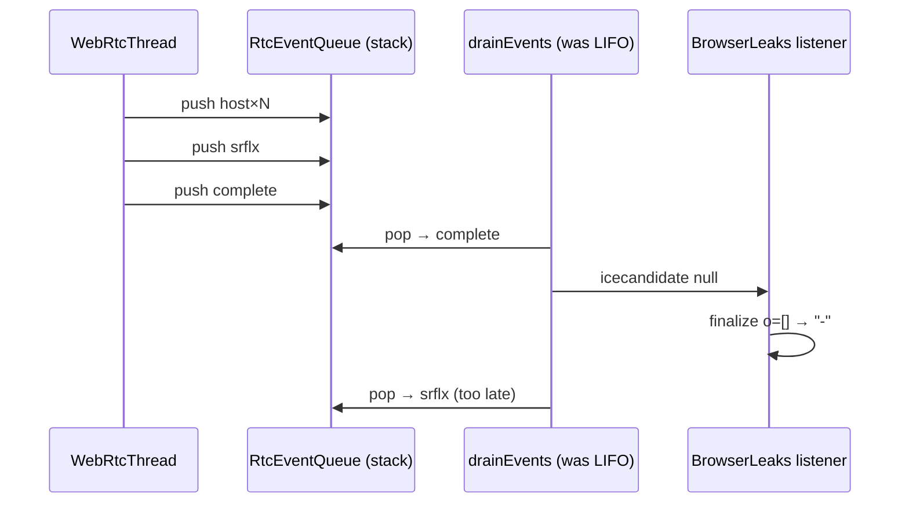

# BrowserLeaks WebRTC: ICE Event LIFO Drain + MediaDeviceInfo

> **Date:** 2026-07-21 · **Area:** WebRTC, ICE, BrowserLeaks, MediaDevices · **Status:** Verified (ICE harness + page UI 3/3)

## Summary

`browserleaks.com/webrtc` intermittently showed **Local IP / Public IP as `-`**, empty SDP candidate lines, and “No Leak”, even though the native STUN path logged `STUN srflx candidate` with the real public IPv4. Root cause: `RTCPeerConnection.drainEvents` used `RtcEventQueue.pop()` (**LIFO**). When STUN completed in one batch, **`ice_gathering_complete` was dispatched before host/srflx**, so BrowserLeaks’ `icecandidate` listener finalized with an empty IP list and closed the PC.

After FIFO drain, plus macrotask RTC pumping, `MediaDeviceInfo` instances, and small ICE polish, the site reliably shows Local IP (RFC1918 host), Public IP including **srflx**, SDP `a=candidate:… typ srflx`, and Media Devices support.

---

## Problem

### Symptoms on BrowserLeaks WebRTC

| Field | Broken | Fixed |
|-------|--------|-------|
| Local IP Address | `-` (intermittent) | `192.168.x.x` |
| Public IP Address | `-` or host IPv6 only | includes STUN mapped IPv4 |
| SDP Log | offer only, `c=IN IP4 0.0.0.0`, **0** `a=candidate` lines | host + srflx candidates patched |
| RTC support | ✔ True (always) | ✔ True |
| Media Devices API | ✔ True but empty kind/deviceId | real `MediaDeviceInfo` fields |

Native logs already proved STUN worked:

```text
$scope=webrtc $msg="STUN binding request sent"
$scope=webrtc $msg="STUN srflx candidate" addr=42.113.185.216:…
```

So the network path was fine; **JS never saw candidates in order** (or at all before finalize).

### Why it mattered

BrowserLeaks is a common antidetect / leak-check surface. Empty Local/Public rows look like broken WebRTC; intermittent success looked like flaky networking rather than a scheduler bug.

---

## Root Cause

### 1. LIFO event drain (primary)

`RtcEventQueue` is an **atomic stack** (producers prepend). Docs say consumers should `drainAll()` and reverse to FIFO. `RTCPeerConnection.drainEvents` instead looped `pop()`:

```text
Network thread push order:  host0 → host1 → host2 → host3 → srflx → complete
JS pop() order (LIFO):     complete → srflx → host3 → … → host0
```

BrowserLeaks does:

```js
pc.addEventListener("icecandidate", (e) => {
  if (e.candidate) collect(e.candidate.candidate);
  if (e.candidate == null) finalize(); // close PC, fill DOM
});
```

If `complete` arrives first → **finalize with empty list** → Local/Public `-`.

Race: if a drain ran **before** STUN finished, only hosts were in the queue (LIFO among hosts still OK) → intermittent green UI. Once STUN completed in the same batch as hosts, UI went red.



### 2. CDP await / macrotask starve

ICE candidates land on the network thread; JS only sees them when `Frame.drainRtcEvents` runs. CDP `Runtime.evaluate` paths that only spin promises (or idle pages that never re-enter the full Runner wait loop) could delay drain. Fix: call `drainAllRtcEvents` after `runMacrotasks` / `runMacrotasksCdpSlice`.

### 3. MediaDeviceInfo `empty_with_no_proto`

`enumerateDevices` was switched to `MediaDeviceInfo` instances, but `empty_with_no_proto` makes `fromJS` always return `&.{}` — every accessor returned empty strings. BrowserLeaks then could not read `kind` / `deviceId`. Fix: **remove** `empty_with_no_proto` so TaggedOpaque stores the real instance; register `MediaDeviceInfo` in `navigator_extras.registerTypes`.

### 4. Secondary polish

- Prefer family-matched host as srflx `raddr` (IPv4 mapped must not cite IPv6 base).
- Do not demote `iceGatheringState` from `complete` → `gathering` on a late candidate event.
- Accept legacy singular `url` as well as `urls` on `iceServers`.

---

## Investigation

| Experiment | Expected | Observed | Verdict |
|------------|----------|----------|---------|
| ICE harness (`onicecandidate`) | host + srflx | host + srflx always | STUN OK |
| `addEventListener` vs `onicecandidate` | both fire | both fire (5+1) | EventTarget OK |
| BrowserLeaks page ×3 before FIFO fix | stable Local/Public | 1/3 good, 2/3 `-` | race |
| Candidate order in harness array | hosts then srflx | **srflx first** | LIFO smoking gun |
| Page ×3 after FIFO fix | stable | 3/3 Local + srflx in SDP | fixed |

Probe (durable):

```bash
cd /Users/huydev/Desktop/velora
zig build -Doptimize=ReleaseSafe
node scripts/cdp-browserleaks-webrtc-probe.mjs --profile chrome-local-huys-macbook-pro --max-sec 20
```

Artifacts: `code-check/tmp/browserleaks-webrtc/{REPORT,ice,page}.json`.

---

## Solution

| File | Change |
|------|--------|
| `src/runtime/network/RtcEventQueue.zig` | `takeAll()` — atomic detach of stack |
| `src/core/webapi/net/rtc/RTCPeerConnection.zig` | `drainEvents`: reverse stack → FIFO dispatch; don’t demote complete→gathering |
| `src/core/browser/Browser.zig` | `drainAllRtcEvents` after macrotask slices |
| `src/core/webapi/navigator_extras.zig` | real `MediaDeviceInfo` (registered, not empty_with_no_proto) |
| `src/core/webapi/net/rtc/IceAgent.zig` | family-matched srflx related address |
| `src/core/webapi/rtc_bindings.zig` | `urls` + legacy `url` on iceServers |
| `scripts/cdp-browserleaks-webrtc-probe.mjs` | ICE + page regression probe (20s budget) |

### Explicitly not “fixed”

- BrowserLeaks classifies **global IPv6 host** addresses as Public (private-range table only). That matches real Chrome on dual-stack hosts; not a Velora bug.
- Headless `getUserMedia` still rejects (SecurityError); labels stay empty until permission — Chrome-like.

---

## Lessons Learned

1. **Lock-free stacks are LIFO.** If the protocol order matters (ICE candidates before end-of-candidates), reverse on drain or use a real queue. Comments on `drainAll` were correct; the call site used `pop()`.
2. **Site finalize-on-null is unforgiving.** One early null candidate permanently blanks BrowserLeaks UI for that run.
3. **`empty_with_no_proto` means zero instance state.** Never use it for types with readable fields.
4. **Pump RTC on every macrotask path** the CDP inspector uses, not only the full Runner wait loop.

---

## Verification (post-fix)

ICE harness checks: all OK (host≥1, srflx≥1, null candidate, gathering complete, MediaDeviceInfo×3).

Page (3 consecutive navigations):

```json
{"loc":"192.168.1.84","pub":"42.113.185.216 …","cands":5,"srflx":true,"devices":"✔ True"}
```
