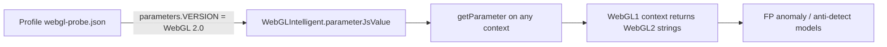

# WebGL1 `VERSION` leaked WebGL2 probe strings (Fingerprint tamper surface)

> **Date:** 2026-07-21 · **Area:** antidetect WebGL, Fingerprint Pro playground · **Status:** Verified locally (ReleaseSafe)

## Summary

Antidetect profiles load a WebGL **probe parameter map** captured from a real Chrome session. That map stored `VERSION` / `SHADING_LANGUAGE_VERSION` as **WebGL 2.0** strings. `WebGLIntelligent.parameterJsValue` applied the map to **every** `getParameter` call, including `getContext('webgl')` (WebGL1).

Result: a `WebGLRenderingContext` reported `WebGL 2.0 (OpenGL ES 3.0 Chromium)` while Chrome reports `WebGL 1.0 …` for the same call. That inconsistency is a classic high-signal input for statistical **browser tampering** and related smart signals.

Fix: for WebGL1 contexts, skip probe overrides of `VERSION` and `SHADING_LANGUAGE_VERSION` so identity-profile WebGL1 strings apply. WebGL2 still uses probe (or Chrome-accurate WebGL2 fallbacks). Also: `Notification.permission` is a static string accessor; default `AudioContext` sample rate is **48000** on desktop Mac paths.

---

## Problem

Comparing Chrome vs Velora on `https://demo.fingerprint.com/playground`:

| Surface | Chrome | Velora (before) |
|---------|--------|-----------------|
| `getContext('webgl').getParameter(VERSION)` | `WebGL 1.0 (OpenGL ES 2.0 Chromium)` | **`WebGL 2.0 (OpenGL ES 3.0 Chromium)`** |
| Unmasked GPU (good profile) | Apple M1 Metal | Apple M1 Metal (OK) |
| Playground | Tampering **No**, VM **No** | Tampering **Yes**, VM **Yes** |

With profile `chrome-local-huys-macbook-pro`, hardware/UA/WebGL unmasked already matched M1 Chrome, but VERSION still lied for WebGL1.

---

## Root Cause



1. Probe assets are often captured via WebGL2 (or a single parameters bag shared across contexts).
2. Antidetect path preferred probe values **unconditionally** before identity `webgl.version`.
3. Fingerprint Pro does not need the full sealed API to score this: raw device attributes include WebGL basics; context-type vs VERSION mismatch is rare in real browsers.

Secondary cleanups (same session):

- `Notification.permission` was registered as a **static function**; Chrome exposes a **string** static property.
- `new AudioContext()` defaulted to **44100**; Chrome on this Mac host uses **48000**.

---

## Solution

| File | Change |
|------|--------|
| `WebGLRenderingContext.zig` | Pass `self`; for `!_is_webgl2`, do not apply probe `VERSION` / `SHADING_LANGUAGE_VERSION`; WebGL2 falls back to Chrome-accurate 2.0 strings if identity still has 1.0 text |
| `dom_notification.zig` | `permission` → static **accessor** returning string |
| `audio.zig` | `AudioContext` default sample rate **48000** |
| `cdp-fingerprint-playground-probe.mjs` | Capture playground smart-signal text + `glVersion` in SNAP |

Verify:

```bash
cd /Users/huydev/Desktop/velora
zig build -Doptimize=ReleaseSafe
# WebGL1 must print WebGL 1.0; WebGL2 must print WebGL 2.0
node scripts/cdp-fingerprint-playground-probe.mjs --profile chrome-local-huys-macbook-pro --max-sec 20
```

Observed after fix: `signals.glVersion` / direct evaluate show **WebGL 1.0** for `webgl` and **WebGL 2.0** for `webgl2`; `AudioContext().sampleRate === 48000`; `typeof Notification.permission === 'string'`.

Playground smart-signal outcome remains **intermittent** (agent “Client timeout” / CDP evaluate hang under load). When identification completes, re-check UI for Tampering/VM/Bot against Chrome baseline.

---

## Follow-ups

- Split probe parameters into **webgl1** vs **webgl2** maps instead of VERSION special-cases.
- iframe `contentWindow.chrome` availability on first paint (still differs from Chrome in some probes).
- Canvas/audio probe vs Metal GPU consistency (still diverge from real Chrome pixels).
- Root-cause Fingerprint agent “Client timeout” under CDP polling (engine hang budget).
