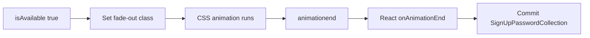

# CSS class change without animationend blocks Fluent SPA routes

> **Date:** 2026-07-22 · **Area:** Frame attributeChange, CSS animation events, React onAnimationEnd · **Status:** Fixed — Hotmail email→password verified

## Summary

Headless Velora has no compositor timeline. When Fluent (signup.live.com) swaps a CSS class to run a route fade-out, React only commits the next location in **`onAnimationEnd`**. Without a synthetic **`animationend` / `transitionend`**, the app stayed on the “New email” step after `CheckAvailableSigninNames` returned `isAvailable: true`, even though trusted Next, form fill, Location/`pushState`, and availability API all worked.

`Frame.attributeChange` for `class` now queues a short scheduler task that dispatches trusted `animationend` and `transitionend` on the element. Probe: password field mounts after email Next.

---

## Problem

Hotmail register automation (`scripts/hotmail-register-velora.mjs --probe-email-step`):

1. Email filled; trusted `LP.clickNode` Next succeeds.
2. `CheckAvailableSigninNames` → **200** + `isAvailable: true`.
3. UI never showed `input[type=password]`.

Prior fixes that did **not** alone unlock password:

| Fix | Result |
|-----|--------|
| Trusted click / skip layout hit-test hang | Next submits |
| Email input selection + insertText | Local-part correct |
| `history.pushState` → live `frame.url` Location getters | Pathname no longer stuck at `/` on manual pushState |
| Force pushState from CDP | Still no password mount |

Fluent’s router applies the next route only after the exit animation’s **`onAnimationEnd`**.

---

## Root Cause



In a real browser, the compositor fires `animationend` when the class animation finishes. Velora headless never runs that timeline, so:

- Class attributes change (mutations/observers fine).
- No native `animationend` / `transitionend`.
- React listeners for `onAnimationEnd` never run.
- Route state stuck on `UsernameCollection` / New-email.

---

## Investigation

1. Network: second CheckAvailable 200, risk/experiment APIs OK.
2. Manual `history.pushState` after Location fix updated `location.pathname` but still no password DOM → router not driven by URL alone.
3. Fluent bundle pattern: navigate `k` → intermediate state with CSS fade → `onAnimationEnd` → commit next collection.
4. Implemented class-change → synthetic animation events → password field appeared.

| Experiment | Expected | Observed | Verdict |
|------------|----------|----------|---------|
| Location fix only | Password if RR uses location | Still New-email | Not sufficient |
| Class → animationend | Password after Next | Password visible | Root cause |

Probe (Debug binary, 2026-07-22):

```text
[click] Next (email) via LP.clickNode text="Next"
[page:response] CheckAvailableSigninNames … 200
[1/4] password field visible
Email-step probe passed: Microsoft rendered the password step.
```

---

## Solution

### `Frame.zig`

1. On `attributeChange` for `class` (value actually changes), call `scheduleCssAnimationEnd(element)`.
2. Coalesce pending elements in `_css_anim_pending`; single-flight scheduler task `css.animationend` with delay **0** (runs after the current task so React can attach `onAnimationEnd` in the same commit).
3. `deliverCssAnimationEnds` dispatches trusted bubbling **`animationend`** then **`transitionend`** via `Event.initTrusted` + `EventManager.dispatch`.

No compositor; events are synthetic. Good enough for SPAs that only gate on end-of-transition, not on `animationName` / elapsed time.

### Not fixed here

- Full `AnimationEvent` / `TransitionEvent` interfaces (`animationName`, `elapsedTime`, …). Fluent’s handler did not require them for this route.
- Debug **ArenaPool leak `name=Event count=2`** on process exit after the probe (untrusted `Event.init` paths such as `selectionchange`, not `Event.trusted` from this fix). Separate cleanup.

---

## Lessons Learned

1. **Headless CSS is not free.** Class-driven animations that gate React navigation need synthetic `animationend`/`transitionend` (or skip animation in product code).
2. **SPA “stuck after API success”** often means an intermediate UI state machine (fade → commit), not a failed XHR.
3. Stack fixes in order: trusted activation → form/input correctness → history/Location → animation lifecycle.
4. Prefer **`Event.initTrusted`** for engine-synthesized events so refcount starts at 0 and dispatch owns lifecycle (untrusted `Event.init` starts at rc=1 and leaks if the creator never `releaseRef`).

---

## Verify

```bash
cd /Users/huydev/Desktop/velora
zig build   # Debug for iterate
node scripts/hotmail-register-velora.mjs \
  --profile chrome-local-huys-macbook-pro \
  --email "veloratest$(date +%s)@outlook.com" \
  --probe-email-step --timeout-ms 45000 --trace
# Expect: Email-step probe passed: Microsoft rendered the password step.
```

Related: `knowledge/bugs/2026-07-22-lp-clicknode-activation-layout-hang.md`, `knowledge/bugs/2026-07-22-history-pushstate-location-stale.md`.
