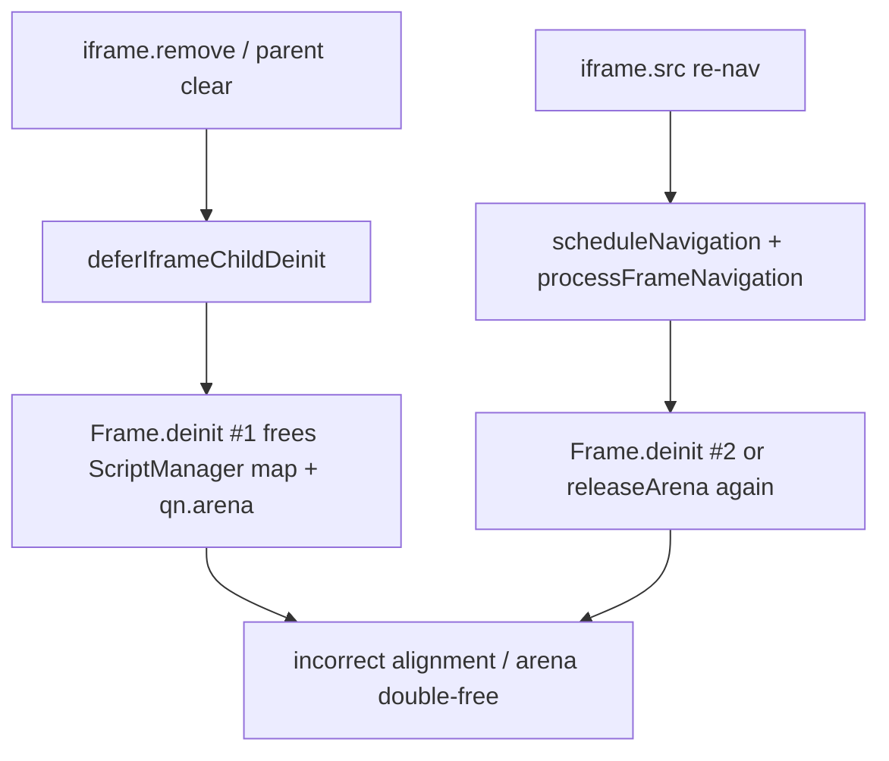

# document.open UAF teardown + Fetch CORS preflight OPTIONS

> **Audience:** Velora engineers  
> **Date:** 2026-07-23  
> **Scope:** Product stability for iframe `document.open` / teardown, and real-site CORS preflight for non-simple fetch

## Summary

Two product-facing failures blocked SPA/ad/widget patterns and authenticated APIs:

1. **`document.open` process death** — after destroyContext was made idempotent, Velora still crashed with `incorrect alignment` / `ArenaPool: double-free` when iframes were opened, removed, or re-navigated. Root cause was **double `Frame.deinit`** (deferred iframe detach racing `processFrameNavigation`) plus open using a departing browsing context.
2. **CORS preflight missing** — cross-origin `fetch` with non-safelisted methods/headers never sent OPTIONS, so real APIs (custom headers, PUT/PATCH) failed.

Both are implemented and smoke-verified. Full WPT `url.window.html` harness can still stall on nested empty-body iframe load timing; product open/write and preflight paths are solid.

---

## Problem

### document.open

Symptoms:

- WPT / product probes of `iframe.contentDocument.open()` → process abort
- Crash reasons progressed through: destroyContext panic → `incorrect alignment` (HashMap) → `ArenaPool: double-free`
- Stack (unstripped Debug): `processFrameNavigation` → `Frame.deinit` → `ScriptManagerBase.clearImportedModules` → HashMap `header()` align cast

Why it mattered: ads/widgets and many SPA patterns call `document.open`/`write`/`close` on about:blank iframes; a process kill is worse than a failed assertion.

### CORS preflight

Symptoms:

- Cross-origin PUT/custom headers never triggered OPTIONS
- Product sites and WPT `cors-preflight.*` need multi-origin hosts; product smoke uses two local ports

---

## Root Cause

### Open / iframe teardown



Contributing bugs:

1. **`document.open` parent wipe** — open/write fell back to the *caller* frame when the document had no live browsing context, clearing the parent page.
2. **Deferred deinit vs re-nav** — detach scheduled deinit while `_queued_navigation` still owned `qn.arena`; both paths released the same arena / map.
3. **URL inheritance** — method `Frame` inject is the document’s realm; entry settings must come from entry/incumbent (parent script), not the child’s `about:blank` URL.
4. **Empty HTTP body** — early `EmptyDocumentBody` abort prevented the existing `.pre` blank-document completion path (WPT `common/blank.html` is 0 bytes).

### CORS

Fetch §4.3: cors mode + cross-origin + non-safelisted method or request header → OPTIONS preflight with `Access-Control-Request-Method` / `Headers`, then main request only if ACAO/ACAM/ACAH (and credentials rules) allow.

---

## Fix

| Area | Change |
|------|--------|
| `Document.frameForDocument` / `activeBrowsingContext` | Own live context only; null if detach_pending / not active / going away |
| `Document.open` / `write` / `close` | No-op when no active context; entry URL via `getEntryFrame` / `getIncumbent` |
| `Document.getURL` | Prefer document’s `_frame.url`, not caller frame |
| `Frame.detachChildFrameForIframe` | Null `document._frame` immediately |
| `Frame.deinit` | Idempotent `_deinit_done`; null `_frame` |
| Deferred iframe deinit | Skip if deinit done, not detach_pending, or `_queued_navigation != null` |
| `Session.processFrameNavigation` | Snapshot nav url/opts; single arena release; deinit only if alive |
| `ScriptManagerBase` | Guard empty map; clear map after deinit |
| `Fetch.zig` | OPTIONS preflight pipeline + Origin on CORS cross-origin |
| `frameDoneCallback` | Empty body falls through to `.pre` blank complete (no hard fail) |

---

## Verification

```bash
cd /Users/huydev/Desktop/velora && zig build
# headers combine (WPT)
# open: CDP smoke — fully active open inherits parent URL; remove+open no-op; process stays up
# CORS: two ports (8766 page → 8765 API PUT + x-test-header1) → OPTIONS then 200
```

Observed:

- **OPEN** inherits parent URL; write/close works; process **ALIVE**
- **CORS** `PREFLIGHT PUT` then `{"ok":true,"s":200}`
- **headers-combine** 6/6 PASS
- WPT `url.window.html` may still **stall 5s** (nested iframe load / harness report) without process death

---

## Follow-up

1. Nested iframe parent `load` when child is empty-body (page-with-frame harness hangs).
2. Preflight redirect policy + exact Origin echo validation.
3. Page.deinit `origins.count()==0` assert on some Target.closeTarget paths.
4. Multi-origin `/etc/hosts` for full WPT cors-preflight matrix.
