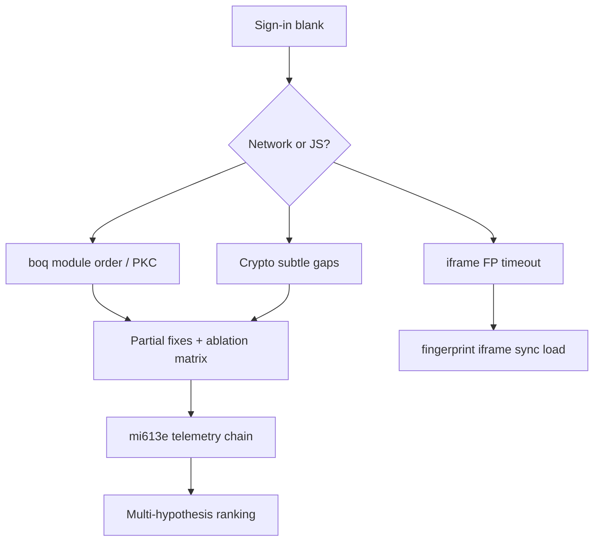

# Google Sign-In & Accounts — ablation, crypto, iframe fingerprint, lifecycle UAF

> **Date:** 2026-07-01 – 2026-07-02 · **Area:** Google Accounts UI, iframes, crypto, CDP lifecycle · **Status:** Investigation / partial fixes

## Summary

Google Accounts sign-in inside Velora surfaced **dozens of correlated failures**: silent `rib`/`sya` telemetry, **boq module load order**, **SubtleCrypto** gaps, **PKC static methods**, **async script races**, **mi613e** chain telemetry, **browserinfo** probes, **iframe fingerprint** timeouts, and **frame/document UAF** during redirects. This consolidates fourteen hypothesis-driven notes into one investigation arc.

## Problem

Observable symptoms when loading `accounts.google.com` or embedded sign-in iframes:

- Blank or spinner-only UI with no explicit JS error.
- `not supported` crypto exceptions in minified boq modules.
- YubiKey/fingerprint (`yb`) iframe never fires `load` — Turnstile-style timeouts.
- SIGSEGV after redirect when pending frame discarded mid-navigation.
- SERP layout cache segfault on back navigation.

## Investigation arc

**Ablation method:** disable compat shims (`GoogleCompat`), strip individual boq scripts, compare wire headers vs Chrome HAR, rank hypotheses by blast radius.

| Hypothesis tier | Finding |
|-----------------|---------|
| P0 crypto | Missing algorithms / `not supported` on HMAC/RSA paths used by Accounts |
| P0 module order | `boq` expects `google.pkc` statics before identity scripts |
| P1 iframe FP | `yb` iframe blocked on `realm_state=initializing` + sync load gate |
| P1 lifecycle | `disposeBrowserContext` deferred dispatch UAF; pending frame on redirect |
| P2 telemetry | `mi613e` / `browserinfo` — silent failure if beacons blocked (non-blocking for UI) |

## Solution (durable fixes)

| Area | Fix |
|------|-----|
| Crypto | Expand `SubtleCrypto` algorithm table; EC/RSA import paths |
| Scripts | `ScriptManager` ordering for Google bundles; async race guard |
| Iframe FP | `fingerprint-iframe-sync-load` — allow subresource load before root microtask gate completes |
| Lifecycle | Defer CDP dispatch on context dispose; guard pending navigation frames |
| SERP cache | Layout cache invalidation on history navigation |

## What we explicitly did not fix

- Full parity with every `rib`/`sya` beacon — product works without matching telemetry noise.
- Complete Turnstile/Google CAPTCHA iframe matrix — tracked under captcha knowledge tree.

## Lessons Learned

1. **Sign-in debugging needs ablation**, not single-shot fixes — boq bundles hide failures.
2. **Crypto gaps surface as blank UI**, not stack traces — probe `crypto.subtle` early.
3. **Iframe fingerprint loads are lifecycle-sensitive** — same class of bug as WPT microtask gate.
4. Pair sign-in work with **cookie jar warmup** — see captcha detection journey.

## References

- `src/core/webapi/GoogleCompat.zig`, `SubtleCrypto.zig`, `ScriptManager*.zig`
- `src/core/browser/Frame.zig`, `Session.zig`, `CDP.zig`
- Knowledge: [`../captcha/detection/google-search-investigation-journey.md`](../captcha/detection/google-search-investigation-journey.md)

## Related Knowledge

- [`2026-07-08-wpt-cookie-suite.md`](2026-07-08-wpt-cookie-suite.md) — secure cookies + jar
- [`2026-07-05-wpt-async-error-handling-batch.md`](2026-07-05-wpt-async-error-handling-batch.md) — microtask / parse gate