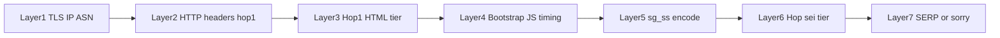

# Google Search Flow Architecture (Deep Dive)

> **Update (2026-06-29):** Trust tier at hop 1 is primarily **session cookie state** (mature `NID` jar). See [`google-search-investigation-journey.md`](google-search-investigation-journey.md). Diagrams below describe paths; **warm jar → short path** is the production goal.

## Summary

Google Search is a **multi-hop state machine**, not a single document fetch. The server chooses a **trust tier** at hop 1 that determines HTML shape (bootstrap shell vs SERP), whether `knitsail.a()` runs, and what document type is returned on hop `sei`. **Cold Velora (no jar)** → long path below. **Warm Velora (Chrome account jar)** → short path: hop-1 SERP ~270–600 KB, `knitsail=0`, 1 hop.

---

## Two Paths (not interchangeable)

```mermaid
flowchart TB
    subgraph shortPath [Chrome short path - trusted tier]
        C1["GET /search?q= hop1"] --> C2["~184ms replace to /search?sei="]
        C2 --> C3["SERP document ~330KB 0 knitsail"]
        C3 --> C4["SERP or /sorry sei-only continue"]
    end
    subgraph longPath [Velora long path - automation tier]
        V1["GET /search?q= hop1"] --> V2["Bootstrap ~91KB 5 scripts knitsail"]
        V2 --> V3["knitsail.a encode sg_ss"]
        V3 --> V4["location.replace sei+sg_ss"]
        V4 --> V5["Bootstrap again at sei ss_cgi=true"]
        V5 --> V6["knitsail again → /sorry or SERP"]
    end
```



| Checkpoint | Chrome (guest, trusted) | Velora (antidetect) |
|------------|-------------------------|---------------------|
| Hop 1 body | Evicted in ~184ms; likely minimal or fast-replace shell | Bootstrap ~91KB, `sclm=false`, `ussv=''`, `sp=''` |
| `knitsail.a()` | **0** (probe) | **2–4×** per hop |
| `location.replace` | Yes (`gen_204` `ant=replace`) but **no `sg_ss`** in final URL | Yes, with **`sg_ss` ~2.8KB** |
| Hop `sei` body | **SERP** ~270–330KB, 16–25 scripts, `#rso` | **Bootstrap** ~91KB, `ss_cgi=true`, knitsail again |
| Final (cold IP) | SERP title match | Sometimes SERP; often `/sorry` with `sg_ss` continue |

---

## Hop 1 — Bootstrap shell anatomy (Velora capture)

Velora hop-1 HTML (`velora-initial.html`) structure:

1. **Script 0** — `window.google` stub (`cap:0`)
2. **Script 1** — `sctm=false`; optional `google.tick("load","pbsst")` when `sctm`
3. **Script 2** — **Knitsail loader** ~62KB `(0,eval)(closure)` → `globalThis.knitsail`
4. **Script 3** — **SGS bootstrap** ~28KB — gate + encode + redirect
5. **Script 4** — CSS id / tick helper

**Server-embedded gate variables** (inline constants in script 3):

```javascript
// Captured values for Velora hop 1:
sclm = false    // if true → installs window.td from performance.timing
sctm = false
ss_cgi = false  // hop 1; becomes true on sei hop for Velora
ussv = ''       // short-path gate — EMPTY → long path
sp = ''         // short-path gate — EMPTY → long path
```

**Branch logic** (deobfuscated from inline bootstrap):

```javascript
// Short path (Chrome when ussv/sp populated):
window.sgs && ussv && sp
  ? Z = window.sgs(sp).then(ok => { /* skip knitsail */ })
  : Z = Promise.resolve(false);

Z.then(a => a || la());  // la() → knitsail long path

function la() {
  ia(function(encoded) {
    // knitsail.a callback → build sg_ss token
    ka(encoded);  // → T(token) → location.replace with sg_ss+sei
  }, err);
}

function T(a) {
  var c = new URLBuilder(location.href);
  c.add("sg_ss", encodeURIComponent(a));
  c.add("sei", eid);
  U(c.toString());  // → W(url) → location.replace(url)
}
```

When `ussv` and `sp` are empty, **long path is mandatory** in this HTML tier.

---

## Chrome hop 1 — What we know

From `probe-search-flow-deep.mjs` (query `deep2-*`):

| Signal | Value |
|--------|-------|
| Initial → sei latency | **~184ms** (document response timestamps) |
| HTTP redirects (CDP) | **0** — both hops return 200 |
| `frameNavigated` | `initial` → `about:blank` → `sei` |
| Hop 1 body capture | **Failed** — evicted before `getResponseBody` |
| First `gen_204` after hop 1 | `ant=replace`, `nt=navigate`, `rt=...sct.328,frts.337...` |
| Hop `sei` body | SERP 331KB, `google.sn=web`, **no knitsail** |

**Interpretation:** Chrome also uses **replace navigation** (`ant=replace` in CSI beacon), but the server returns **SERP HTML on the `sei` hop** without client `sg_ss` encoding. Either:

1. Hop-1 HTML for Chrome is a **different tier** (populated `ussv`/`sp`, or no knitsail), or
2. `window.sgs(sp)` short-path promise resolves true before `la()`, or
3. Hop-1 shell only schedules replace to a **server-prebuilt `sei` URL** that already carries trust.

We cannot diff hop-1 HTML bytes Chrome vs Velora until hop-1 body capture succeeds (Chrome evicts in <200ms).

---

## Hop `sei` — Document type is the smoking gun

Same request shape (referer, cookies=0, Downlink/RTT in-session) can still yield:

| | Velora | Chrome |
|---|--------|--------|
| `htmlLen` | ~91KB | ~270–330KB |
| `docKind` | `bootstrap` (`ss_cgi=true`, knitsail) | `serp` (`#rso`, 16+ scripts) |
| `title` | `"Google Search"` | `"{query} - Google Search"` |

This is **not** a client parse bug — `Network.getResponseBody` on the wire document shows different server HTML.

---

## Signal layers (evaluation order)



1. **TLS / IP / ASN** — evaluated before HTML is generated
2. **Hop-1 HTTP** — UA, Sec-CH, x-browser, Sec-Fetch (cold), curl-impersonate JA3/JA4
3. **Hop-1 HTML tier** — `sclm`, `ussv`, `sp`, presence/size of knitsail loader
4. **Bootstrap JS** — `pageT`, `ha()`, `knitsail.a`, `google.tick`, `window.td`
5. **`sg_ss` token** — ~2.8KB blob; rejected → `/sorry` 429
6. **Hop `sei` tier** — bootstrap again vs SERP (server decision)
7. **Post-fail** — `/sorry` + reCAPTCHA Enterprise chain

**CreepJS fingerprint** (canvas, audio, window keys) affects layers 3–5 only indirectly via trust score. Fixing knitsail prune does not flip hop-`sei` doc type if layer 3 tier stays "automation."

---

## Beacons (`gen_204`) — how to read them

| Parameter | Meaning |
|-----------|---------|
| `cad=sg_b_e` | Bootstrap error (`Error: f` = missing `knitsail`) |
| `cad=sg_b_e&e=...` | Other encode failures |
| `t=aft` + `rt=sct.*` | After-first-paint timing; `sct` ≈ short-path timing marker |
| `ant=replace` | Navigation used `location.replace` (both engines) |
| `nhp=h3` | Navigation HTTP protocol |
| `ei=` | Event id / `kEI` |

Chrome short-path beacon example (from deep probe):

```
/gen_204?s=web&t=aft&...&rt=wsrt.129,hst.32,sgl.164,...,sct.328,frts.337,...&ant=replace&nhp=h3
```

Velora long-path produces `sg_ss` in URL and `SG_SS` cookie writes before sorry.

---

## What fixes moved the needle

| Fix | Layer | Effect |
|-----|-------|--------|
| `knitsail` + `td` allowlist | 4 | Removed `sg_b_e=Error: f` |
| `pageT` freeze ~192.6 | 4 | Correct encode timing |
| x-browser + cold hop hints | 2 | `sclm=false` parity on hop 1 |
| Referer `hl` on sei | 2 | Wire parity |
| Omit Sec-Fetch-* in-session | 2 | sei wire matches Chrome CDP |
| Downlink 1.7 / RTT 100 in-session | 2 | sei wire parity |

**Still open:** hop-1 tier selection (why Velora gets knitsail bootstrap + empty gates) and hop-`sei` SERP tier.

---

## Debug commands

```bash
cd /Users/huydev/Desktop/velora

# Deep flow (Chrome then Velora sequential — best for understanding)
node google-search-debug/scripts/probe-search-flow-deep.mjs --query "mytest" --max-sec 25 --gap-sec 20

# Hop HTML + script bytes
node google-search-debug/scripts/diff-hop1-html.mjs --query "mytest" --max-sec 25

# knitsail I/O per hop
node google-search-debug/scripts/probe-knitsail-io.mjs --query "mytest" --max-sec 25

# Wire vs CDP
node google-search-debug/scripts/capture-wire-search-hops.mjs --query "mytest" --max-sec 25

# Document hop timeline + redirects
node google-search-debug/scripts/probe-document-hops-detail.mjs --query "mytest" --max-sec 25
```

**Probe hygiene:** Run **sequentially** with 15–30s gap. Parallel Chrome+Velora probes heat IP and mix `/sorry` with SERP outcomes.

---

## Open questions (next investigation)

1. **Capture Chrome hop-1 body** — retry `getResponseBody` in a tight loop on `responseReceived`; or net-log / mitmproxy
2. **Diff hop-1 request bytes** — `diff-hop1-request.mjs`; any remaining header delta vs Chrome
3. **Does Chrome hop-1 HTML include knitsail loader?** — if no, tier split is at HTML generation
4. **What populates `ussv`/`sp` on trusted tier?** — server-only; cannot client-forge
5. **`window.sgs` short path** — what does `sgs(sp)` resolve to on Chrome hop 1?

---

## References

- `google-search-debug/scripts/probe-search-flow-deep.mjs`
- `google-search-debug/tmp/search-flow-deep-*/report.json`
- `knowledge/bugs/2026-06-29-google-search-bootstrap-divergence.md`
- `knowledge/captcha/detection/google-search-signal-inventory.md`