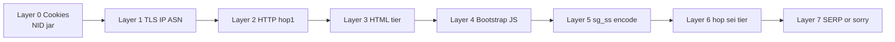
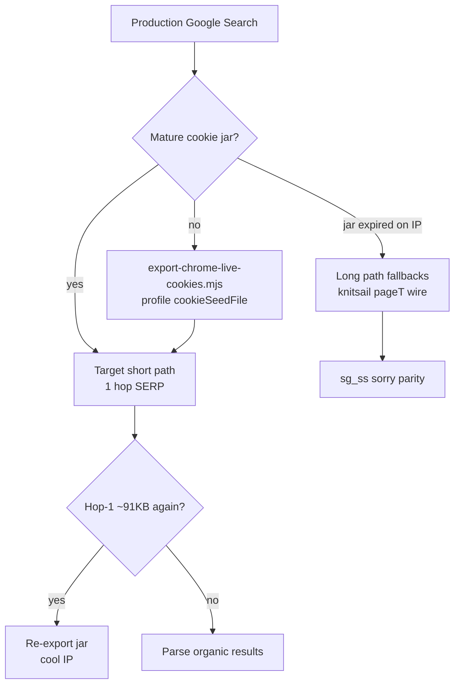
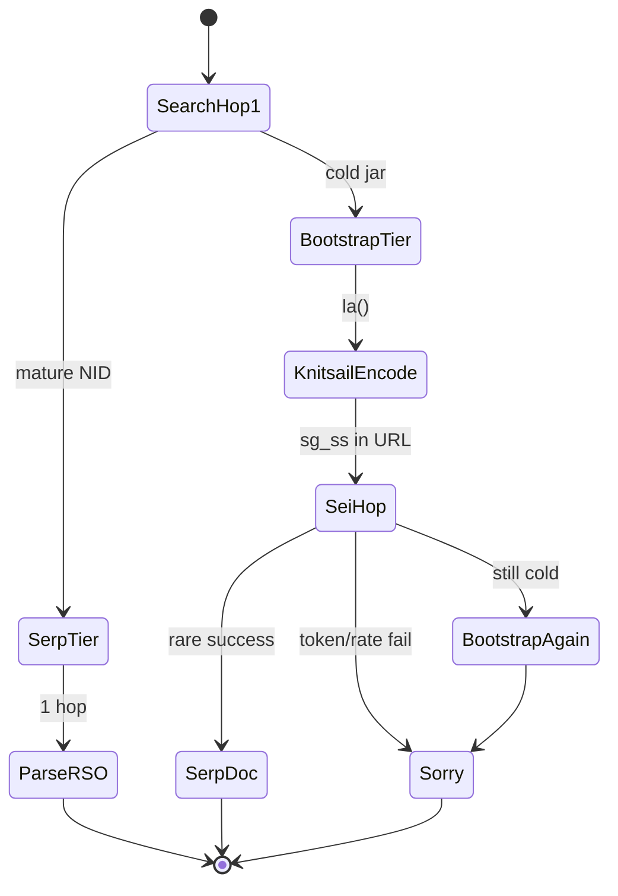

# Google Search Flow Architecture — Trust Tiers, Hops, and Bootstrap Mechanics

> **Update (2026-06-29):** Trust tier at hop 1 is primarily **session cookie state** (mature `NID` jar). Canonical narrative: [`google-search-investigation-journey.md`](google-search-investigation-journey.md). Signal priorities: [`google-search-signal-inventory.md`](google-search-signal-inventory.md). Diagrams below describe **both** paths; **warm jar → short path** is the production goal.

---

## Summary

Google Search is not a single document fetch. It is a **multi-hop state machine** where the server selects a **trust tier** at hop 1 based largely on **mature session cookies** (see [Layer 0 in Signal Inventory](google-search-signal-inventory.md#layer-0--session-cookies-primary)). That tier determines:

- HTML shape: ~91 KB **bootstrap shell** vs ~270–600 KB **SERP**
- Whether inline gates `ussv` / `sp` are populated or empty
- Whether `knitsail.a()` runs and whether `sg_ss` appears in the URL
- What document type returns on the `sei` hop (bootstrap again vs SERP)

**Cold Velora (no jar):** long path — bootstrap → knitsail encode → `sei` + `sg_ss` → possible second bootstrap → `/sorry` risk.

**Warm Velora (Chrome account jar):** short path — hop-1 SERP, `knitsail=0`, typically 1 document hop, parse `#rso`.

This document explains **mechanics**. For **why we believed the wrong things for months**, read the [Investigation Journey](google-search-investigation-journey.md).

---

## Problem

Engineers debugging Velora vs Chrome often compared the **wrong hop** or optimized **client JS on a path Chrome never takes**.

| Confusion | Reality |
|-----------|---------|
| “Chrome and Velora both hit `/search` — same request” | Same URL shape; **different server HTML** by tier |
| “Fix `knitsail` encode → parity” | Chrome probes show **0× `knitsail.a`** on short path |
| “Hop `sei` wire matches but body differs” | **Server document type** is the smoking gun, not parse bugs |
| “CreepJS green → Search should work” | Tier decided **before** fingerprint scripts run |

Without a flow architecture model, teams naturally dive into bootstrap JS (layers 4–5) while layer 0 (cookie jar) stays empty — months of apparent contradictions documented in the [journey Phase 3 vs Phase 6](google-search-investigation-journey.md#phase-3--bootstrap--knitsail--paget--is-root-cause).

---

## Root Cause (architectural framing)

Trust tier is **server-side**, evaluated in roughly this order (re-prioritized 2026-06-29):



**Primary flip:** mature `NID` (+ signed-in cookies) → hop-1 SERP tier.  
**Secondary:** wire hygiene, knitsail robustness, sorry forensics — matter on long path or after jar expiry.

The architectural mistake in early docs was treating layers 4–5 as **root** when they are **conditional execution** on layer 3’s “automation” HTML template.

---

## Investigation (flow probes that built this model)

Key scripts and what each proved:

| Script | Finding |
|--------|---------|
| `probe-search-flow-deep.mjs` | Chrome ~184 ms initial→`sei`; 0 HTTP redirects; `ant=replace` beacon |
| `diff-hop1-html.mjs` | Velora hop-1 ~91 KB, 5 scripts, knitsail loader |
| `probe-knitsail-io.mjs` | Velora 2–4× `knitsail` per hop; Chrome 0 |
| `capture-wire-search-hops.mjs` | In-session `sei` wire can match; **body tier still diverges** cold |
| `probe-document-hops-detail.mjs` | Document timeline: search → sei → sorry vs search → SERP |
| `probe-cookie-ablation.mjs` | Same wire + IP; **only cookie state flips hop-1 tier** |

**Probe hygiene:** run **sequentially** with 15–30 s gaps. Parallel Chrome+Velora probes heat IP and mix `/sorry` with SERP — invalid A/B.

---

## Solution (which path to engineer)



**Do not** implement production strategy around perfect `sg_ss` encode while hop-1 remains ~91 KB. **Do** implement jar warmup + thermometer monitoring, then long-path hardening as **fallback**.

---

## Two Paths (not interchangeable)

```mermaid
flowchart TB
    subgraph shortPath ["Chrome / warm Velora — trusted tier"]
        C1["GET /search?q= hop1"] --> C2["~184ms replace to /search?sei="]
        C2 --> C3["SERP document ~270-600KB\n0 knitsail"]
        C3 --> C4["SERP or /sorry sei-only continue"]
    end
    subgraph longPath ["Cold Velora — automation tier"]
        V1["GET /search?q= hop1"] --> V2["Bootstrap ~91KB\n5 scripts knitsail"]
        V2 --> V3["knitsail.a encode sg_ss"]
        V3 --> V4["location.replace sei+sg_ss"]
        V4 --> V5["Bootstrap again at sei\nss_cgi=true"]
        V5 --> V6["knitsail again → /sorry or SERP"]
    end
```



| Checkpoint | Chrome (guest, trusted) / warm Velora | Cold Velora |
|------------|---------------------------------------|-------------|
| Hop 1 body | Fast replace shell or direct SERP | Bootstrap ~91 KB, `sclm=false`, `ussv=''`, `sp=''` |
| `knitsail.a()` | **0** (probe) | **2–4×** per hop |
| `location.replace` | Yes (`gen_204` `ant=replace`); **no `sg_ss`** in final URL | Yes, with **`sg_ss` ~2.8 KB** |
| Hop `sei` body | **SERP** ~270–330 KB, `#rso` | **Bootstrap** ~91 KB, `ss_cgi=true`, knitsail again |
| Final (cold IP) | SERP title match | Sometimes SERP; often `/sorry` with `sg_ss` continue |

These paths are **not interchangeable optimizations**. They are different **server contracts** selected at hop 1.

---

## Hop 1 — Bootstrap shell anatomy (Velora capture)

Velora hop-1 HTML (`velora-initial.html`) structure on **long path**:

| Order | Script | Role |
|-------|--------|------|
| 0 | `window.google` stub | `cap:0` initialization |
| 1 | `sctm` gate | `sctm=false`; optional `google.tick("load","pbsst")` when `sctm` |
| 2 | Knitsail loader | ~62 KB `(0,eval)(closure)` → `globalThis.knitsail` |
| 3 | SGS bootstrap | ~28 KB — gate + encode + redirect |
| 4 | CSS id / tick helper | ancillary bootstrap |

**Server-embedded gate variables** (inline constants in script 3):

```javascript
// Captured values for Velora hop 1 (long path):
sclm = false    // if true → installs window.td from performance.timing
sctm = false
ss_cgi = false  // hop 1; becomes true on sei hop for Velora
ussv = ''       // short-path gate — EMPTY → long path
sp = ''         // short-path gate — EMPTY → long path
```

**Branch logic** (deobfuscated from inline bootstrap):

```javascript
// Short path (Chrome when ussv/sp populated):
window.sgs && ussv && sp
  ? Z = window.sgs(sp).then(ok => { /* skip knitsail */ })
  : Z = Promise.resolve(false);

Z.then(a => a || la());  // la() → knitsail long path

function la() {
  ia(function(encoded) {
    // knitsail.a callback → build sg_ss token
    ka(encoded);  // → T(token) → location.replace with sg_ss+sei
  }, err);
}

function T(a) {
  var c = new URLBuilder(location.href);
  c.add("sg_ss", encodeURIComponent(a));
  c.add("sei", eid);
  U(c.toString());  // → W(url) → location.replace(url)
}
```

When `ussv` and `sp` are empty, **long path is mandatory** in this HTML tier. Client cannot populate these server-side gates legitimately — earn tier via [mature jar](google-search-investigation-journey.md#phase-6--breakthrough-mature-session-cookie-jar).

**Short path hop-1:** no gate vars, no knitsail loader, ~17 scripts in curl capture, query in title.

---

## Chrome hop 1 — What we know

From `probe-search-flow-deep.mjs` (query `deep2-*`):

| Signal | Value |
|--------|-------|
| Initial → sei latency | **~184 ms** (document response timestamps) |
| HTTP redirects (CDP) | **0** — both hops return 200 |
| `frameNavigated` | `initial` → `about:blank` → `sei` |
| Hop 1 body capture | **Failed** — evicted before `getResponseBody` |
| First `gen_204` after hop 1 | `ant=replace`, `nt=navigate`, `rt=...sct.328,frts.337...` |
| Hop `sei` body | SERP 331 KB, `google.sn=web`, **no knitsail** |

**Interpretation:** Chrome uses **replace navigation** (`ant=replace` in CSI beacon), but the server returns **SERP HTML on the `sei` hop** without client `sg_ss` encoding. Plausible explanations:

1. Hop-1 HTML is a **different tier** (populated `ussv`/`sp`, or no knitsail shell).
2. `window.sgs(sp)` short-path promise resolves before `la()`.
3. Hop-1 shell schedules replace to a **server-prebuilt `sei` URL** that already carries trust.

We cannot diff hop-1 HTML bytes Chrome vs Velora until hop-1 body capture succeeds (Chrome evicts in <200 ms). Open question #1 below.

---

## Hop `sei` — Document type is the smoking gun

Same request shape (referer, cookies omitted in-session per policy, Downlink/RTT) can still yield:

| | Cold Velora | Chrome / warm Velora |
|---|-------------|----------------------|
| `htmlLen` | ~91 KB | ~270–330 KB |
| `docKind` | `bootstrap` (`ss_cgi=true`, knitsail) | `serp` (`#rso`, 16+ scripts) |
| `title` | `"Google Search"` | `"{query} - Google Search"` |

This is **not** a client parse bug — `Network.getResponseBody` on the wire document shows different server HTML. Cookie state on **hop 1** (not `sei`) drives this split — see [ablation data](../../bugs/2026-06-29-google-search-nid-trust-tier.md).



---

## Beacons (`gen_204`) — how to read them

| Parameter | Meaning |
|-----------|---------|
| `cad=sg_b_e` | Bootstrap error (`Error: f` = missing `knitsail`) |
| `cad=sg_b_e&e=...` | Other encode failures |
| `t=aft` + `rt=sct.*` | After-first-paint timing; `sct` ≈ short-path timing marker |
| `ant=replace` | Navigation used `location.replace` (both engines) |
| `nhp=h3` | Navigation HTTP protocol |
| `ei=` | Event id / `kEI` |

Chrome short-path beacon example (from deep probe):

```
/gen_204?s=web&t=aft&...&rt=wsrt.129,hst.32,sgl.164,...,sct.328,frts.337,...&ant=replace&nhp=h3
```

Velora long-path produces `sg_ss` in URL and `SG_SS` cookie writes before sorry. Use beacons to **classify path**, not as primary fix levers when jar is cold.

---

## What fixes moved the needle (by layer)

| Fix | Layer | Effect |
|-----|-------|--------|
| **Mature `NID` jar** | **0** | **Hop-1 SERP; 0 knitsail** — primary |
| `knitsail` + `td` allowlist | 4 | Removed `sg_b_e=Error: f` on long path |
| `pageT` freeze ~192.6 | 4 | Correct encode timing on long path |
| x-browser + cold hop hints | 2 | `sclm=false` parity on hop 1 |
| Referer `hl` on sei | 2 | Wire parity |
| Omit Sec-Fetch-* in-session | 2 | sei wire matches Chrome CDP |
| Downlink 1.7 / RTT 100 in-session | 2 | sei wire parity |
| `HTMLElement.style` shim | 7 | reCAPTCHA cfgClients sorry parity |

**Still open (secondary):** Chrome hop-1 body capture; first-hop `Sec-Fetch-Site: none` vs policy `same-origin`; what exactly populates `ussv`/`sp` on trusted tier (server-only).

---

## Lessons Learned

1. **Classify path before debugging layer** — hop-1 KB size + `knitsail` count beats hours of JS diff.
2. **Long path and short path are different products** — document both; optimize production for short path only.
3. **`sei` parity on wire ≠ `sei` parity on document** — always fetch response body.
4. **Replace navigation is normal** — `ant=replace` does not imply `sg_ss`; check URL params.
5. **Architecture docs must state tier gate** — or readers optimize knitsail forever. Cross-link [journey](google-search-investigation-journey.md) and [inventory](google-search-signal-inventory.md).

---

## Debug commands

```bash
cd /Users/huydev/Desktop/velora

# Deep flow (Chrome then Velora sequential)
node google-search-debug/scripts/probe-search-flow-deep.mjs --query "mytest" --max-sec 25 --gap-sec 20

# Hop HTML + script bytes
node google-search-debug/scripts/diff-hop1-html.mjs --query "mytest" --max-sec 25

# knitsail I/O per hop
node google-search-debug/scripts/probe-knitsail-io.mjs --query "mytest" --max-sec 25

# Wire vs CDP
node google-search-debug/scripts/capture-wire-search-hops.mjs --query "mytest" --max-sec 25

# Document hop timeline + redirects
node google-search-debug/scripts/probe-document-hops-detail.mjs --query "mytest" --max-sec 25

# Trust tier thermometer + ablation
node google-search-debug/scripts/probe-cookie-ablation.mjs --base google-search-debug/tmp/chrome-real-cookies.json
```

---

## Open questions (next investigation)

1. **Capture Chrome hop-1 body** — tight-loop `getResponseBody` on `responseReceived`; or net-log / mitmproxy.
2. **Diff hop-1 request bytes** — `diff-hop1-request.mjs`; remaining header delta vs Chrome.
3. **Does Chrome hop-1 HTML include knitsail loader?** — if no, tier split confirmed at HTML generation.
4. **What populates `ussv`/`sp` on trusted tier?** — server-only; cannot client-forge.
5. **`window.sgs` short path** — what does `sgs(sp)` resolve to on Chrome hop 1?

---

## References

- `google-search-debug/scripts/probe-search-flow-deep.mjs`
- `google-search-debug/tmp/search-flow-deep-*/report.json`
- `knowledge/bugs/2026-06-29-google-search-bootstrap-divergence.md` — long-path symptom catalog
- `knowledge/bugs/2026-06-29-google-search-nid-trust-tier.md` — tier flip ablation
- [`google-search-investigation-journey.md`](google-search-investigation-journey.md) — canonical narrative
- [`google-search-signal-inventory.md`](google-search-signal-inventory.md) — layer priorities

---

## Related Knowledge

| Document | Use when |
|----------|----------|
| [Investigation Journey](google-search-investigation-journey.md) | Understanding hypothesis history and decision tree |
| [Signal Inventory](google-search-signal-inventory.md) | Prioritizing which layer to fix in production |
| `bugs/2026-06-29-google-search-bootstrap-divergence.md` | Deep long-path symptom list |
| `bugs/2026-06-29-google-search-knitsail-window-keys-prune.md` | `knitsail` deleted before bootstrap |
| `browser/policies/google-search.json` | Cookie omission on in-session hops |

**Reading order:** Journey → Signal Inventory → Flow Architecture (this file).