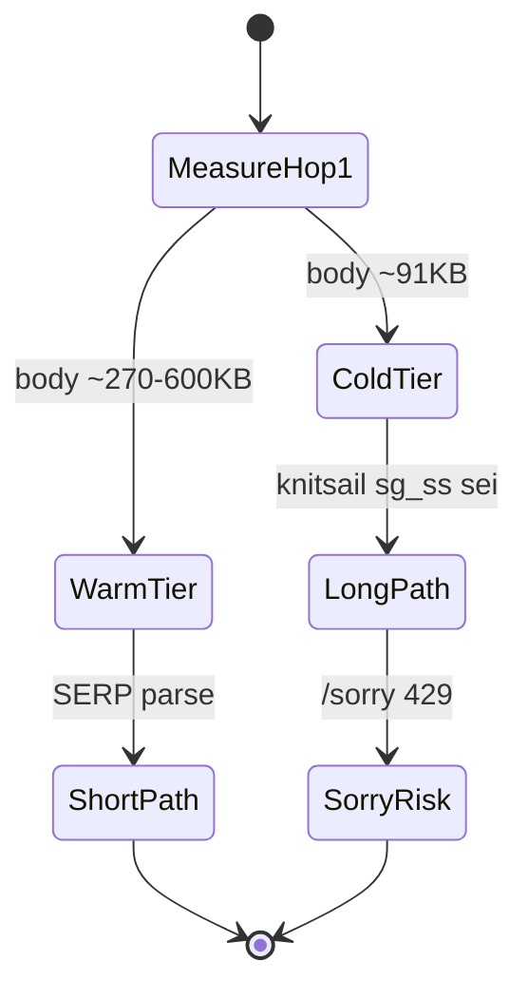
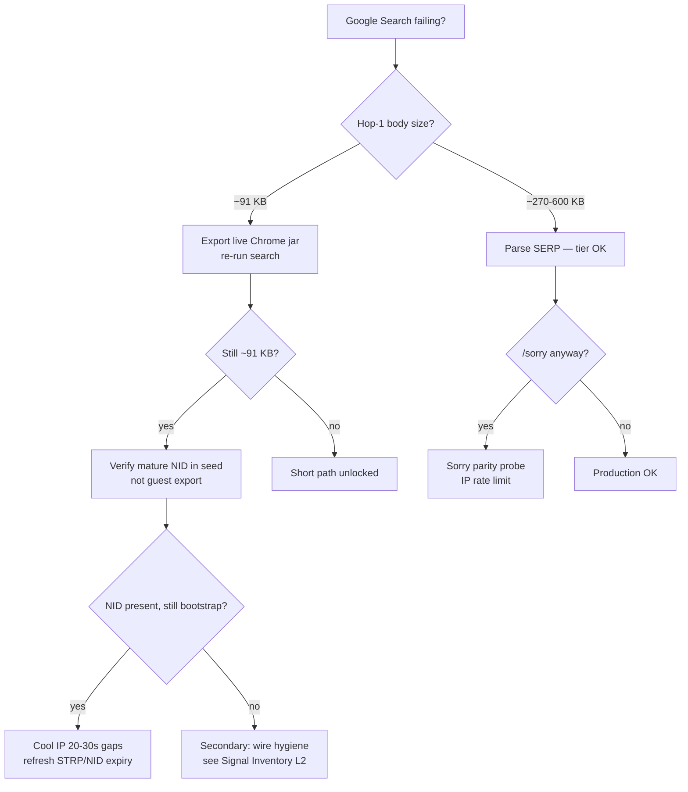
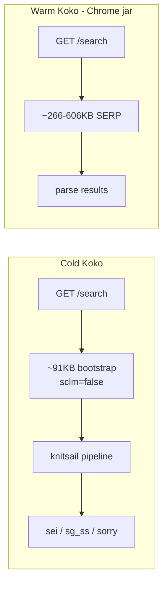

# Google Search Investigation Journey — What We Thought, Tested, and Finally Understood

> **Canonical conclusion (2026-06-29):** Koko Google Search works when the session is **warmed with a mature Chrome cookie jar** (`NID` + signed-in session cookies). Cold start without that jar → long bootstrap path → `knitsail` / `sg_ss` / `/sorry`. Most earlier notes over-weighted fingerprint, knitsail JS, and wire-header diffs relative to this single gate.

This document is the **canonical narrative** for Google Search antibot work at Koko. Read it first — hop-by-hop flow, signal priorities, and cookie warmup are consolidated here (older split notes were merged and removed).

---

## Summary

For months, Koko Google Search behaved like a fingerprint problem: CreepJS sections were green, wire headers were tuned, `knitsail` encode was patched — yet the same query on the same IP still returned a **~91 KB bootstrap shell** instead of Chrome’s **~270–600 KB SERP** on hop 1. The breakthrough was not another JS shim. It was **session cookie state**: a **mature `NID`** (and associated signed-in cookies) exported from the user’s real Chrome profile flips Google’s server-side trust tier before any client fingerprint runs.

**Executive summary for operators:**

| Symptom | Likely tier | First action |
|---------|-------------|--------------|
| Hop-1 body ~91 KB, `knitsail` present | Cold / low trust | [Live-export jar](#solution), reload profile |
| Hop-1 body ~270–600 KB, title matches query | Warm / SERP | Parse results; monitor jar expiry |
| URL contains `sg_ss` ~2.8 KB | Long-path encode in flight | Refresh jar; cool IP between probes |
| `/sorry` after long path | Token or rate rejection | Sorry parity forensics; don’t start here |

**Production unlock:** export cookies from daily Chrome (`export-chrome-live-cookies.mjs`), bake into browser profile `session.cookieSeedFile`, persist runtime jar on exit. Fingerprint and wire work remain valuable for antidetect product quality and long-path robustness — they are **secondary** to warmup.

---

## Problem

Koko is an antidetect browser built on curl-impersonate, CDP, and injected compatibility shims. Google Search is the hardest real-world gate: not a single `GET /search`, but a **multi-hop trust state machine** where the server chooses HTML shape on hop 1.

**What we observed consistently:**

- **Koko (cold start):** hop-1 HTML ~91 KB, inline `sclm=false`, empty `ussv`/`sp`, `knitsail` loader (~62 KB), client `location.replace` to `sei` with **`sg_ss`** blob (~2.8 KB), sometimes second bootstrap at `sei`, often `/sorry` on hot IPs.
- **Chrome (same machine, warm profile):** fast replace to `sei` (~184 ms), hop-`sei` or hop-1 SERP ~270–600 KB, **`knitsail.a()` count = 0** in probes, query in document title.
- **Contradiction:** CreepJS / canvas / audio / WebGL / window-keys could score green while Google still sorry’d or stayed on the long path.

The product impact was severe: agents could not reliably parse organic results; debugging consumed weeks because **symptoms on the long path looked like root causes** (missing `knitsail`, wrong `pageT`, bad `sg_ss` encode) when Chrome often **never entered that path at all**.



---

## Root Cause

Google Search **trust tier selection on cold `/search` is primarily driven by mature session cookies**, especially the **`NID` payload** from an established Chrome profile, plus signed-in `SID` / `SAPISID` family when present. The server decodes cookie state **before** generating hop-1 HTML. That decision determines:

- Bootstrap shell (~91 KB) vs full SERP (~270–600 KB)
- Whether `ussv` / `sp` short-path gates are populated (trusted) or empty (automation tier)
- Whether `knitsail.a()` must run at all

**What is *not* the primary root cause** (though often correlated on cold sessions):

| Over-weighted hypothesis | Actual role |
|------------------------|-------------|
| CreepJS / canvas / audio fingerprint | Product antidetect quality; **does not flip hop-1 tier** |
| TLS JA3/JA4, header order | Necessary wire hygiene; **tier unchanged** when jar cold |
| `knitsail` / `pageT` / `google.tick` | **Conditional** — fixes long path when already on low trust |
| Client-forging `sclm` / `ussv` / `sp` | Server-set; **cannot fake tier** — earn it with jar |
| Guest `NID` from fresh Chrome spawn | Same cookie **name**, different **trust encoding** — useless |

Cookie ablation (`probe-cookie-ablation.mjs`) ended the debate:

- **Mature jar, `NID` only** → short path (~267 KB), 1 hop.
- **Remove `NID`** → long path (~91 KB), 2+ hops.
- **`DV` only** → long path; **`DV` optional** when mature `NID` present.
- **Guest 4-cookie / guest `NID` only** → always long path.

Live export via `browser-cookie3` + macOS Keychain: **154 cookies**, `NID` length **1119** (vs guest ~231–280 chars) — different encoded trust state, not merely “more cookies.”

**Signal priority (production):** Layer 0 session cookies → Layer 1 IP rate → Layer 2 wire hygiene (`Sec-Fetch`, Downlink/RTT) → Layer 3 bootstrap JS (`knitsail`, `pageT`) → Layer 4 fingerprint/CreepJS. Do not invert this order.

---

## Investigation

The investigation spanned six hypothesis phases. Each phase produced real fixes; only Phase 6 explained why Chrome and Koko diverged on **the same IP with the same query**.

### Decision tree (where to spend the next hour)



---

### Phase 0 — Symptom catalog

**What we saw:** long path metrics (~91 KB bootstrap, `knitsail`, `sg_ss`, `/sorry`) vs Chrome short path (SERP on hop 1 or fast `sei`, 0× `knitsail.a`).

**Early intuition (wrong weighting):** “Google detects our JS fingerprint; CreepJS parity will unlock Search.”

That sent us deep into client-side signals before measuring **server trust tier** via hop-1 body size — the single best thermometer (~91 KB bootstrap vs ~270–600 KB SERP).

---

### Phase 1 — “Fix fingerprint first” (CreepJS sweep)

**Hypothesis:** Google uses CreepJS-class signals; matching Chrome on canvas, audio, WebGL, window keys, TLS → Search parity.

**Tests:** `cdp-creepjs-*` section compares; profile baselines (`chrome-local-huys-macbook-pro`); window-keys allowlist so `knitsail` survives bootstrap.

**Passed:** Many CreepJS sections improved; `knitsail` on `window` — **necessary** for long path, **not sufficient** for short path.

**Realized:** CreepJS green ≠ Google SERP. Hop-1 shape is **server-chosen HTML tier**, not a client fingerprint score. We optimized layer 4 while layer 0 (session trust) was empty.

**Verdict:** Fingerprint is **real but secondary**. Do not block Search on CreepJS sweep completion.

---

### Phase 2 — “TLS / HTTP wire must be wrong”

**Hypothesis:** curl-impersonate JA3/JA4, ALPN, `Sec-Fetch-*`, Downlink/RTT, referer on `sei` hops downgrade us.

**Tests:** `capture-wire-search-hops.mjs`, `diff-hop1-request.mjs`, `diff-sei-request.mjs`; Chrome net-log vs Koko wire.

**Fixes applied:** in-session Downlink/RTT (1.7/100), omit `Sec-Fetch-*` on in-session hops, `search_q_only` referer, `x-browser` headers, h2 policy for `sg_ss`.

**Passed:** Wire diffs narrowed; some cold-IP runs reached SERP without matching every Chrome hop-1 header.

**Realized:** Wire parity is **hygiene** but does not explain same IP / same query → 91 KB vs 270 KB. Headers do not flip tier if cookie state differs.

**Verdict:** Keep wire fixes; stop treating them as primary trust unlock. Layer 2 = HTTP header hygiene only.

---

### Phase 3 — “Bootstrap / knitsail / `pageT` is root cause”

**Hypothesis:** `sclm=false`, empty `ussv`/`sp` force `la()` → `knitsail.a()` → `sg_ss`. Fix `pageT`, `window.td`, `google.tick`, inject patching → encode succeeds → Chrome path.

**Tests:** `probe-bootstrap-hop2.mjs` (`pageT` ~303 ms vs Chroma ~192 ms); `probe-knitsail-io.mjs`; `google.tick()` in `Frame.zig`; `sg_ss` curl replay.

**Passed:** Improved long-path behavior; reCAPTCHA cfgClients parity on `/sorry`; SGS script order documented (scripts 0–4).

**Realized:** We **engineered the long path better** while Chrome **never entered** it. Knitsail fixes matter **only when already on low-trust tier**.

**Verdict:** Conditional fixes for the long path only — bootstrap shell anatomy (`sclm=false`, empty `ussv`/`sp`, `knitsail` loader) is server-chosen on low trust.

---

### Phase 4 — “Sorry / path parity”

**Hypothesis:** `/sorry` document timeline must match Chrome to reveal the bug.

**Tests:** `npm run google:sorry-parity`; `grecaptcha` / `HTMLElement.style` shim.

**Passed:** cfgClients parity (1 vs 1); documented Chrome sorry often **search → sorry** (no `sei` 200) vs Koko **search → sei → sorry** with fat `sg_ss` in `continue`.

**Realized:** Valuable forensic; optimizing `sg_ss` before earning short path is backwards.

**Verdict:** North-star for antibot forensics; not first production fix.

---

### Phase 5 — “Koko has no cookies” (first cookie hypothesis)

**Hypothesis:** Cold Koko sends zero hop-1 cookies; inject guest cookies → tier flip.

**Tests:** `export-chrome-cookies.mjs` (fresh Chrome, 4 cookies); `test-koko-chrome-cookies.mjs` A/B; `--cookie` on `spawnKoko`.

**Passed:** Koko sends cookies when jar loaded (438 B on wire).

**Failed tier flip:** `sclm` still `false`, ~91 KB bootstrap, 2 hops.

**Realized:** **Having cookies ≠ having trust.** Guest `NID` ≠ mature profile `NID`. Copying Chrome profile dir on macOS yields encrypted DB → 4 guest cookies only.

**Verdict:** Directionally right; **wrong experiment** (guest export).

---

### Phase 6 — Breakthrough: mature session cookie jar

**Refined hypothesis:** Need **real Chrome account session**, not spawned guest profile.

**Tests:**

1. User curl with full session cookies (`NID` ~280 chars + `DV` + `__Secure-*`) → **271 KB SERP**.
2. Same cookies in Koko → **~266 KB SERP**, 1 hop, `knitsail=0`.
3. Cookie ablation — `NID` alone sufficient; guest `NID` never sufficient.
4. Live export — 154 cookies, `NID` 1119 chars, `SID`/`SAPISID` signed-in state.
5. Production: `koko` search → **606 KB SERP**; `coingloo.com` → top 5 organic parsed.

| State | Hop-1 body | Hops | `knitsail` | SERP |
|-------|-----------|------|------------|------|
| Cold Koko (no jar) | ~91 KB | 2+ | yes | sometimes after `sei` |
| Warm Koko (mature jar) | ~266–606 KB | 1 | 0 | yes |



**What finally explained months of contradictions:**

- Same IP, different path → cookie/session state differed, not fingerprint.
- Wire fixes helped marginally but did not flip tier.
- Knitsail fixes “worked” on long path; Chrome never needed them on short path.
- CreepJS unrelated to hop-1 HTML size → server decided before client fingerprint.

---

### Investigation timeline (compressed)

| Order | Hypothesis | Test | Outcome |
|-------|------------|------|---------|
| 1 | Fingerprint / CreepJS | section compares | pass sections, **Search still long path** |
| 2 | TLS / wire headers | wire diff scripts | closer wire, **tier unchanged** |
| 3 | knitsail / pageT / td | bootstrap probes | better long path, **Chrome still 0 knitsail** |
| 4 | Sorry parity | sorry-parity compare | path divergence documented |
| 5 | Guest cookies | 4-cookie A/B | cookies sent, **still bootstrap** |
| 6 | Mature session jar | ablation + live export | **short path, SERP, top results** ✓ |

---

## Solution

### Immediate production recipe (warmup)

Profile-baked session (agent-native, no CLI flags required per search):

```json
// browser/profiles/chrome-local-huys-macbook-pro.json
"session": {
  "cookieSeedFile": "browser/profiles/assets/chrome-local-huys-macbook-pro-session-cookies.json",
  "cookieRuntimeFile": "browser/profiles/sessions/chrome-local-huys-macbook-pro-cookies.json"
}
```

```bash
cd /Users/huydev/Desktop/koko

# Start Koko with profile — cookies auto-load from seed + runtime jar
zig-out/bin/koko serve --browser-profile chrome-local-huys-macbook-pro

# Probe SERP tier (hop-1 body size, title, knitsail presence)
node scripts/cdp-profile-probe.mjs --profile chrome-local-huys-macbook-pro --max-sec 20
```

**Bootstrap order:** runtime jar (if non-empty) → profile seed → CLI `--cookie` override.  
**Persist:** runtime jar + `.storage.json` on exit (skips empty jar).  
**Load on start:** `--cookie-jar` round-trip added 2026-06-29 (`CDP.zig`, `MCP Server.zig`).

**Re-export seed when:** hop-1 ~91 KB returns, `knitsail` reappears, or `sg_ss` in URL.

### What still matters (secondary, after warmup)

1. **Wire hygiene** — `Sec-Fetch`, Downlink/RTT on in-session hops, referer shape (Layer 2).
2. **Long-path robustness** — knitsail, `pageT`, `google.tick`, window-keys allowlist when jar expires.
3. **Sorry parity** — forensic compare when both engines should sorry.
4. **IP rate limit** — sequential probes 20–30 s gaps; parallel Chrome+Koko heats IP.
5. **Fingerprint / CreepJS** — antidetect product quality, not Search tier gate.

### What older knowledge got wrong (or overstated)

| Old belief | Reality |
|------------|---------|
| Primary blocker is knitsail / bootstrap JS | Primary blocker is **cold session** (no mature jar) |
| `sclm` / `ussv` / `sp` client bugs | Server-set on low-trust HTML; **earn tier with jar** |
| CreepJS sweep required for Search | Helpful product work; **not** Search unlock |
| Chrome guest vs Koko = fingerprint delta | Often **cookie delta** + IP rate limit |
| Copy Chrome profile dir for cookies | macOS Keychain encrypts; use **live export** |
| `DV` cookie required | Optional when mature `NID` present |
| `--cookie-jar` persists session | Was save-only until 2026-06-29 — need load + export round-trip |

---

## Lessons Learned

1. **Measure hop-1 body size first** (~91 KB vs ~270 KB) — instant trust-tier thermometer before touching JS.
2. **Ablation beats theory** — `NID`-only vs guest `NID` ended months of debate in one script run.
3. **Do not optimize knitsail before earning short path** — fight the war you are in; short and long paths are not interchangeable.
4. **Warmup is operational, not code magic** — export jar from real Chrome; persist runtime jar; refresh on expiry signals.
5. **Symptom docs are not root-cause docs** — bootstrap divergence catalog remains valid for **long path** debugging, superseded as **primary** narrative by jar warmup.
6. **Server decides before client runs** — reorder investigation layers: cookies → IP → wire → bootstrap JS → fingerprint.

---

## References

| Artifact | Purpose |
|----------|---------|
| `scripts/cdp-profile-probe.mjs` | CDP probe with 20s budget; SERP tier check |
| `browser/profiles/assets/*-session-cookies.json` | Cookie seed files (export from real Chrome) |
| `browser/profiles/sessions/*-cookies.json` | Runtime jar persisted on exit |
| `browser/policies/google-search.json` | `omitCookies: in_session` |
| `code-check/tmp/google-serp-skeleton.html` | Offline SERP fixture for parser work |
| `knowledge/bugs/2026-06-29-grecaptcha-htmlelement-style-shim.md` | Sorry-path reCAPTCHA fix |

---

## Related Knowledge

| Document | Relationship |
|----------|--------------|
| [`../../bugs/2026-07-google-signin-suite.md`](../../bugs/2026-07-google-signin-suite.md) | Accounts UI, crypto, iframe fingerprint |
| [`../../bugs/2026-06-29-grecaptcha-htmlelement-style-shim.md`](../../bugs/2026-06-29-grecaptcha-htmlelement-style-shim.md) | `/sorry` reCAPTCHA render path |
| [`../../performance/benchmarks/2026-06-benchmark-harness.md`](../../performance/benchmarks/2026-06-benchmark-harness.md) | Google agent bench needs warmed jar |
| [`../../fingerprint/navigator/creepjs-navigator-parity.md`](../../fingerprint/navigator/creepjs-navigator-parity.md) | Layer 4 fingerprint work (secondary) |