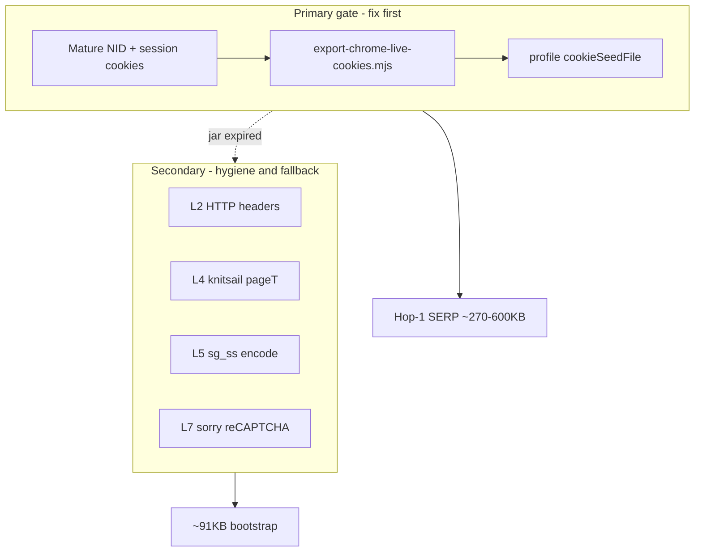
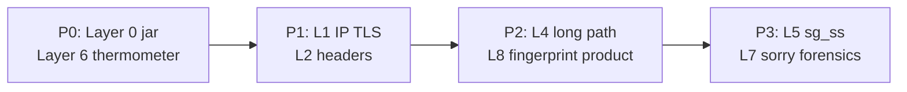

# Google Search Signal Inventory — Layers, Thermometers, and Production Priorities

> **Priority revised (2026-06-29).**  
> Canonical narrative: [`google-search-investigation-journey.md`](google-search-investigation-journey.md)  
> Hop mechanics: [`google-search-flow-architecture.md`](google-search-flow-architecture.md)  
> **Layer 0 (session cookies) is the primary production gate.** Layers 2–5 dominate only on the **long path** (~91 KB bootstrap). Warm jar → often skip straight to SERP on hop 1.

---

## Summary

Google Search antibot defense presents as a **trust-tier state machine**. Velora’s job is not to “beat CreepJS” or “perfect knitsail” first — it is to **present a session Google already trusts**, then maintain wire and JS hygiene when the long path appears.

With a **mature Chrome cookie jar** (live-exported `NID` ~1119 chars + `SID`/`SAPISID` when signed in), hop 1 is often a **full SERP** (~270–600 KB, `knitsail=0`, 1 hop). With a **cold session** (no jar, or guest `NID` only), Google returns an **SGS bootstrap shell** (~91 KB): inline scripts, `knitsail`, `sg_ss` encode, multi-hop navigation, `/sorry` risk.

This inventory lists **every signal layer** we measured, how Velora handles it, and **production priority** after months of phased investigation ([journey doc](google-search-investigation-journey.md#investigation)).

---

## Problem

Antidetect projects naturally sort signals by **what is measurable in the browser**:

- Canvas hash, audio oscillator, WebGL vendor — CreepJS dashboards
- JA3, header order — wire captures
- `knitsail`, `pageT`, `google.tick` — bootstrap HTML post-mortems

Google Search failures persisted because **the decisive signal is not visible in CreepJS** and **not fixable in bootstrap JS** when the server has already chosen the automation-tier HTML template. Teams optimized layers 4–5 while layer 0 was empty.

**Operational pain without prioritization:**

| Mistake | Cost |
|---------|------|
| Block Search on CreepJS sweep | Weeks of green sections, still ~91 KB hop 1 |
| Treat guest `NID` as warmup | Cookies on wire, tier unchanged |
| Copy Chrome `User Data` dir on macOS | Keychain encryption → 4 guest cookies |
| Parallel Chrome+Velora probes | IP rate limit → false `/sorry` signal |
| Fake `ussv`/`sp` client-side | Server-side gates; wasted engineering |

This inventory re-orders signals so operators fix **jar warmup first**, then hygiene, then long-path robustness.

---

## Root Cause (signal-level)

**Primary:** Google decodes **session cookie state** (especially mature `NID` payload) at hop 1 and selects HTML tier before client fingerprint executes.

**Secondary:** TLS/IP, HTTP headers, bootstrap timing, `sg_ss` encode quality — affect outcomes **on the long path** or at margin when jar is warm; they do **not** replace jar warmup.



Evidence: [`probe-cookie-ablation.mjs`](../../bugs/2026-06-29-google-search-nid-trust-tier.md) — `NID`-only → short path; guest `NID` → always long path; remove `NID` from mature jar → long path.

---

## Investigation (what we thought → tested → learned)

| # | Thought | Test | Learned |
|---|---------|------|---------|
| 1 | CreepJS fingerprint blocks Search | `cdp-creepjs-*` section compares | Unrelated to hop-1 tier |
| 2 | Wire headers flip tier | `diff-sei-request.mjs`, wire capture | Hygiene only; tier unchanged cold |
| 3 | knitsail/`pageT` is root cause | `probe-bootstrap-hop2.mjs` | Long-path symptoms; Chrome 0 knitsail |
| 4 | Any cookies help | guest 4-cookie A/B | Guest `NID` useless |
| 5 | Need real account session | live export + ablation | **Warmup jar is the essence** |
| 6 | `DV` required | ablation minus-DV | Optional with mature `NID` |

Full phase narrative: [Investigation Journey](google-search-investigation-journey.md#investigation).

---

## Solution (layered playbook)

### Thermometer: hop-1 body size

**Always measure before deep debugging.**

| Hop-1 size | Tier | Action |
|------------|------|--------|
| ~91 KB | Cold / low trust | Live-export jar; reload profile seed |
| ~270–600 KB | Warm / SERP | OK — parse `#rso` results |
| URL contains `sg_ss` | Long-path encode active | Refresh jar; cool IP 20–30 s |
| `/sorry` after long path | Token or rate rejection | Sorry parity; don’t start here |

### Layer 0 runbook (production)

```bash
cd /Users/huydev/Desktop/velora

# Live export from daily Chrome (Keychain) — NOT fresh spawn guest export
node google-search-debug/scripts/export-chrome-live-cookies.mjs \
  --out browser/profiles/assets/chrome-local-huys-macbook-pro-session-cookies.json

# Profile-baked load (preferred)
zig-out/bin/velora serve --browser-profile chrome-local-huys-macbook-pro

# Or explicit jar (load+save since 2026-06-29)
zig-out/bin/velora serve --cookie-jar browser/profiles/assets/chrome-local-huys-macbook-pro-google-cookies.json
```

**Bootstrap order:** runtime jar (non-empty) → profile `cookieSeedFile` → CLI `--cookie` override.  
**Persist:** `cookieRuntimeFile` + `.storage.json` on exit.  
**Re-export when:** hop-1 returns to ~91 KB, `knitsail` reappears, `sg_ss` in URL.

---

## Signal layers (full inventory)

### Layer 0 — Session cookies (**PRIMARY**)

| Signal | Source | Velora handling | Notes |
|--------|--------|-----------------|-------|
| `NID` payload | Chrome profile history | `cookieSeedFile` / `--cookie-jar` load on start | **Mature `NID` alone flips short path** (ablation) |
| `SID` / `SAPISID` / `HSID` / `SSID` | Signed-in Chrome | Live export (`browser-cookie3`) | ~154 cookies typical in full export |
| Guest `NID` | Fresh Chrome spawn (`export-chrome-cookies.mjs`) | Insufficient for tier | Same name, different trust encoding (~231 chars) |
| `DV` | Per-visit `www.google.com` | Sent when present | **Optional** when mature `NID` present |
| `AEC`, `__Secure-BUCKET`, `__Secure-STRP` | Guest / session | Optional with mature `NID` | Not sufficient without mature `NID` |
| Cookies on in-session hops | Guest Chrome HAR | `omitCookies: in_session` in policy | Correct — cookies matter on **hop 1 only** |
| Profile dir copy | macOS Chrome `User Data` | **Broken** — Keychain encrypts SQLite | Use **live export** only |

**Ablation summary (mature `chrome-real-cookies.json` base):**

| Case | Tier | Hop-1 body |
|------|------|------------|
| none | long | ~91 KB |
| **NID-only** | **short** | ~267 KB |
| all-minus-NID | long | ~91 KB |
| all-minus-DV | short | ~329 KB |
| DV-only | long | ~91 KB |

**Guest base (`chrome-cookies.json`):** all cases → long path ~91 KB.

---

### Layer 1 — Server-side (pre-HTML)

| Signal | Velora handling | Priority | Notes |
|--------|-----------------|----------|-------|
| Client IP / rate limit | Sequential probes, 20–30 s gap | High when sorry | Hot IP → `/sorry` for **both** engines |
| TLS fingerprint | curl-impersonate chrome149 | Hygiene | Necessary; not tier flip alone |
| ASN / datacenter IP | Use residential where possible | Context | Amplifies cold tier |
| Trust tier decision | **Driven by cookie state** | **Primary** | → bootstrap vs SERP HTML |

---

### Layer 2 — HTTP headers (hygiene)

Document navigations: `HttpProfile.zig`, `browser/policies/google-search.json`.

| Signal | Cold hop (hop 1) | In-session (`sei`/`sg_ss`) | Tier flip? |
|--------|------------------|----------------------------|------------|
| `User-Agent` + Sec-CH | Full Chrome client hints | Same family | No alone |
| `Sec-Fetch-Site` | Velora may send `same-origin` (policy `priorOrigin`) | Omitted | Minor |
| `Sec-Fetch-User` | Sometimes omitted (`curlDefaultsOnly`) | Omitted | Minor |
| `Sec-Fetch-*` | Present cold | **Omitted** in-session | Wire parity |
| Downlink / RTT | Chrome-like | **1.7 / 100** in-session | Wire parity |
| Referer | Search shape | `search_q_only` + `hl` | Wire parity |
| `x-browser-*` | Chrome parity headers | As policy | Marginal |
| Cookie header | **Full jar hop 1** | Omitted in-session | **Hop 1 critical** |

**Verdict:** Keep fixes from [Phase 2 journey](google-search-investigation-journey.md#phase-2--tls--http-wire-must-be-wrong); do not expect hop-1 91 KB → 270 KB from headers alone when jar is cold.

---

### Layer 3 — Inline bootstrap (**LONG PATH ONLY**)

Active when hop-1 ≈ **91 KB** and `sclm=false`, empty `ussv`/`sp`.

| Script # | Size | Role |
|----------|------|------|
| 0 | small | `window.google` stub |
| 1 | small | `sctm` / optional tick |
| 2 | ~62 KB | **Knitsail loader** → `globalThis.knitsail` |
| 3 | ~28 KB | SGS bootstrap — `la()` → `knitsail.a()` |
| 4 | small | `sg_trbl` beacon helper |

| Gate var | Long path value | Short path |
|----------|-----------------|------------|
| `sclm` | `false` (or `true` without short-circuit) | absent |
| `ussv` | `''` | absent / populated server-side |
| `sp` | `''` | absent / populated server-side |
| `ss_cgi` | `false` hop 1; `true` on sei | N/A |
| `knitsail` refs | 3+ | **0** |

**Do not** client-forge gates — server tier selection. See [bootstrap branch logic](google-search-flow-architecture.md#hop-1--bootstrap-shell-anatomy-velora-capture).

---

### Layer 4 — SGS timing (`pageT`, `td`, `google.tick`)

Relevant **only on long path**. Implementation: `Frame.zig`, `GoogleCompat.zig`, inject scripts.

| Signal | Symptom when wrong | Fix status |
|--------|-------------------|------------|
| `knitsail` pruned from `window` | `sg_b_e=Error: f` | Allowlist — valid long-path fix |
| `pageT` drift async | Wrong encode timing (~303 ms vs ~192 ms) | Freeze ~192.6 — improved encode |
| `window.td` / `ha()` | Missing performance channel | Seeded in `Frame.zig` |
| `google.tick()` | Bootstrap timing beacons | Implemented |
| `sclm=true` without `td` | Branch errors | Conditional on long path |

**Verdict:** Real engineering for **fallback path**; irrelevant when [Layer 0](#layer-0--session-cookies-primary) delivers SERP hop 1.

---

### Layer 5 — `sg_ss` token encode

| Signal | Typical value | Failure mode |
|--------|---------------|--------------|
| `sg_ss` query param | ~2.8 KB URL-encoded | Rejected → `/sorry` 429 |
| `SG_SS` cookie | Set on long path | Carried into sorry `continue` |
| knitsail.a output | Encoded blob | Diff vs Chrome when on long path only |

Chrome short path: **no `sg_ss` in URL**. Optimizing encode before short path is [Phase 4 lesson](google-search-investigation-journey.md#phase-4--sorry--path-parity).

---

### Layer 6 — Hop `sei` document tier

| Signal | Cold Velora | Warm / Chrome |
|--------|-------------|---------------|
| Response body | ~91 KB bootstrap | ~270–330 KB SERP |
| `docKind` | bootstrap | serp |
| `#rso` | absent | present |
| Title | `"Google Search"` | `"{query} - Google Search"` |

Same wire on `sei` can still differ — **server HTML** is the signal. [Flow Architecture smoking gun](google-search-flow-architecture.md#hop-sei--document-type-is-the-smoking-gun).

---

### Layer 7 — Post-fail `/sorry` + reCAPTCHA Enterprise

| Signal | Notes |
|--------|-------|
| Document path | Chrome: search → sorry; Velora cold: search → sei → sorry |
| `continue` URL | Velora often includes fat `sg_ss` from long path |
| `grecaptcha` cfgClients | `HTMLElement.style` shim → 1 vs 1 parity |
| IP rate limit | Indistinguishable from encode fail without gap discipline |

Forensics: `npm run google:sorry-parity`. Not first production fix.

---

### Layer 8 — Browser fingerprint (CreepJS class) (**SECONDARY**)

| Signal | Examples | Search tier impact |
|--------|----------|-------------------|
| Canvas / WebGL | CreepJS sections | None on hop-1 size |
| Audio | Oscillator fingerprint | None on hop-1 size |
| Window keys | `knitsail` survival | Long path only |
| Client rects / fonts | CreepJS | Product quality |
| Worker / maths | CreepJS | Product quality |

**Verdict:** Continue for antidetect product; **do not block Search** on sweep completion. [Phase 1 journey](google-search-investigation-journey.md#phase-1--fix-fingerprint-first-creepjs-sweep).

---

## Priority matrix (where to invest)

| Layer | Production priority | When it matters |
|-------|---------------------|-----------------|
| 0 Cookies | **P0 — must have** | Every Search session |
| 1 IP / TLS | P1 — context | Sorry, rate limits |
| 2 HTTP | P1 — hygiene | Margin; in-session parity |
| 3 Bootstrap HTML | P2 — read-only | Diagnose long path |
| 4 SGS timing | P2 — fallback | Jar expired / cold IP |
| 5 sg_ss | P3 — fallback | Long path only |
| 6 sei tier | P0 diagnostic | Thermometer confirmation |
| 7 sorry | P3 — forensics | Incidents |
| 8 fingerprint | P2 product | Antidetect, not Search gate |



---

## Lessons Learned

1. **Name the layer before opening a PR** — if hop-1 is ~91 KB, Layer 0 ops beats Layer 4 code.
2. **Guest vs mature `NID` is not semantic sugar** — ablation is the only decisive test.
3. **Cookie presence on wire ≠ trust** — 438 B guest cookies still bootstrap.
4. **In-session cookie omission is correct** — matches HAR; do not “fix” by sending cookies on `sei`.
5. **Inventory must stay re-prioritized** — old bootstrap docs read like root cause; link [journey](google-search-investigation-journey.md) at top.
6. **Thermometer beats dashboards** — CreepJS green + 91 KB hop 1 = misallocated effort.

---

## References

| Path | Description |
|------|-------------|
| `google-search-debug/scripts/probe-cookie-ablation.mjs` | 11-case ablation matrix |
| `google-search-debug/scripts/export-chrome-live-cookies.mjs` | Keychain live export |
| `google-search-debug/scripts/export-chrome-cookies.mjs` | Guest spawn (insufficient) |
| `google-search-debug/scripts/test-velora-chrome-cookies.mjs` | A/B cookie test |
| `browser/policies/google-search.json` | `omitCookies: in_session` |
| `browser/profiles/chrome-local-huys-macbook-pro.json` | `cookieSeedFile` example |
| `src/runtime/cookies.zig` | `--cookie` / jar load format |
| `knowledge/bugs/2026-06-29-google-search-nid-trust-tier.md` | Ablation tables |
| [`google-search-investigation-journey.md`](google-search-investigation-journey.md) | Full narrative |
| [`google-search-flow-architecture.md`](google-search-flow-architecture.md) | Hop state machine |

---

## Related Knowledge

| Document | Relationship |
|----------|--------------|
| [Investigation Journey](google-search-investigation-journey.md) | **Read first** — hypothesis history, decision tree, production recipe |
| [Flow Architecture](google-search-flow-architecture.md) | Bootstrap script order, `gen_204`, two-path diagram |
| `bugs/2026-06-29-google-search-bootstrap-divergence.md` | Long-path symptom catalog (layers 3–5) |
| `bugs/2026-06-29-google-search-nid-trust-tier.md` | Layer 0 ablation evidence |
| `bugs/2026-06-29-google-search-knitsail-window-keys-prune.md` | Layer 4 window-keys |
| `bugs/2026-06-29-grecaptcha-htmlelement-style-shim.md` | Layer 7 sorry |

**Reading order:** Journey → Signal Inventory (this file) → Flow Architecture.