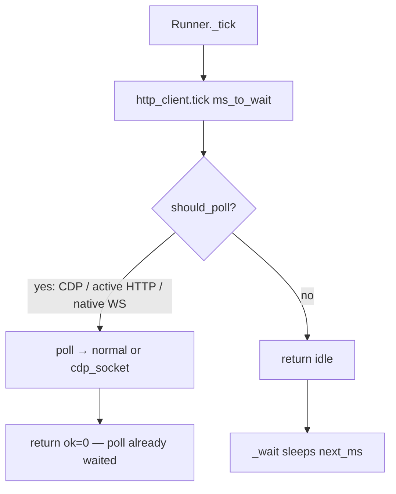

# Lightpanda ports: GC cadence, macrotask tick signal, CDP dead-peer

> **Audience:** Velora engineers working on runner liveness, CDP stability, or CPU during long waits.  
> **Date:** 2026-07-23  
> **Upstream:** lightpanda-io/browser PRs #3005, #2999, #3018 (July 2026)

## Summary

Three stability/perf ports from Lightpanda landed in Velora’s event loop and CDP socket path:

1. **GC hint every 5s** instead of every 1s during `Runner.wait` — less V8 pressure on heavy pages.
2. **`HttpClient.tick` returns `.idle`** when nothing can be polled; **Runner sleeps until the next macrotask** instead of spinning at 100% CPU on I/O-idle, timer-only pages.
3. **Linux `TCP_USER_TIMEOUT` (10s)** on accepted CDP sockets, plus **`shutdown(SHUT_RDWR)`** when a CDP peer is known dead so a blocked `send()` unblocks.

`zig build` (Debug) succeeded after these changes (V8 also rebuilt once for the unrelated embedder-string rename to `-velora`).

---

## Problem

Long WPT/CDP sessions showed:

- High CPU while a page had only delayed timers (no network) — the wait loop re-entered `tick` immediately after a no-op `HttpClient.perform`.
- Periodic `memoryPressureNotification(.moderate)` every second competing with real work on complex SPA loads.
- CDP workers that could hang on `send()` after the client vanished, because keepalive does not always fire when unacked write data sits in the TCP buffer.

---

## Changes

| Area | File(s) | Behavior |
|------|---------|----------|
| GC period | `src/core/browser/Runner.zig` | `gc_hint_period_ns = ns_per_s * 5` |
| Idle tick | `HttpClient.zig` `PerformStatus.idle`; `Runner._tick` | If `tick` → `.idle` (non-CDP), return `.{ .ok = ms_to_wait }` so `_wait` sleeps |
| USER_TIMEOUT | `Config.zig`, `Network.acceptConnections` | Linux only: `TCP.USER_TIMEOUT = 10_000` ms |
| Dead peer | `WsConnection.shutdownPeer`, `CDP.readSocket`, handshake read path | `shutdown(.both)` on EOF/read error |

`PerformStatus` is now `{ cdp_socket, normal, idle }`. Sync-request and CDP paths treat `.idle` like `.normal` for control flow; only Runner’s non-CDP wait uses it to sleep.

### Tick signal (why `.idle` exists)



Previously `perform` returned `.normal` even when it skipped poll entirely. Callers then looped with `next_ms = 0` → tight spin. Lightpanda #2999 fixed the same class of bug by returning “did not wait” from `HttpClient.tick`.

### Dead peer

Keepalive alone: window ≈ `IDLE + CNT * INTVL` = 10s, but **unacked writes** can prevent probes. Linux `TCP_USER_TIMEOUT` closes that gap. After EOF/error, `SHUT_RDWR` unblocks a peer `send()` stuck in the kernel.

macOS has no `TCP_USER_TIMEOUT`; keepalive + `shutdownPeer` still apply.

---

## Verification

```bash
cd /Users/huydev/Desktop/velora
zig build   # Debug; exit 0
```

Binary: `zig-out/bin/velora`.

Not re-run: full WPT suite (user can re-run `wpt-spa-tests/velora-probe/run-all.sh`). Expect fewer cascade timeouts from stuck CDP and less CPU on timer-heavy idle pages.

---

## Non-goals / deferred

- Full Lightpanda `msToNextTask` / `hasMacrotasks` rename — Velora already uses `scheduler.msToNext()` across both priority queues via `Env.msToNextMacrotask`.
- V8 `lowMemoryNotification` removal (unused; LP dropped it) — optional cleanup later.
- macOS equivalent of `TCP_USER_TIMEOUT` — none; rely on keepalive + explicit shutdown.
