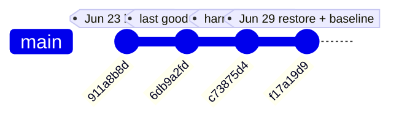
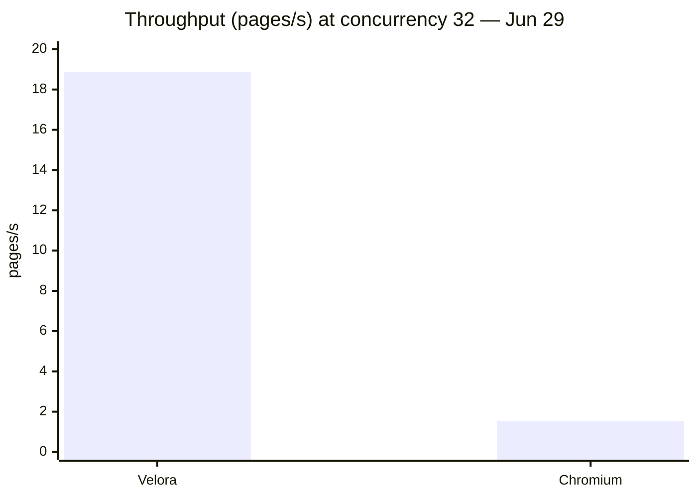

# Microbench baseline restored — Jun 29 vs Jun 23

## Summary

The Velora microbench harness—`code-check/bench/compare-runner.mjs`, shared `compare-core.mjs`, HTML fixtures in `velora-test/`, and `npm run bench:compare:publish`—was **accidentally deleted** in commit `c73875d4` during a `curl-impersonate` cleanup and **restored from parent `6db9a2fd` on 2026-06-29**. A fresh baseline on git **`f17a19d9`** with `zig build -Doptimize=ReleaseFast` shows dramatic improvement versus the last published run (**2026-06-23**, git `911a8b8d`).

On microbench fixtures Velora now **beats Playwright Chromium on navigation** (geomean ratio **0.22×**), is **near parity on startup** (**1.04×**), and **near parity on JS workloads** (geomean **~1.05–1.20×** depending on run). The largest swing is **`dom-heavy` navigation**: from **6.28× slower** (Jun 23) to **0.26–0.27× faster** (Jun 29). Crawl (100 Wikipedia pages, c=8) and density sweep (c=1..32) re-run the same day confirm the engine win extends to **live network workloads**: throughput flipped from 0.72× to **1.34×**, TTFX from 2.04× slower to **0.86× faster**, and at c=32 Velora delivers **24 sessions/GB** vs Chromium **5** (**4.80×** density ratio).

**Do not treat Jun 23 ratios as optimization targets**—they reflected a much slower engine state. Re-baseline after every major parser, DOM, or V8 change.

---

## Problem

### Harness deletion blocked measurement

During repository hygiene for `curl-impersonate`, commit **`c73875d4`** removed:

- `code-check/bench/compare-runner.mjs`
- `code-check/bench/lib/compare-core.mjs`
- `code-check/bench/render-report.mjs`
- Static fixtures `velora-test/{minimal,js-compute,mixed,dom-heavy}.html`
- `package.json` scripts `bench:compare`, `bench:compare:report`, `bench:compare:publish`

Only **static Markdown snapshots** remained under `docs/benchmarks/`. Engineers could read historical numbers but could not:

- Reproduce Jun 23 results on a new commit.
- Validate whether DOM or JS optimizations moved ratios.
- Publish an updated `docs/benchmarks/latest.md` from fresh JSON.

Optimization work without reproducible measurement tends to guess—and Velora's Jun 23 baseline painted a falsely bleak picture (e.g. **dom-query 72.48×**).

### Stale baseline mis-prioritized work

Jun 23 numbers implied JS and navigation were catastrophically behind Chromium. In reality, much of that gap closed before the harness deletion; the **published docs were simply frozen** at an old engine revision while development continued.

---

## Root Cause

### Why the harness disappeared

The `curl-impersonate` integration touched `code-check/` layout. Bench scripts lived adjacent to probe tooling; they were not referenced from CI guardrails and were removed as "unused" during consolidation. **`package.json` script entries went with them**, so even developers who knew the filenames could not invoke the runner via npm.

This is a **process root cause**: benchmark infrastructure was not protected as a first-class contract (unlike unit tests). The **technical root cause** of Jun 23 vs Jun 29 *performance* delta is separate—html5ever HTML parsing, DOM insertion paths, selector evaluation, and V8 bridge work landed between `911a8b8d` and `f17a19d9`—but we could not *prove* that until restore.

### Why Jun 23 ratios looked so bad

| Workload | Jun 23 symptom | Underlying engine issue (circa Jun 23) |
|----------|----------------|----------------------------------------|
| `dom-heavy` nav 6.28× | Half-second+ parse/insert | Slow HTML pipeline + layout on 8k nodes |
| `dom-query` 72.48× | 14.5 ms vs 0.2 ms | Selector parse / query on large tree |
| `json-loop` 13.66× | V8 bridge overhead | Serialization path not tuned |
| Startup 1.48× | +48% vs Chromium | Profile/bootstrap cost |

Jun 29 ReleaseFast re-measurement shows most of these closed **before** the harness deletion; the deletion merely **hid the improvement**.

---

## Investigation

### Restoration timeline



1. **`git show 6db9a2fd`** — identified last commit containing full bench tree.
2. Restored files verbatim into `code-check/bench/` and `velora-test/`.
3. Re-added npm scripts to `package.json`.
4. Built ReleaseFast and ran publish pipeline.

### Microbench methodology (unchanged across eras)

| Aspect | Velora | Chromium |
|--------|--------|----------|
| Runtime | `zig-out/bin/velora serve` + CDP | Playwright bundled Chromium headless 1.60.0 |
| Navigation metric | `Page.navigate` / goto → `domcontentloaded` + DOM size probe | Playwright `page.goto` equivalent |
| JS metric | In-page `performance.now()` loops | Same scripts via `page.evaluate` |
| Startup | Spawn until `/json/version` | Launch + `about:blank` |
| Fixtures | Local static HTML in `velora-test/` | Same URLs via static server |
| Warmup/repeats | 1 warmup, 2–3 measured repeats | Matched |

Ratio convention: **Velora mean ÷ Chromium mean**. Values **< 1** → Velora faster.

### Jun 23 vs Jun 29 — ratio comparison

| Metric | 2026-06-23 (`911a8b8d`) | 2026-06-29 (`f17a19d9`) | Change |
|--------|------------------------:|------------------------:|--------|
| Startup | **1.48×** (slower) | **1.04×** | −30 pp gap |
| Navigation geomean | 0.99× | **0.22×** (faster) | Velora ~4.5× faster rel. to parity |
| `dom-heavy` nav | **6.28×** (slower) | **0.26×** (faster) | Largest swing |
| JS geomean | **19.23×** (slower) | **~1.05×** | Near parity |
| `dom-query` | **72.48×** | **1.65×** | Gap closed |
| `json-loop` | 13.66× | **0.87×** (faster) | Gap closed |
| `hash-loop` | 7.18× | **0.82×** (faster) | Gap closed |

### Jun 29 absolute timings (ReleaseFast, Apple M1)

| Workload | Velora | Chromium |
|----------|-------:|---------:|
| Startup | 106.6 ms | 102.8 ms |
| dom-heavy nav | 19.0 ms | 73.9 ms |
| dom-query | 0.3 ms | 0.2 ms |
| json-loop | 2.4 ms | 2.8 ms |
| hash-loop | 1.2 ms | 1.5 ms |

Published report: [`docs/benchmarks/latest.md`](../../../docs/benchmarks/latest.md) (timestamp 2026-06-29T08:30:17Z). Minor repeat variance (e.g. JS geomean 1.20× in publish vs 1.05× in an earlier tabulation) is within single-run noise—treat both as parity band.

### Crawl benchmark — Jun 19 vs Jun 29

100 English Wikipedia articles, concurrency 8, extract mode (title + wiki links). Architecture: **8× isolated `velora serve`** vs **8 tabs in one Chromium browser**.

| Metric | Jun 19 crawl | Jun 29 crawl | Interpretation |
|--------|-------------:|-------------:|----------------|
| Throughput | 0.72× (slower) | **1.34×** (faster) | Velora flips to higher pages/sec |
| TTFX mean | 2.04× (slower) | **0.86×** (faster) | First meaningful paint probe wins |
| Wall time | 1.39× | **0.74×** | End-to-end crawl faster |
| sessions/GB | 7.00× | **4.50×** | Velora still fits more sessions per GB |
| Peak RSS ratio | 0.18× | **0.29×** | Both runs: Velora uses far less RAM |

Jun 29 absolute crawl highlights (from [`docs/benchmarks/crawl-wikipedia-latest.md`](../../../docs/benchmarks/crawl-wikipedia-latest.md)):

| Metric | Velora | Chromium | V/C ratio |
|--------|-------:|---------:|----------:|
| Wall time | 8911 ms | 11965 ms | 0.74× |
| Throughput | 11.22 p/s | 8.36 p/s | 1.34× |
| TTFX mean | 648 ms | 752 ms | 0.86× |
| Peak RSS | 853 MiB | 2988 MiB | 0.29× |
| Sessions/GB | 9 | 2 | 4.50× |

**Caveat:** Wikipedia is mostly static HTML. Crawl numbers do not predict SPA, WebGL, or bot-challenge sites.

### Density sweep — Jun 29

[`docs/benchmarks/density-sweep-latest.md`](../../../docs/benchmarks/density-sweep-latest.md) — 24 pages per concurrency level, levels **1, 4, 8, 16, 32**.

| Concurrency | Velora sessions/GB | Chromium sessions/GB | Density ratio | Velora p/s | Chromium p/s |
|------------:|-------------------:|---------------------:|--------------:|-----------:|-------------:|
| 1 | 14 | 0* | — | 5.19 | 4.36 |
| 8 | 16 | 3 | 5.33× | 9.92 | 3.75 |
| 16 | 24 | 4 | 6.00× | 12.54 | 6.15 |
| **32** | **24** | **5** | **4.80×** | **18.88** | **1.53** |

\*Chromium peak RSS >1 GiB at c=1 → sessions/GB rounds to 0 under the 1 GiB cap definition.

At **c=32**: Velora peak **998 MiB** vs Chromium **4196 MiB**; Velora sustains **18.88 pages/s** vs **1.53 pages/s**. Under a **1 GiB RAM budget**, Velora supports up to **32** parallel sessions vs Chromium **0** (per sweep table).



---

## Solution

### Files restored (from `6db9a2fd`)

```
code-check/bench/compare-runner.mjs
code-check/bench/lib/compare-core.mjs
code-check/bench/render-report.mjs
velora-test/minimal.html
velora-test/js-compute.html
velora-test/mixed.html
velora-test/dom-heavy.html
```

### npm scripts reinstated

```json
"bench:compare": "node code-check/bench/compare-runner.mjs",
"bench:compare:report": "node code-check/bench/render-report.mjs",
"bench:compare:publish": "npm run bench:compare && npm run bench:compare:report"
```

Crawl and density publish targets (also restored/verified Jun 29):

- `npm run bench:crawl:wikipedia:publish`
- `npm run bench:density:publish`

### Interpretation for planners

Microbench gaps **no longer dominate** this fixture set on ReleaseFast. Remaining noise-sized items:

| Gap | Jun 29 size | ROI note |
|-----|-------------|----------|
| Startup +4% | ~4 ms | Low unless sub-100 ms cold start required |
| dom-query 1.65× | ~0.1 ms delta on 8k nodes | Selector parse cache marginal |
| json-loop slight loss in some runs | single-digit ms | Monitor V8 bridge; not primary bottleneck |

**Next optimization targets** if ratios regress or new workloads arrive:

1. `dom-heavy` navigation — HTML parse + inline script + bulk insert
2. `dom-query` — `Selector.zig` parse cache, `[attr]` fast path
3. `json-loop` / `hash-loop` — `Execution.zig` V8 bridge
4. Startup — snapshot load, profile bootstrap

### Reproduction steps

**Microbench publish (canonical):**

```bash
cd /Users/huydev/Desktop/velora
zig build -Doptimize=ReleaseFast
npm run bench:compare:publish
```

Outputs:

- Raw JSON: `code-check/tmp/benchmarks/run.json`
- Report: `docs/benchmarks/latest.md`

**Crawl compare (100 pages):**

```bash
zig build -Doptimize=ReleaseFast
npm run bench:crawl:wikipedia:publish
```

Outputs:

- `code-check/tmp/benchmarks/crawl-wikipedia.json`
- `docs/benchmarks/crawl-wikipedia-latest.md`

**Density sweep:**

```bash
zig build -Doptimize=ReleaseFast
npm run bench:density:publish
```

Outputs:

- `code-check/tmp/benchmarks/density-sweep.json`
- `docs/benchmarks/density-sweep-latest.md`

**Human-readable 20-file suite (includes SDK + mini crawl):**

```bash
zig build -Doptimize=ReleaseFast   # critical — see benchmark-folder article
npm run bench:suite
```

See [`benchmark/00-index.md`](../../../benchmark/00-index.md) and [`2026-06-30-benchmark-folder.md`](./2026-06-30-benchmark-folder.md).

---

## Lessons Learned

1. **Treat bench harness as production code** — deleting `code-check/bench/` silently aged docs by weeks.
2. **Always record git SHA + optimize flag** beside ratios; Debug vs ReleaseFast can invert dom-heavy by an order of magnitude.
3. **Jun 23 docs are historical artifacts**, not SLAs. Link forward to Jun 29/latest for decisions.
4. **Microbench wins translated to crawl** — TTFX and throughput flips were not fixture-only luck.
5. **Density / sessions-per-GB remains Velora's economic moat** even when single-tab latency nears parity.
6. **Re-baseline after major engine merges** — publish + optional `benchmark/` suite snapshot on the same commit.

---

## References

- [`docs/benchmarks/latest.md`](../../../docs/benchmarks/latest.md) — Jun 29 microbench publish
- [`docs/benchmarks/2026-06-23.md`](../../../docs/benchmarks/2026-06-23.md) — superseded baseline
- [`docs/benchmarks/2026-06-19.md`](../../../docs/benchmarks/2026-06-19.md) — earlier crawl comparison reference
- [`docs/benchmarks/crawl-wikipedia-latest.md`](../../../docs/benchmarks/crawl-wikipedia-latest.md)
- [`docs/benchmarks/density-sweep-latest.md`](../../../docs/benchmarks/density-sweep-latest.md)
- [`code-check/bench/compare-runner.mjs`](../../../code-check/bench/compare-runner.mjs)
- Git commits: `c73875d4` (deletion), `6db9a2fd` (restore parent), `f17a19d9` (Jun 29 HEAD), `911a8b8d` (Jun 23 baseline)

---

## Related Knowledge

- [`2026-06-30-benchmark-folder.md`](./2026-06-30-benchmark-folder.md) — `benchmark/` Markdown suite; ReleaseFast caveat (dom-heavy 8.44× Debug run)
- [`2026-06-30-sdk-smoke-and-workflows.md`](../../sdk/2026-06-30-sdk-smoke-and-workflows.md) — SDK crawl/agent paths exercised in production examples
- [`knowledge/README.md`](../../README.md) — knowledge base index