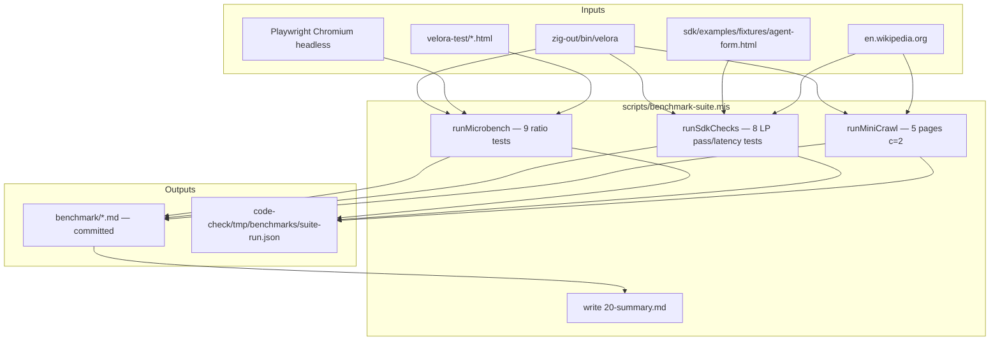

# Benchmark folder (`benchmark/`) — human-readable performance snapshots

## Summary

On **2026-06-30**, Velora gained a dedicated **`benchmark/`** directory at the repository root. The folder stores **only Markdown evaluation reports**—roughly **20 per suite run**—produced by `scripts/benchmark-suite.mjs` via `npm run bench:suite`. Raw machine-readable results live elsewhere (`code-check/tmp/benchmarks/suite-run.json`); `benchmark/` is the curated, diff-friendly layer engineers read when deciding whether an engine change helped or hurt.

The suite covers cold start, static-page navigation, in-page JavaScript workloads, SDK **LP** (Low-level Page) agent APIs, and a mini Wikipedia crawl. A single command regenerates every report and rolls them into `benchmark/20-summary.md`. The index at [`benchmark/00-index.md`](../../../benchmark/00-index.md) explains how to run the suite and how to read Velora/Chromium ratios.

**Critical caveat from the Jun 30 snapshot:** a local run without `ReleaseFast` produced misleading microbench ratios (e.g. **dom-heavy navigation 8.44×** slower than Playwright Chromium). Published Jun 29 baselines in [`2026-06-29-microbench-baseline.md`](./2026-06-29-microbench-baseline.md) used `zig build -Doptimize=ReleaseFast` and show dom-heavy at **0.27×** (Velora faster). Always align build mode before comparing snapshots.

---

## Problem

Before June 2026, Velora performance knowledge was scattered:

| Location | Contents | Pain point |
|----------|----------|------------|
| `docs/benchmarks/*.md` | Published microbench, crawl, density reports | Generated by separate `bench:compare:*` scripts; not one-shot |
| `code-check/tmp/benchmarks/` | Ephemeral JSON | Not committed; hard to correlate with git SHA |
| Ad-hoc SDK checks | Manual `node scripts/...` runs | No standard pass/fail artifact |

Engineers optimizing DOM parsing or LP APIs had no single directory that answered: *"Did we break startup, navigation, JS, SDK extraction, or crawl—all on this commit?"* Comparing two git revisions meant re-running multiple scripts and mentally stitching results. SDK correctness (semantic tree, NodeHandle fill, session state) was not tied to the same run as microbench numbers.

A second problem surfaced immediately after the first `bench:suite` run on Jun 30: **`benchmark/20-summary.md` looked catastrophic**—navigation geomean **3.49×**, JS **6.53×**, startup **2.28×**—while `docs/benchmarks/latest.md` from Jun 29 showed Velora winning navigation. Without documenting *why* the folders disagreed, future readers would assume a regression.

---

## Root Cause

Two architectural choices explain the design; one operational mistake explains the Jun 30 ratio inversion.

### Why `benchmark/` is Markdown-only

1. **Git diffs must be human-scannable.** JSON benchmark dumps change field ordering, floating-point formatting, and timestamps—noisy in PR review. Markdown reports carry verdict emojis (🟢/🟡/🔴), ratio tables, and one-line assessments.
2. **Separation of concerns.** The orchestrator needs structured data for geomean math and cross-test aggregation. That belongs in `code-check/tmp/`, which is intentionally ephemeral and `.gitignore`d. Committed artifacts are interpretations, not raw telemetry.
3. **Enforcement in code.** `ensureBenchDirClean()` in `scripts/benchmark-suite.mjs` throws if any non-`.md` file appears under `benchmark/`. Accidental JSON or log commits cannot pollute the folder.

### Why ~20 tests instead of one mega-report

Microbench (`bench:compare`) measures engine primitives. SDK LP tests measure **product-facing agent APIs** that do not exist in Playwright. A mini crawl validates **network + `waitUntil: done` + `createCrawlWorker`** under live Wikipedia load. Lumping these into one JSON blob hid which layer failed when a suite went red.

### ReleaseFast vs Debug (Jun 30 dom-heavy 8.44×)

The Jun 30 suite invoked `zig-out/bin/velora` after a default `zig build` (Debug). Debug Zig builds disable LLVM optimizations, inflate branch costs in hot DOM paths, and widen the gap on **`dom-heavy.html`**—a fixture that parses HTML, runs an inline script, and inserts ~8000 DOM nodes. Chromium (Playwright headless) was always release-grade.

| Build | dom-heavy V/C ratio | Velora mean | Chromium mean |
|-------|--------------------:|------------:|--------------:|
| Debug (Jun 30 suite) | **8.44×** (slower) | 698.0 ms | 82.7 ms |
| ReleaseFast (Jun 29 publish) | **0.27×** (faster) | 19.9 ms | 72.7 ms |

The engine did not regress overnight; **the comparison mixed build modes**. SDK LP checks and crawl mini still passed because they are latency-threshold tests, not tight ratio races.

---

## Investigation

### Suite architecture



### Reproducing the Jun 30 snapshot

```bash
cd /Users/huydev/Desktop/velora

# Default — uses whatever is in zig-out/ (often Debug after plain zig build)
npm run bench:suite

# Optional profile (antidetect / UA bundle)
npm run bench:suite -- --profile chrome-local-huys-macbook-pro
```

`prebench:suite` runs `npm run build:sdk` so LP tests use a fresh `@velora/sdk` build. The script records hostname, CPU, Node version, and `git rev-parse --short HEAD` in every report header.

### Interpreting Velora/Chromium ratios

Ratio = **Velora mean ÷ Chromium mean** (same metric, same fixture).

| Ratio | Meaning | Quick verdict |
|------:|---------|---------------|
| **< 1.0** | Velora faster or leaner | 🟢 Velora wins |
| **≈ 1.0** (within ~8%) | Parity | 🟡 Equivalent |
| **> 1.0** | Velora slower | 🔴 Velora behind |

**Geomean** aggregates multiplicative effects across fixtures (navigation ×4, JS ×3). A single outlier like dom-heavy under Debug can drag the whole navigation geomean to 3.49× even when minimal/mixed fixtures are closer.

Per-file emoji verdicts use the same rule. Invert only for metrics where *higher* is better (e.g. crawl throughput as V/C when framed as Velora pages per second divided by Chromium's).

### What each snapshot file contains

Startup reports (`01`, `02`) show mean/median/min/max spawn-to-ready times. Navigation (`03`–`06`) and JS (`07`–`09`) use a shared comparison table template. SDK files (`10`–`18`) record pass/fail and wall-clock ms for each LP probe. Crawl mini (`19`) reports success fraction and mean TTFX/extract. Summary (`20`) rolls up geomeans and links every sibling file.

---

## Solution

### Directory layout and 20-test taxonomy

| ID | File | Category | What it measures |
|----|------|----------|------------------|
| 01 | `01-startup-velora.md` | Startup | Velora cold start to CDP `/json/version` |
| 02 | `02-startup-chromium.md` | Startup | Playwright Chromium launch + `about:blank` |
| 03 | `03-nav-minimal.md` | Navigation | Tiny static HTML (`minimal.html`) |
| 04 | `04-nav-mixed.md` | Navigation | Mixed assets (`mixed.html`) |
| 05 | `05-nav-js-compute.md` | Navigation | Page with compute-heavy inline JS |
| 06 | `06-nav-dom-heavy.md` | Navigation | Parse + script + ~8k node insert (`dom-heavy.html`) |
| 07 | `07-js-dom-query.md` | JS workload | `querySelectorAll` on large tree |
| 08 | `08-js-json-loop.md` | JS workload | `JSON.parse` / stringify loop |
| 09 | `09-js-hash-loop.md` | JS workload | FNV-style hash loop |
| 10 | `10-sdk-goto-done.md` | SDK LP | Wikipedia `goto` with `waitUntil: "done"` |
| 11 | `11-sdk-markdown.md` | SDK LP | `LP.getMarkdown` / `page.markdown()` |
| 12 | `12-sdk-semantic-tree.md` | SDK LP | Pruned semantic tree (text, depth 4) |
| 13 | `13-sdk-structured-data.md` | SDK LP | JSON-LD, OpenGraph, meta |
| 14 | `14-sdk-links.md` | SDK LP | Wiki link extraction |
| 15 | `15-sdk-extract-wiki.md` | SDK LP | TTFX + structured page extract |
| 16 | `16-sdk-detect-forms.md` | SDK LP | Form schema + `backendNodeId` fields |
| 17 | `17-sdk-interactive-elements.md` | SDK LP | Clickable/focusable inventory |
| 18 | `18-sdk-agent-fill.md` | SDK LP | `NodeHandle.fill` via `backendNodeId` |
| 19 | `19-crawl-wikipedia-mini.md` | Crawl | 5 Wikipedia articles, concurrency 2 |
| 20 | `20-summary.md` | Summary | Geomeans, SDK/crawl status, file index |

**Count:** 2 startup + 4 navigation + 3 JS + 9 SDK + 1 crawl + 1 summary = **20 Markdown artifacts** (19 measurements + 1 rollup).

### Recommended workflow for trustworthy numbers

```bash
cd /Users/huydev/Desktop/velora

# 1. Release-grade Velora binary
zig build -Doptimize=ReleaseFast

# 2. Full human-readable suite
npm run bench:suite

# 3. Optional: publish canonical microbench to docs/benchmarks/
npm run bench:compare:publish

# 4. Review
cat benchmark/20-summary.md
# Index and reading guide:
cat benchmark/00-index.md
```

Compare `benchmark/06-nav-dom-heavy.md` against `docs/benchmarks/latest.md` only when both used **ReleaseFast**. If dom-heavy ratio is >2× while Jun 29 docs show <0.5×, check `zig build` flags before filing a regression.

### Jun 30 verified outcomes (same git `f17a19d9`)

| Layer | Result | Notes |
|-------|--------|-------|
| Microbench ratios | 🔴 Misleading under Debug | dom-heavy **8.44×**; re-run ReleaseFast |
| SDK LP (10–18) | ✅ Pass | Extraction + NodeHandle fill OK |
| Crawl mini (19) | ✅ **5/5** pages | `createCrawlWorker`, `waitUntil: done` |

---

## Lessons Learned

1. **Commit interpretations, not raw JSON.** `benchmark/` stays reviewable; tmp JSON stays disposable.
2. **Always label build mode in your head.** A Debug binary can turn a 0.27× win into an 8.44× loss on DOM-heavy navigation with zero API changes.
3. **Ratios are relative to Playwright Chromium headless**, not installed Google Chrome. Absolute milliseconds matter for agent SLA; ratios matter for optimization priority.
4. **SDK pass tests and microbench ratios answer different questions.** A green LP suite does not excuse red navigation geomeans—and vice versa.
5. **Re-baseline after major engine work** (html5ever migration, selector changes, V8 bridge). Overwrite `benchmark/*.md` and note git SHA in `20-summary.md`.
6. **Read [`benchmark/00-index.md`](../../../benchmark/00-index.md) first** when onboarding; it is the stable entry point even if individual `01`–`19` files rotate each run.

---

## References

- [`benchmark/00-index.md`](../../../benchmark/00-index.md) — run instructions, ratio legend, folder structure
- [`scripts/benchmark-suite.mjs`](../../../scripts/benchmark-suite.mjs) — orchestrator implementation
- [`code-check/bench/lib/compare-core.mjs`](../../../code-check/bench/lib/compare-core.mjs) — shared microbench primitives
- [`docs/benchmarks/latest.md`](../../../docs/benchmarks/latest.md) — ReleaseFast microbench publish target
- [`velora-test/dom-heavy.html`](../../../velora-test/dom-heavy.html) — dom-heavy fixture source
- [`package.json`](../../../package.json) — `bench:suite`, `bench:compare:publish` scripts

---

## Related Knowledge

- [`2026-06-29-microbench-baseline.md`](./2026-06-29-microbench-baseline.md) — ReleaseFast Jun 29 numbers; correct comparison baseline for dom-heavy
- [`2026-06-30-sdk-smoke-and-workflows.md`](../../sdk/2026-06-30-sdk-smoke-and-workflows.md) — deeper SDK smoke and production crawl/agent workflows
- [`docs/benchmarks/crawl-wikipedia-latest.md`](../../../docs/benchmarks/crawl-wikipedia-latest.md) — full 100-page crawl vs Chromium
- [`docs/benchmarks/density-sweep-latest.md`](../../../docs/benchmarks/density-sweep-latest.md) — agent density / sessions-per-GB sweep