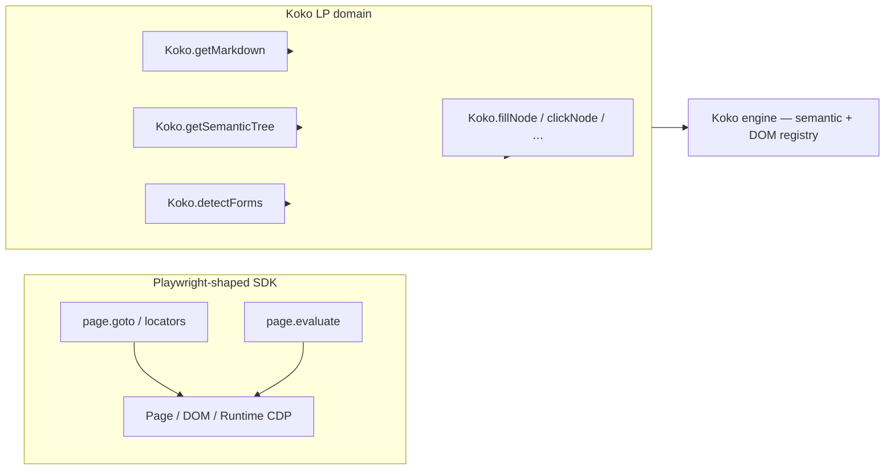
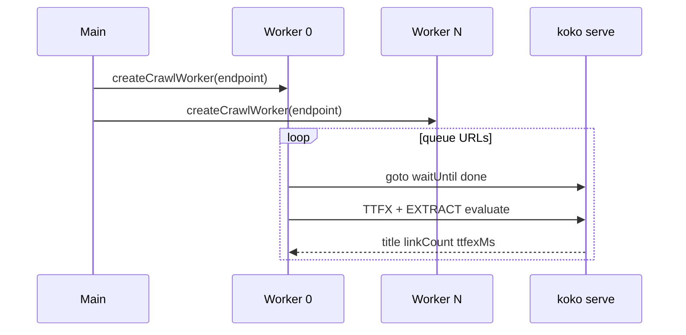

# SDK smoke test and production workflows (crawl + agent)

## Summary

Between **2026-06-29** and **2026-06-30**, Koko shipped end-to-end verification and two reference workflows for `@koko/sdk`:

1. **`scripts/sdk-smoke.mjs`** — a bounded, CI-friendly probe of Koko-specific APIs over the **Koko CDP domain**, plus session persistence and `NodeHandle` actions.
2. **`sdk/examples/crawl-wikipedia.mjs`** — Workflow **B**: multi-worker Wikipedia crawl shaped like the benchmark harness (`createCrawlWorker`, TTFX expressions, `waitUntil: "done"`).
3. **`sdk/examples/agent-semantic.mjs`** — Workflow **C**: MCP-equivalent agent loop (semantic tree → forms → NodeHandle) runnable without Cursor.

The SDK's **public surface mirrors Playwright** (`page.goto`, locators, `getByRole`) so scripts port with minimal edits. **Koko-only value** lives behind the **`Koko.*` CDP namespace**—markdown, semantic tree, `detectForms`, stable `backendNodeId` handles—and behind stricter navigation (`waitUntil: "done"`). Smoke verified **9/9 checks in ~6.5s** on 2026-06-30; `searchGoogle` remains opt-in. Known gaps: **`Koko.clickNode` can hang** on some buttons (smoke uses fill-only), and **`browser.newPage()` may return `TargetAlreadyLoaded`** when reusing a loaded target.

---

## Problem

### Playwright parity is necessary but insufficient

Automation authors expect `Browser.connect`, `page.goto`, locators, and `evaluate` to behave like [Playwright](https://playwright.dev/docs/api/class-playwright). Koko delivers that via direct WebSocket CDP—no Playwright or Puppeteer dependency. However, **AI agents and high-density crawlers** need APIs Playwright does not expose: token-efficient page markdown, pruned semantic trees, form schemas with stable node IDs, and proactive dialog handling.

Without a single smoke entrypoint, regressions in Koko handlers (`src/protocols/cdp/domains/koko.zig`) could slip through while Playwright-shaped locator tests still passed. Conversely, MCP tools in Cursor could work while the published npm package broke.

### Production paths were undocumented

Benchmark crawl scripts in `code-check/bench/` are comparative (Koko vs Chromium) and heavy. SDK consumers needed **copy-pasteable examples** that:

- Scale to N workers without reimplementing queue logic.
- Mirror MCP tool ordering so SDK and Cursor agents stay semantically aligned.
- Run against a launched binary *or* an existing `KOKO_CDP` endpoint.

---

## Root Cause

Koko's architecture splits **generic CDP compatibility** from **agent-native LP methods**:



**Playwright parity** routes through standard CDP domains implemented for compatibility.**LP domain** methods read Koko's DOM registry and semantic pipeline directly—faster for extraction, stable for `backendNodeId`, but **only implemented in Koko**, not Chromium.

Gaps like `TargetAlreadyLoaded` stem from Koko's target model: creating a second page while the default target already finished initial navigation triggers `error.TargetAlreadyLoaded` in `target.zig`. Playwright's browser spawns fresh targets more liberally.

`Koko.clickNode` hangs on some fixtures because click synthesis waits for hit-target stability and navigation side-effects that differ from Playwright's input dispatcher; submit buttons that trigger full navigation without a predictable CDP lifecycle event are the worst case (smoke deliberately avoids clicking the fixture submit button).

---

## Investigation

### Playwright parity vs LP domain

| Concern | Playwright-shaped API | LP / Koko-only API |
|---------|----------------------|----------------------|
| Primary consumer | Ported test suites, locators | AI agents, MCP, crawlers |
| CDP path | Page, DOM, Input, Network | Custom `Koko.*` namespace |
| Element identity | CSS / role locators (fragile across re-renders) | `backendNodeId` from semantic scan |
| Navigation wait | `domcontentloaded`, `load`, `networkidle` | + **`waitUntil: "done"`** (load + network idle + document complete) |
| Page text for LLMs | `page.content()` (full HTML) | `page.markdown()`, `page.semanticTree()` |
| Forms | Manual selectors | `page.detectForms()` → field `backendNodeId` |
| Dialogs | Reactive (breaks headless auto-dismiss) | `page.armDialog()` → `Koko.handleJavaScriptDialog` |

The SDK README maps ~40 Playwright methods to Koko equivalents. Items **not** ported (`page.route`, `frameLocator`, full a11y tree parity on `getByRole`) are intentional; agents should prefer **`findElement` + `NodeHandle`** for Koko deployments.

### Smoke test design (`scripts/sdk-smoke.mjs`)

```bash
cd /Users/huydev/Desktop/koko
npm run build:sdk
npm run test:sdk:smoke

# Attach to running server:
node scripts/sdk-smoke.mjs --endpoint http://127.0.0.1:9222

# Optional live Google (rate-limit sensitive):
node scripts/sdk-smoke.mjs --with-google

# Budget cap (default 45s); hang → exit 3 via probe rules
node scripts/sdk-smoke.mjs --max-sec 60
```

**Checks (9 core + 1 optional):**

| # | Check name | API under test | Assertion highlights |
|---|------------|----------------|----------------------|
| 1 | `goto:done` | `page.goto(WIKI, { waitUntil: "done" })` | Title contains "Earth" |
| 2 | `markdown` | `page.markdown()` | Length >200, mentions Earth |
| 3 | `semanticTree:text` | `page.semanticTree({ format: "text", maxDepth: 4 })` | Non-empty string |
| 4 | `structuredData` | `page.getStructuredData()` | `jsonLd` array present |
| 5 | `links` | `page.links()` | >5 Wikipedia links |
| 6 | `extract:wiki` | `page.extract()` | `title` + `linkCount > 0` |
| 7 | `agent:fixture` | `detectForms` + `NodeHandle.fill` + `findElement` | Fill `#q`; locate search button `backendNodeId` (**no click**) |
| 8 | `waitForSelectorHandle` | `waitForSelectorHandle("#q")` | `details().tagName === "input"` |
| 9 | `sessionState` | `captureSessionState` / `restoreSessionState` | `version === 1`, cookies array |
| opt | `searchGoogle` | `page.searchGoogle()` | ≥1 SERP result (--with-google) |

**2026-06-30 result:** 9/9 pass, ~6.5s wall time, `searchGoogle` skipped by default.

### Workflow B — crawl at scale (`sdk/examples/crawl-wikipedia.mjs`)

```bash
npm run example:crawl
# default: --launch --limit 8 --concurrency 2

# Attach + tune:
KOKO_CDP=http://127.0.0.1:9222 \
  node sdk/examples/crawl-wikipedia.mjs --limit 20 --concurrency 4
```

Architecture:



- One **`createCrawlWorker`** per concurrency slot (isolated page/session).
- TTFX / extract expressions copied from benchmark harness (`#firstHeading`, wiki link query).
- Titles from Wikipedia random API with static fallback list.
- **Verified 2026-06-30:** 8/8 articles, mean TTFX ~1.8s, ~64 pages/min @ c=2.

For Chromium comparison at 100 pages, use `npm run bench:crawl:wikipedia:publish` instead.

### Workflow C — MCP-style agent (`sdk/examples/agent-semantic.mjs`)

```bash
npm run example:agent
node sdk/examples/agent-semantic.mjs --dump-tree

# Launch with profile:
node sdk/examples/agent-semantic.mjs --launch --profile chrome-local-huys-macbook-pro
```

Agent loop (matches MCP tool order):

1. `goto` fixture with `waitUntil: "done"`
2. `semanticTree` (text, depth 5)
3. `getStructuredData` (og:title probe)
4. `detectForms` → find field `q` with `backendNodeId`
5. **`NodeHandle.fill`** — `page.node(id).fill("koko agent demo")`
6. `findElement({ role: "button", name: "search" })` — assert button handle exists
7. Final `markdown()` + URL for sanity

**Verified 2026-06-30:** full loop ~3.4s on local fixture. Cursor users should still prefer `koko mcp --browser-profile <id>` for daily work; this script proves SDK parity with MCP semantics.

### NodeHandle model

`NodeHandle` (`sdk/src/browser/node-handle.ts`) wraps a **`backendNodeId`** from LP scans—stable across semantic re-serialization unlike CSS paths.

| Method | Koko CDP method | Status in smoke |
|--------|---------------|-----------------|
| `fill(text)` | `Koko.fillNode` | ✅ exercised |
| `click()` | `Koko.clickNode` | ⚠️ known hang risk — not in smoke |
| `hover()` | `Koko.hoverNode` | Added Jun 30 in `lp.zig` |
| `press(key)` | `Koko.pressKey` | Supported |
| `selectOption(v)` | `Koko.selectOptionNode` | Supported |
| `check()` / `uncheck()` | `Koko.setCheckedNode` | Supported |
| `details()` | `Koko.getNodeDetails` | ✅ via `waitForSelectorHandle` |

Jun 30 CDP additions: `Koko.hoverNode`, `Koko.pressKey`, `Koko.selectOptionNode`, `Koko.setCheckedNode` complete the action set for agent parity with MCP.

---

## Solution

### Deliverables map

| Artifact | Role |
|----------|------|
| `scripts/sdk-smoke.mjs` | Fast regression gate; LP + session + NodeHandle |
| `sdk/examples/crawl-wikipedia.mjs` | Production crawl template |
| `sdk/examples/agent-semantic.mjs` | Agent / MCP semantic reference |
| `src/protocols/cdp/domains/koko.zig` | Server-side Koko handlers |
| `npm run test:sdk:smoke` | Wired in root `package.json` with `prebuild:sdk` |

### Operational guidance

**Prefer one page per session** when launching Koko fresh:

```ts
const page = await browser.newPage();
await page.goto(url, { waitUntil: "done" });
// Avoid second newPage() on same browser if default target already loaded
```

**Prefer fill + Enter or explicit navigation** over `clickNode` on submit until hang root-caused:

```ts
const field = forms[0].fields.find(f => f.name === "q");
await page.node(field.backendNodeId).fill("query");
// await page.node(btnId).click();  // risky today
await page.press("Enter");
```

**Use `--max-sec`** in CI so wedged CDP calls cannot block pipelines indefinitely.

---

## Lessons Learned

1. **Two SDK layers:** Playwright-shaped APIs win compatibility; LP APIs win agent robustness. Document both whenever adding features.
2. **Smoke must track MCP ordering** — semantic tree before form fill — or Cursor and SDK diverge silently.
3. **`backendNodeId` > CSS** for agents; re-run `detectForms` after navigation if DOM changed.
4. **`waitUntil: "done"` is stricter than Playwright `networkidle`** — crawl TTFX numbers are comparable to MCP defaults, not to loose `domcontentloaded` scripts.
5. **Do not infer click health from fill health** — `Koko.fillNode` and `Koko.clickNode` use different synchronization paths; track click hangs as a separate bug.
6. **`searchGoogle` stays off by default** — live SERP probes invite rate limits and captcha noise; opt in locally only.

---

## References

- [`sdk/README.md`](../../sdk/README.md) — Playwright → Koko API map, Koko-only features
- [`scripts/sdk-smoke.mjs`](../../scripts/sdk-smoke.mjs) — smoke implementation
- [`sdk/examples/crawl-wikipedia.mjs`](../../sdk/examples/crawl-wikipedia.mjs) — Workflow B
- [`sdk/examples/agent-semantic.mjs`](../../sdk/examples/agent-semantic.mjs) — Workflow C
- [`sdk/src/browser/node-handle.ts`](../../sdk/src/browser/node-handle.ts) — NodeHandle
- [`src/protocols/cdp/domains/koko.zig`](../../src/protocols/cdp/domains/koko.zig) — Koko CDP handlers
- [`src/protocols/cdp/domains/target.zig`](../../src/protocols/cdp/domains/target.zig) — `TargetAlreadyLoaded`
- [`sdk/examples/fixtures/agent-form.html`](../../sdk/examples/fixtures/agent-form.html) — agent smoke fixture

---

## Related Knowledge

- [`2026-06-30-benchmark-folder.md`](../performance/benchmarks/2026-06-30-benchmark-folder.md) — `bench:suite` SDK LP benchmarks (tests 10–18)
- [`2026-06-29-microbench-baseline.md`](../performance/benchmarks/2026-06-29-microbench-baseline.md) — engine performance context for crawl TTFX
- [`knowledge/performance/benchmarks/2026-06-benchmark-harness.md`](../performance/benchmarks/2026-06-benchmark-harness.md) — crawl + microbench harness
- [`knowledge/captcha/detection/google-search-investigation-journey.md`](../captcha/detection/google-search-investigation-journey.md) — cookie warmup gate for `searchGoogle`